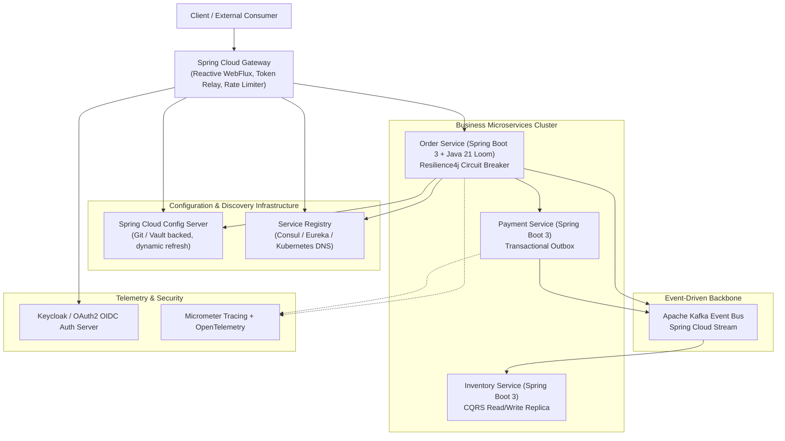

# Production Spring Boot & Spring Cloud Microservices

> "Spring Boot 3 and Spring Cloud represent the gold standard for enterprise-grade distributed microservices in the JVM ecosystem. Built upon Java 21 virtual threads (Project Loom), Spring Cloud Gateway, declarative HTTP interfaces, Spring Cloud Config, resilience patterns via Resilience4j, distributed tracing via Micrometer, and event-driven architectures with Spring Cloud Stream and Apache Kafka."  
> — *Synthesized from Spring Microservices in Action (John Carnell & Illary Huaylupo Sánchez), Cloud Native Spring in Action (Thomas Vitale), and Spring Boot 3 Official Architecture Docs*

---

## 📚 Canonical Literature & Authoritative References
1. **Spring Microservices in Action (2nd Edition)** (John Carnell & Illary Huaylupo Sánchez / Manning)
2. **Cloud Native Spring in Action: With Spring Boot and Kubernetes** (Thomas Vitale / Manning)
3. **Spring Boot: Up and Running** (Mark Heckler / O'Reilly)
4. **Resilience4j & Micrometer Tracing Production Architecture Guides**

---

## 🏛️ Comprehensive Enterprise Architecture



---

## 1. Declarative Routing & Token Relay with Spring Cloud Gateway

Spring Cloud Gateway is built on non-blocking **Project Reactor** and Netty. It acts as the single security entry point, validating OAuth2 JWT access tokens and relaying them down to downstream microservices via the `TokenRelay` filter:

```yaml
# application.yml for Spring Cloud Gateway
server:
  port: 8080

spring:
  application:
    name: api-gateway
  security:
    oauth2:
      resourceserver:
        jwt:
          jwk-set-uri: http://auth-server:8080/realms/enterprise/protocol/openid-connect/certs
  cloud:
    gateway:
      default-filters:
        - TokenRelay
        - name: RequestRateLimiter
          args:
            redis-rate-limiter.replenishRate: 100
            redis-rate-limiter.burstCapacity: 200
      routes:
        - id: order-service-route
          uri: lb://ORDER-SERVICE
          predicates:
            - Path=/api/v1/orders/**
          filters:
            - StripPrefix=0
            - name: CircuitBreaker
              args:
                name: orderFallbackBreaker
                fallbackUri: forward:/fallback/orders
```

---

## 2. Java 21 Virtual Threads (Project Loom) in Spring Boot 3

In Spring Boot 3.2+, switching from traditional thread pools (which block an OS kernel thread per request) to **Virtual Threads** requires a single configuration property:

```yaml
spring:
  threads:
    virtual:
      enabled: true
```

* **Under the Hood**: Every incoming HTTP request in Tomcat is handled by an ultra-lightweight virtual thread scheduled by the JVM onto carrier kernel threads. Blocking I/O (JDBC database queries, external REST calls) unmounts the virtual thread, eliminating thread-exhaustion bottlenecks and enabling 50,000+ concurrent connections per instance.

---

## 3. Declarative HTTP Clients (`@HttpExchange`)

Spring 6 and Spring Boot 3 introduce native compile-time declarative HTTP client interfaces, eliminating external Feign client dependencies:

```java
package com.enterprise.order.client;

import com.enterprise.order.dto.PaymentRequest;
import com.enterprise.order.dto.PaymentResponse;
import org.springframework.web.bind.annotation.PathVariable;
import org.springframework.web.bind.annotation.RequestBody;
import org.springframework.web.service.annotation.HttpExchange;
import org.springframework.web.service.annotation.PostExchange;

@HttpExchange(url = "/api/v1/payments", accept = "application/json", contentType = "application/json")
public interface PaymentClient {

    @PostExchange
    PaymentResponse processPayment(@RequestBody PaymentRequest request);
}
```

```java
// Configuration Bean registering the HTTP client with WebClient
@Configuration
public class ClientConfig {

    @Bean
    public PaymentClient paymentClient(WebClient.Builder builder) {
        WebClient webClient = builder
                .baseUrl("http://payment-service")
                .build();
        WebClientAdapter adapter = WebClientAdapter.create(webClient);
        HttpServiceProxyFactory factory = HttpServiceProxyFactory.builderFor(adapter).build();
        return factory.createClient(PaymentClient.class);
    }
}
```

---

## 4. Fault Tolerance with Resilience4j (Circuit Breakers & Retries)

```java
package com.enterprise.order.service;

import com.enterprise.order.client.PaymentClient;
import com.enterprise.order.dto.PaymentRequest;
import com.enterprise.order.dto.PaymentResponse;
import io.github.resilience4j.circuitbreaker.annotation.CircuitBreaker;
import io.github.resilience4j.retry.annotation.Retry;
import org.slf4j.Logger;
import org.slf4j.LoggerFactory;
import org.springframework.stereotype.Service;

@Service
public class OrderProcessingService {

    private static final Logger log = LoggerFactory.getLogger(OrderProcessingService.class);
    private final PaymentClient paymentClient;

    public OrderProcessingService(PaymentClient paymentClient) {
        this.paymentClient = paymentClient;
    }

    @CircuitBreaker(name = "paymentServiceBreaker", fallbackMethod = "paymentFallback")
    @Retry(name = "paymentServiceRetry")
    public PaymentResponse executePayment(PaymentRequest request) {
        log.info("Attempting payment for order: {}", request.orderId());
        return paymentClient.processPayment(request);
    }

    // Fallback executed when circuit breaker opens or retries exhaust
    public PaymentResponse paymentFallback(PaymentRequest request, Throwable t) {
        log.error("Payment service unavailable! Triggering deferred fallback. Cause: {}", t.getMessage());
        return new PaymentResponse(request.orderId(), "DEFERRED_PENDING_RETRY", false);
    }
}
```

---

## 5. Event-Driven Messaging with Spring Cloud Stream & Kafka

Spring Cloud Stream decouples business logic from Kafka broker configurations using functional programming (`java.util.function.Supplier` and `Consumer`):

```java
package com.enterprise.order.event;

import org.springframework.context.annotation.Bean;
import org.springframework.context.annotation.Configuration;
import java.util.function.Consumer;

public record OrderCreatedEvent(String orderId, String customerId, long amountCents) {}

@Configuration
public class OrderEventProcessingConfig {

    @Bean
    public Consumer<OrderCreatedEvent> processOrderCreated() {
        return event -> {
            System.out.println("Processing async order event from Kafka: " + event.orderId());
            // Update local read database projection (CQRS)
        };
    }
}
```

```yaml
# application.yml for Spring Cloud Stream
spring:
  cloud:
    stream:
      bindings:
        processOrderCreated-in-0:
          destination: orders.created.topic
          group: inventory-service-group
      kafka:
        binder:
          brokers: kafka-broker:9092
```

---

## 6. Do's, Don'ts & Production Gotchas

| Category | Rule | Deep Technical Rationale |
| :--- | :--- | :--- |
| **DON'T** | Never pin virtual threads with `synchronized` blocks around blocking I/O. | In Java 21, executing blocking I/O (like database queries or sockets) inside a `synchronized` block **pins the virtual thread to its underlying OS carrier thread**, preventing the JVM from context-switching other virtual threads onto that carrier thread. Replace `synchronized` with `java.util.concurrent.locks.ReentrantLock`. |
| **DO** | Enable distributed tracing context propagation with Micrometer Tracing. | In multi-service microservice chains, requests cross HTTP and Kafka boundaries. Without Micrometer tracing headers (`traceparent`), tracking a failure across 10 services in production logs is mathematically impossible. |
| **GOTCHA** | `@Transactional` in Spring does NOT roll back on checked exceptions by default. | By default, Spring only rolls back for `RuntimeException` and `Error`. If a method throws a checked `Exception` (e.g. `IOException`), the transaction commits! Always write `@Transactional(rollbackFor = Exception.class)`. |
| **DO** | Set explicit timeouts on all HTTP connection pools and circuit breakers. | Unset timeouts default to infinite or operating system defaults (typically 120 seconds). Under load, 500 slow requests will exhaust all connection pools, triggering cascading cluster-wide failures. |
| **DON'T** | Avoid using Eureka in Kubernetes environments. | Kubernetes provides native Service Discovery (`kube-dns`), health checks (Liveness/Readiness probes), and IP load balancing out of the box. Running Eureka inside Kubernetes adds unnecessary operational complexity and duplicate registries. Use Kubernetes native discovery. |
