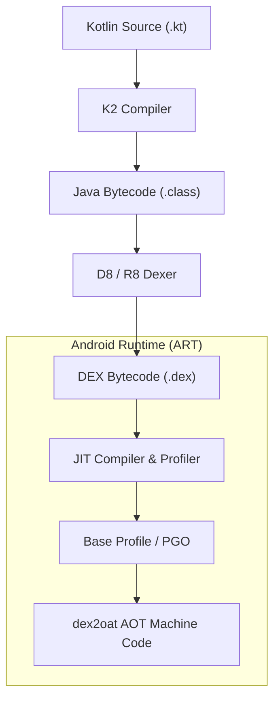
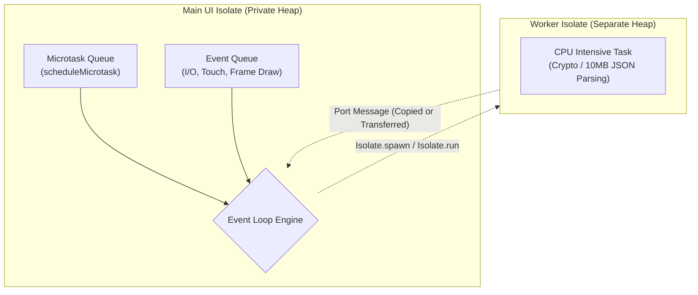

# Chapter 01: Core Languages & Modern Runtime Internals (Kotlin vs Dart)

> "Coroutines are not magical light-weight threads created by the OS; they are cooperative state machines generated by the Kotlin compiler. Understanding Continuation-Passing Style (CPS) and Structured Concurrency is what separates a novice from a senior Android systems engineer."  
> — *Roman Elizarov et al., Kotlin in Action (2nd Ed, Manning)*
>
> "Dart's single-threaded event loop combined with Sound Null Safety and generational garbage collection guarantees predictable frame delivery. When heavy computation is required, Isolates provide isolated memory heaps without shared-memory concurrency bugs."  
> — *Dart Language Engineering Architecture Guide*

---

## ⚙️ 1. Kotlin Language & Android Runtime (ART) Internals

Modern Android development centers on **Kotlin 2.0+** running on the **Android Runtime (ART)**.

```
===================================================================================================
                                  KOTLIN COMPILATION & ART PIPELINE
===================================================================================================

  Kotlin Source Code (.kt)
            │
            ▼ (Kotlin K2 Compiler Frontend)
  Intermediate Representation (IR)
            │
            ▼ (JVM Bytecode Generator)
  Standard JVM Class Files (.class)
            │
            ▼ (D8 / R8 Compiler)
  Dalvik Executable (.dex)
            │
            ▼ (Installed on Device)
  +-----------------------------------------------------------------------------------------------+
  |                                     ANDROID RUNTIME (ART)                                     |
  |                                                                                               |
  |  1. Ahead-of-Time (AOT) Compilation: Compiles critical code paths during app installation.    |
  |  2. Just-in-Time (JIT) Profiler: Profiles hot methods during live execution.                  |
  |  3. Profile-Guided Optimization (PGO): Background dex2oat compiles hot methods to machine ELF.|
  |  4. Generational Concurrent Garbage Collector (CMS / CC): Sub-millisecond pause times.         |
  +-----------------------------------------------------------------------------------------------+
```



### 1.1 Memory Optimization: Inline Value Classes
Standard object wrappers (e.g. `class OrderId(val value: String)`) incur heap allocation overhead (16 bytes object header + reference pointers).
Kotlin's `@JvmInline value class` provides compile-time type safety while erasing the wrapper at runtime to a raw primitive/string:

```kotlin
// Zero heap allocation overhead; treated as raw String in DEX bytecode!
@JvmInline
value class CustomerId(val value: String) {
    init {
        require(value.isNotBlank()) { "CustomerId cannot be blank" }
    }
}
```

### 1.2 Kotlin Coroutines & Continuation-Passing Style (CPS)
Coroutines provide non-blocking cooperative multitasking. When a function is marked `suspend`, the Kotlin compiler transforms it via **Continuation-Passing Style (CPS)** into a state machine:

```kotlin
// Developer Writes:
suspend fun fetchUserProfile(userId: String): UserProfile {
    val token = authService.getToken()       // Suspension point 1
    val profile = apiService.getProfile(token) // Suspension point 2
    return profile
}

// Compiler Transformed (Conceptual Bytecode):
fun fetchUserProfile(userId: String, continuation: Continuation<Any?>): Any? {
    val sm = continuation as? ThisStateMachine ?: object : CoroutineImpl(continuation) {
        var label = 0
        var result: Any? = null
        var token: String? = null
        override fun invokeSuspend(res: Any?): Any? {
            this.result = res
            return fetchUserProfile(userId, this)
        }
    }

    when (sm.label) {
        0 -> {
            sm.label = 1
            val res = authService.getToken(sm)
            if (res == COROUTINE_SUSPENDED) return COROUTINE_SUSPENDED
            sm.token = res as String
        }
        1 -> {
            sm.label = 2
            val res = apiService.getProfile(sm.token!!, sm)
            if (res == COROUTINE_SUSPENDED) return COROUTINE_SUSPENDED
            return res as UserProfile
        }
    }
}
```

---

## 🎯 2. Dart Language & Dart Virtual Machine Architecture

Flutter applications run on the **Dart 3+** language.

```
===================================================================================================
                                      DART RUNTIME ARCHITECTURE
===================================================================================================

  [ Development Mode: JIT Engine ]
  Dart Source ──► Dart VM JIT ──► Dynamic Machine Code
  - Supports Hot Reload in < 500ms by swapping modified AST methods in-place without restarting state!

  [ Production Release: AOT Engine ]
  Dart Source ──► AOT Compiler (gen_snapshot) ──► Native Machine Code (ELF Binary / ARM64)
  - Zero VM compilation overhead; executes directly on device CPU at maximum performance.
```

### 2.1 Concurrency Model: Event Loop vs. Isolates
Unlike Java/Kotlin where multiple threads share a single memory heap (requiring locks, mutexes, and volatile memory fences), **Dart code runs inside a single-threaded Event Loop with completely isolated heaps (Isolates)**:

```
===================================================================================================
                                     DART ISOLATE EVENT LOOP
===================================================================================================

  +-----------------------------------------------------------------------------------------------+
  |                                        MAIN ISOLATE                                           |
  |                                                                                               |
  |  +---------------------------+        +----------------------------------------------------+  |
  |  |   Microtask Queue         |        |   Event Queue                                      |  |
  |  |   (High Priority Tasks)   | -----> |   (I/O, Timers, UI Touch Events, Frame Rendering)  |  |
  |  +---------------------------+        +----------------------------------------------------+  |
  |                                                                                               |
  |  Allocated Private Memory Heap (No shared memory with any other thread!)                      |
  +-----------------------------------------------------------------------------------------------+
                                                  │
                 +────────────────────────────────+────────────────────────────────+
                 │ Messages passed via Port Serialization (SendPort / ReceivePort) │
                 ▼                                                                 ▼
  +-------------------------------+                             +-------------------------------+
  |      BACKGROUND ISOLATE 1     |                             |      BACKGROUND ISOLATE 2     |
  |  (Heavy JSON Parsing / Crypto)|                             |  (Image Resizing / Audio DSP) |
  |  Private Memory Heap          |                             |  Private Memory Heap          |
  +-------------------------------+                             +-------------------------------+
```



---

## 💻 3. Side-by-Side Production Implementations: Concurrency & State

To demonstrate production language mechanics, we implement an **Asynchronous Stock Price Streamer & Heavy Data Parser** in:
1. **Kotlin (Coroutines, StateFlow, Structured Concurrency)**
2. **Dart (Async/Await, Streams, Dart 3 Records, Isolate.run)**

---

### 3.1 Kotlin Implementation (Coroutines + Structured Concurrency + Flow)

```kotlin
package com.enterprise.mobile.core.concurrency

import kotlinx.coroutines.*
import kotlinx.coroutines.flow.*
import java.util.UUID

// 1. Immutable Value Objects & Domain Models
@JvmInline
value class Symbol(val value: String)

data class StockQuote(
    val symbol: Symbol,
    val price: Double,
    val timestamp: Long = System.currentTimeMillis()
)

// 2. Production Stock Repository with Coroutines Flow & Structured Concurrency
class StockRepository(
    private val ioDispatcher: CoroutineDispatcher = Dispatchers.IO
) {
    // Shared StateFlow caching latest quotes for UI observation
    private val _stockState = MutableStateFlow<Map<Symbol, StockQuote>>(emptyMap())
    val stockState: StateFlow<Map<Symbol, StockQuote>> = _stockState.asStateFlow()

    fun streamStockUpdates(symbols: List<Symbol>): Flow<StockQuote> = flow {
        while (currentCoroutineContext().isActive) {
            symbols.forEach { sym ->
                // Simulate network latency without blocking thread
                delay(1000)
                val quote = StockQuote(symbol = sym, price = 100.0 + Math.random() * 50.0)
                emit(quote)
            }
        }
    }.flowOn(ioDispatcher)

    // CPU-bound JSON parsing offloaded to Dispatchers.Default
    suspend fun parseLargePayload(rawJson: String): List<StockQuote> = withContext(Dispatchers.Default) {
        // High-performance CPU parsing here...
        listOf(StockQuote(Symbol("AAPL"), 182.5))
    }

    // Launching managed worker with SupervisorJob
    fun startStockTracker(scope: CoroutineScope, symbols: List<Symbol>): Job {
        return scope.launch(ioDispatcher + CoroutineName("StockTrackerWorker")) {
            streamStockUpdates(symbols)
                .catch { exception ->
                    println("Stream error encountered: ${exception.message}")
                }
                .collect { quote ->
                    _stockState.update { currentMap ->
                        currentMap + (quote.symbol to quote)
                    }
                }
        }
    }
}
```

---

### 3.2 Dart 3 Implementation (Records, Streams, & Background Isolates)

```dart
import 'dart:async';
import 'dart:isolate';
import 'dart:math';

// 1. Dart 3 Typed Extension & Domain Entity
extension type Symbol(String value) {
  bool get isValid => value.isNotEmpty && value.length <= 5;
}

class StockQuote {
  final Symbol symbol;
  final double price;
  final DateTime timestamp;

  StockQuote({
    required this.symbol,
    required this.price,
    DateTime? timestamp,
  }) : timestamp = timestamp ?? DateTime.now();

  @override
  String toString() => '${symbol.value}: \$$price at $timestamp';
}

// 2. Production Stock Service with Dart Stream & Isolate.run
class StockService {
  final StreamController<StockQuote> _quoteStreamController =
      StreamController<StockQuote>.broadcast();

  Stream<StockQuote> get quoteStream => _quoteStreamController.stream;

  // Asynchronous Stream Generator
  Stream<StockQuote> startPriceTicker(List<Symbol> symbols) async* {
    final random = Random();
    while (true) {
      await Future.delayed(const Duration(milliseconds: 1000));
      for (final sym in symbols) {
        final quote = StockQuote(
          symbol: sym,
          price: 100.0 + random.nextDouble() * 50.0,
        );
        yield quote;
        _quoteStreamController.add(quote);
      }
    }
  }

  // Heavy computational task offloaded to a dedicated Isolate (Zero UI Jank!)
  Future<List<StockQuote>> parseHeavyPayload(String rawPayload) async {
    // Isolate.run spawns worker, copies payload, executes closure, returns result, and kills isolate
    return await Isolate.run(() {
      // Executed on separate OS thread with private heap!
      final parsedQuotes = <StockQuote>[
        StockQuote(symbol: Symbol('GOOG'), price: 175.40),
        StockQuote(symbol: Symbol('MSFT'), price: 420.10),
      ];
      return parsedQuotes;
    });
  }

  void dispose() {
    _quoteStreamController.close();
  }
}
```

---

## 🚨 4. Production Pitfalls, Concurrency Bugs & Triage Runbook

```
===================================================================================================
                                RUNTIME ANOMALY TRIAGE RUNBOOK
===================================================================================================

  Anomaly: Kotlin Coroutine Job Cancellation Exception Swallowing
  ├── Symptom: Coroutine execution silently halts; database or network retry loop stops working.
  ├── Root Cause: Catching raw 'Exception' or 'Throwable' catches 'CancellationException'!
  └── Triage: Rule: Never catch CancellationException, or re-throw it immediately:
              'catch (e: Exception) { if (e is CancellationException) throw e; handle(e) }'.

  Anomaly: Main Thread Starvation & UI Jank in Flutter
  ├── Symptom: Scrolling stutters; Flutter frame times spike to 45ms (> 16.6ms budget).
  ├── Root Cause: Executing CPU-intensive JSON decoding or cryptographic hashing on the Main Event Loop.
  └── Triage: Offload CPU-heavy computation to a background Isolate via 'Isolate.run(() => parse(json))'.

  Anomaly: ART Memory Leak via Kotlin CoroutineScope Leak
  ├── Symptom: Activity destroyed during screen rotation, but ViewModel / Repository remains in heap.
  ├── Root Cause: Launching coroutines using 'GlobalScope.launch' instead of 'viewModelScope' or 'lifecycleScope'.
  └── Triage: Ban GlobalScope; always bind coroutines to lifecycle-aware scopes that cancel on destruction.
===================================================================================================
```
