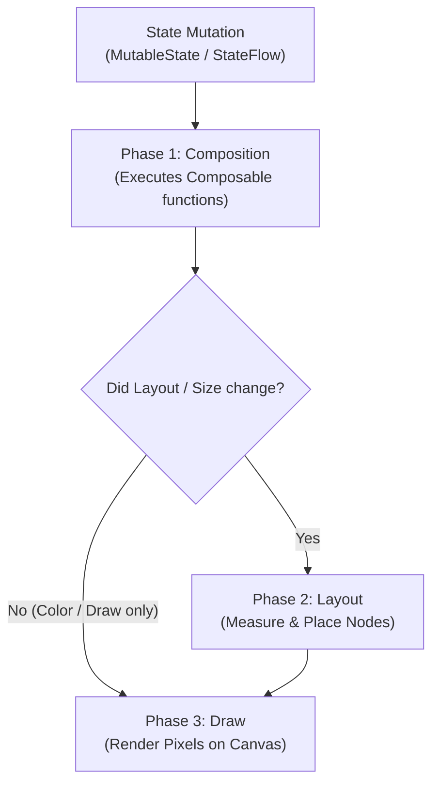
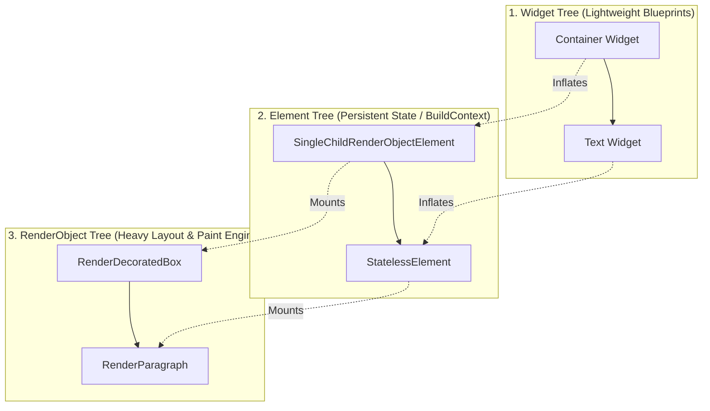

# Chapter 02: Declarative UI Paradigms (Jetpack Compose & Flutter Widgets)

> "In declarative UI, you do not mutate widgets imperatively with getters and setters. Instead, you declare what the UI should look like for a given state: UI = f(State). When state changes, the framework reconciles and redraws only the modified nodes."  
> — *Modern Declarative UI Architecture*
>
> "The Slot Table in Jetpack Compose is an in-memory gap buffer that tracks the call graph and memoizes values across recomposition. Understanding how Compose infers stability is the key to achieving 120 FPS buttery-smooth scrolling."  
> — *Jorge Castillo, Compose Internals*

---

## 🎨 1. Declarative UI: The Mathematical Paradigm Shift

For two decades, mobile UI frameworks operated **Imperatively**:
- Android XML Views: `findViewById<TextView>(R.id.title).setText("New Title")`
- iOS UIKit: `label.text = "New Title"`

Imperative UI causes state-synchronization bugs: when state transitions occur across asynchronous background tasks, views frequently get stuck in inconsistent visual states (e.g. spinner keeps spinning while data is displayed).

### The Declarative Invariant:
$$\text{UI} = f(\text{State})$$
The user interface is a pure projection of the application state. When state changes, the framework rebuilds or reconciles the minimal necessary subtrees.

```
===================================================================================================
                             IMPERATIVE VS. DECLARATIVE UI PIPELINE
===================================================================================================

[ Imperative: Manual Mutation ]
State Changes ──► Developer manually finds View A, View B ──► Mutates properties
- Risk: Forgetting to update View C or clear loading spinner.

[ Declarative: Automated Reconciliation ]
State Changes ──► Framework passes State to f(State) ──► Recomputes UI Diff ──► Repaints Screen
- Invariant: Impossible for UI to desynchronize from active state!
```

---

## 🧩 2. Jetpack Compose Internals: The Slot Table & Recomposition

Jetpack Compose is not just a UI library; it is a **Kotlin Compiler Plugin** paired with an in-memory runtime.

```
===================================================================================================
                                 JETPACK COMPOSE RUNTIME PHASES
===================================================================================================

  1. Composition Phase           2. Layout Phase                3. Draw Phase
  ┌─────────────────────────┐    ┌─────────────────────────┐    ┌─────────────────────────┐
  │ Executes @Composable    │    │ Measures and places     │    │ Paints visual pixels    │
  │ functions to generate   │ ──►│ nodes. Each node        │ ──►│ onto hardware GPU       │
  │ UI Layout Tree.         │    │ measured exactly once.  │    │ canvas (Vulkan/Skia).   │
  └─────────────────────────┘    └─────────────────────────┘    └─────────────────────────┘
```



### 2.1 The Slot Table & Positional Memoization
Under the hood, the Compose `Composer` stores the composition tree in a **Slot Table** (a flattened array using a **Gap Buffer**):
- When `remember { ... }` is invoked, the Composer reads or writes the cached object into the current slot.
- During **Recomposition**, Compose skips functions whose parameters have not changed, provided the parameter types are recognized as **Stable**.

### 2.2 Stability Inference & The Unstable List Trap
Compose inspects class definitions to determine whether a Composable can be skipped:
1. **Primitive / Immutable types:** `Int`, `String`, `Float` are inherently Stable.
2. **Standard Kotlin Collections (`List<T>`, `Set<T>`):** The Compose compiler treats standard `List<T>` as **UNSTABLE** because standard interfaces do not guarantee runtime immutability (e.g., `java.util.ArrayList` can be mutated under the hood).

> [!WARNING]
> Passing `List<Product>` into a Composable causes that Composable to **recompose on every single frame**, even if the list content is identical!
> **Production Fix:** Use Kotlinx Immutable Collections (`ImmutableList<Product>`) or annotate the data class with `@Immutable` / `@Stable`.

---

## 🌳 3. Flutter Widget Architecture: The Three Trees

Flutter renders its UI without using OEM platform widgets. It draws every pixel directly via its graphics engine (**Impeller / Skia**).
To achieve high performance, Flutter maintains **Three Parallel Trees**:

```
===================================================================================================
                                    THE THREE TREES OF FLUTTER
===================================================================================================

  1. Widget Tree (Immutable Blueprints)
  +-----------------------------------------------------------------------------------------------+
  |  Container(color: blue)  ──►  Padding(8.0)  ──►  Text("Checkout")                             |
  |  - Ephemeral, disposable configurations. Recreated on every build() frame!                    |
  +-----------------------------------------------------------------------------------------------+
                                                  │ (Instantiates & Updates)
                                                  ▼
  2. Element Tree (Structural Lifecycle & State)
  +-----------------------------------------------------------------------------------------------+
  |  ComponentElement        ──►  SingleChildElement ──► StatelessElement                         |
  |  - Persistent identity across rebuilds. Manages 'State' object in StatefulWidget.              |
  |  - 'BuildContext' is literally the Element corresponding to that Widget in this tree!          |
  +-----------------------------------------------------------------------------------------------+
                                                  │ (Directs Render Pipeline)
                                                  ▼
  3. RenderObject Tree (Layout, Measure & Paint)
  +-----------------------------------------------------------------------------------------------+
  |  RenderDecoratedBox      ──►  RenderPadding    ──►  RenderParagraph                           |
  |  - Heavyweight mutable nodes. Computes BoxConstraints, layout geometry, and GPU paint draw.    |
  +-----------------------------------------------------------------------------------------------+
```



### 3.1 The Next-Gen Impeller Rendering Engine
In older Flutter versions, Skia compiled GLSL shaders at runtime during first-encounter animations, causing visible **Shader Compilation Jank**.
Flutter's modern **Impeller** engine pre-compiles all shaders Ahead-of-Time during the engine build, utilizing modern GPU APIs (**Vulkan** on Android, **Metal** on iOS) to eliminate runtime stutter.

---

## 💻 4. Side-by-Side Implementations: Production UI Component

To demonstrate production declarative UI engineering, we implement an **E-Commerce Product Card** with dynamic quantity adjustments and animated state transitions in:
1. **Jetpack Compose (Kotlin)**
2. **Flutter Widgets (Dart 3)**

---

### 4.1 Jetpack Compose Implementation (Kotlin 2.0+)

```kotlin
package com.enterprise.mobile.ui.components

import androidx.compose.animation.AnimatedVisibility
import androidx.compose.animation.animateColorAsState
import androidx.compose.animation.core.tween
import androidx.compose.foundation.background
import androidx.compose.foundation.layout.*
import androidx.compose.foundation.shape.RoundedCornerShape
import androidx.compose.material3.*
import androidx.compose.runtime.*
import androidx.compose.ui.Alignment
import androidx.compose.ui.Modifier
import androidx.compose.ui.draw.clip
import androidx.compose.ui.graphics.Color
import androidx.compose.ui.unit.dp

// 1. Immutable Stable Domain Model
@Immutable
data class ProductUiModel(
    val id: String,
    val title: String,
    val priceFormatted: String,
    val stockCount: Int
)

// 2. Production Composable with Recomposition Optimization
@Composable
fun ProductCard(
    product: ProductUiModel,
    quantity: Int,
    onQuantityChanged: (Int) -> Unit,
    modifier: Modifier = Modifier
) {
    // Derived state prevents recomposition unless boolean condition flips!
    val isOutOfStock by remember(product.stockCount) {
        derivedStateOf { product.stockCount <= 0 }
    }

    val cardBgColor by animateColorAsState(
        targetValue = if (quantity > 0) MaterialTheme.colorScheme.primaryContainer else MaterialTheme.colorScheme.surface,
        animationSpec = tween(durationMillis = 300),
        label = "cardBgColorAnimation"
    )

    Card(
        modifier = modifier
            .fillMaxWidth()
            .padding(8.dp)
            .clip(RoundedCornerShape(16.dp)),
        colors = CardDefaults.cardColors(containerColor = cardBgColor),
        elevation = CardDefaults.cardElevation(defaultElevation = 4.dp)
    ) {
        Row(
            modifier = Modifier
                .fillMaxWidth()
                .padding(16.dp),
            verticalAlignment = Alignment.CenterVertically,
            horizontalArrangement = Arrangement.SpaceBetween
        ) {
            Column(modifier = Modifier.weight(1f)) {
                Text(
                    text = product.title,
                    style = MaterialTheme.typography.titleMedium
                )
                Spacer(modifier = Modifier.height(4.dp))
                Text(
                    text = product.priceFormatted,
                    style = MaterialTheme.typography.bodyLarge,
                    color = MaterialTheme.colorScheme.secondary
                )
            }

            if (isOutOfStock) {
                Text(
                    text = "Out of Stock",
                    color = MaterialTheme.colorScheme.error,
                    style = MaterialTheme.typography.labelMedium
                )
            } else {
                Row(verticalAlignment = Alignment.CenterVertically) {
                    IconButton(
                        onClick = { if (quantity > 0) onQuantityChanged(quantity - 1) },
                        enabled = quantity > 0
                    ) {
                        Text("-", style = MaterialTheme.typography.headlineSmall)
                    }

                    Text(
                        text = "$quantity",
                        style = MaterialTheme.typography.titleMedium,
                        modifier = Modifier.padding(horizontal = 8.dp)
                    )

                    IconButton(
                        onClick = { if (quantity < product.stockCount) onQuantityChanged(quantity + 1) }
                    ) {
                        Text("+", style = MaterialTheme.typography.headlineSmall)
                    }
                }
            }
        }
    }
}
```

---

### 4.2 Flutter Implementation (Dart 3)

```dart
import 'package:flutter/material.dart';

// 1. Immutable Model
class ProductItem {
  final String id;
  final String title;
  final String priceFormatted;
  final int stockCount;

  const ProductItem({
    required this.id,
    required this.title,
    required this.priceFormatted,
    required this.stockCount,
  });
}

// 2. Production Product Card Widget with RepaintBoundary
class ProductCardWidget extends StatelessWidget {
  final ProductItem product;
  final int quantity;
  final ValueChanged<int> onQuantityChanged;

  const ProductCardWidget({
    super.key,
    required this.product,
    required this.quantity,
    required this.onQuantityChanged,
  });

  @override
  Widget build(BuildContext context) {
    final theme = Theme.of(context);
    final isOutOfStock = product.stockCount <= 0;

    // RepaintBoundary isolates render layer so card animations do not repaint whole screen!
    return RepaintBoundary(
      child: AnimatedContainer(
        duration: const Duration(milliseconds: 300),
        curve: Curves.easeInOut,
        margin: const EdgeInsets.symmetric(horizontal: 16, vertical: 8),
        padding: const EdgeInsets.all(16),
        decoration: BoxDecoration(
          color: quantity > 0
              ? theme.colorScheme.primaryContainer
              : theme.colorScheme.surface,
          borderRadius: BorderRadius.circular(16),
          boxShadow: [
            BoxShadow(
              color: Colors.black.withOpacity(0.05),
              blurRadius: 10,
              offset: const Offset(0, 4),
            ),
          ],
        ),
        child: Row(
          children: [
            Expanded(
              child: Column(
                crossAxisAlignment: CrossAxisAlignment.start,
                children: [
                  Text(
                    product.title,
                    style: theme.textTheme.titleMedium,
                  ),
                  const SizedBox(height: 4),
                  Text(
                    product.priceFormatted,
                    style: theme.textTheme.bodyLarge?.copyWith(
                      color: theme.colorScheme.secondary,
                    ),
                  ),
                ],
              ),
            ),
            if (isOutOfStock)
              Text(
                'Out of Stock',
                style: theme.textTheme.labelMedium?.copyWith(
                  color: theme.colorScheme.error,
                ),
              )
            else
              Row(
                mainAxisSize: MainAxisSize.min,
                children: [
                  IconButton(
                    icon: const Icon(Icons.remove_circle_outline),
                    onPressed:
                        quantity > 0 ? () => onQuantityChanged(quantity - 1) : null,
                  ),
                  Text(
                    '$quantity',
                    style: theme.textTheme.titleMedium,
                  ),
                  IconButton(
                    icon: const Icon(Icons.add_circle_outline),
                    onPressed: quantity < product.stockCount
                        ? () => onQuantityChanged(quantity + 1)
                        : null,
                  ),
                ],
              ),
          ],
        ),
      ),
    );
  }
}
```

---

## 🚨 5. Failure Modes, Rendering Jank & Production Triage

```
===================================================================================================
                                DECLARATIVE UI TRIAGE RUNBOOK
===================================================================================================

  Anomaly: Compose Unnecessary Recomposition Storm
  ├── Symptom: Screen drops frames during scrolling; Android Profiler shows 50+ recompositions per second.
  ├── Root Cause: Passing unstable objects (e.g. java.util.List or unannotated third-party classes) as arguments.
  └── Triage: Wrap collections with 'kotlinx.collections.immutable.PersistentList' or annotate models with '@Immutable'.

  Anomaly: Flutter Over-Rebuilding Subtrees
  ├── Symptom: Whole page repaints whenever a text counter increments.
  ├── Root Cause: Calling 'setState()' at the root page level instead of encapsulating state locally.
  └── Triage: Scope state with 'ValueNotifier' or wrap the animated subcomponent in a 'RepaintBoundary'.

  Anomaly: Excessive Object Allocations during Draw Phase
  ├── Symptom: Frequent GC pauses (ART GC concurrent copying) during animations.
  ├── Root Cause: Allocating new 'Modifier' or 'Paint()' objects inside the Compose/Draw phase loop.
  └── Triage: Hoist object creations out of the draw scope into 'remember { Paint() }'.
===================================================================================================
```
