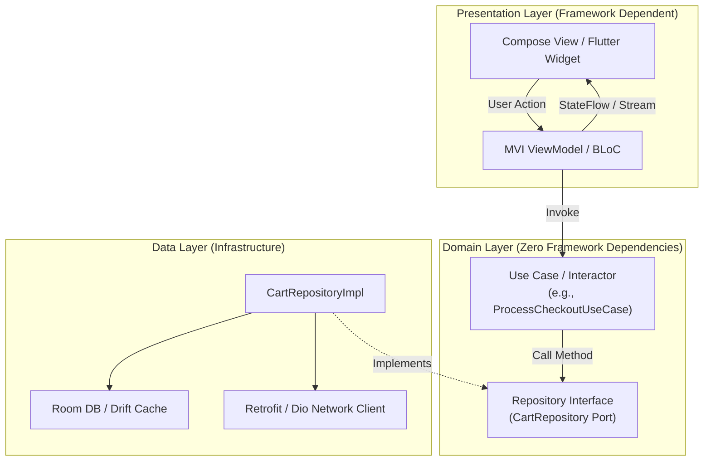

# Chapter 03: Architecture Patterns — MVI, MVVM, Clean Architecture & BLoC

> "Architecture is about intent, not frameworks. A mobile application should be structured so that business rules can be verified in unit tests without starting an Android emulator or booting a Flutter engine."  
> — *Robert C. Martin, Clean Architecture*
>
> "Unidirectional Data Flow (UDF) is the cornerstone of Modern Android Architecture. State flows down, events flow up. By restricting state mutations to a single immutable pipeline, we eliminate race conditions and non-reproducible UI glitches."  
> — *Google Modern Android Architecture Guide*

---

## 🏛️ 1. Clean Architecture in Mobile Clients

Mobile applications often suffer from **Massive Activity / God Widget Syndrome**: networking, database queries, business rules, and UI rendering crammed into a single 2,000-line file.

Clean Architecture enforces the **Dependency Rule**: source code dependencies must point inward toward the high-level business rules.

```
===================================================================================================
                                  MOBILE CLEAN ARCHITECTURE LAYERS
===================================================================================================

  [ UI / Presentation Layer ]
  - Jetpack Compose Screens / Flutter Widgets
  - ViewModel / BLoC / Presenters
  - Manages UI state, renders widgets, captures user gestures.
              │
              ▼ (Depends on Domain)
  [ Domain Layer (Pure Business Logic) ]
  - Use Cases / Interactors (e.g. 'CheckoutCartUseCase')
  - Domain Entities (Pure Kotlin / Dart data classes)
  - Zero dependencies on Android SDK, Compose, or Flutter!
              ▲
              │ (Inverted Dependency via Repository Interfaces)
  [ Data Layer (Infrastructure & Persistence) ]
  - Repository Implementations
  - Local Data Sources (Room DB, Drift SQLite)
  - Remote Data Sources (Retrofit REST, Dio, gRPC)
===================================================================================================
```



---

## 🔄 2. Android: Modern MVI (Model-View-Intent) & Unidirectional Data Flow

In legacy Android MVVM, ViewModels exposed 10+ distinct `MutableLiveData` properties (`isLoading`, `user`, `errorMessage`, `cartItems`). When an asynchronous operation finished, updating multiple streams created race conditions where the UI rendered intermediate, inconsistent states.

**Model-View-Intent (MVI / UDF)** resolves this by enforcing:
1. **Single Immutable UiState:** The entire screen state is captured in a single data class (`StateFlow<UiState>`).
2. **User Intents / Actions:** User gestures are modeled as a sealed interface (`CartIntent`).
3. **One-Time Side Effects (Single Live Events):** Navigation and Snackbars are emitted via a Kotlin `Channel<UiEffect>` to prevent event replay upon screen rotation.

```
===================================================================================================
                             UNIDIRECTIONAL DATA FLOW (UDF) CYCLE
===================================================================================================

            User Clicks "Pay Now" ──────────────► [ CartIntent.SubmitPayment ]
                     ▲                                         │
                     │                                         ▼
            [ Compose Screen ]                     [ CartViewModel (MVI) ]
                     ▲                                         │ (Invokes UseCase)
                     │                                         ▼
            [ UiState.Success ] ◄── (Emits New State) ── [ Process Payment ]
                     ▲
                     └── [ UiEffect.NavigateToSuccess ] (Buffered Channel)
```

---

## 🧱 3. Flutter: The BLoC (Business Logic Component) Pattern

In Flutter, the canonical architecture pattern is **BLoC** (*Felix Angelov*). BLoC uses Dart **Streams** to separate presentation from business logic:
- **Events:** Inputs into the BLoC (e.g., `AddCartItemEvent`).
- **States:** Outputs emitted by the BLoC (e.g., `CartLoadedState`).

```
===================================================================================================
                                      FLUTTER BLoC PIPELINE
===================================================================================================

  [ UI Widget ] ──(dispatches Event: AddItem)──► [ BLoC Event Sink ]
                                                           │
                                                           ▼
                                                [ on<AddItem>((event, emit)) ]
                                                - Executes UseCase
                                                - Interacts with Repository
                                                           │
                                                           ▼
  [ UI Widget ] ◄──(listens to State: CartUpdated)── [ BLoC State Stream ]
```

---

## 💻 4. Side-by-Side Production Implementations: Cart Checkout Workflow

We implement a complete **Cart Checkout Architecture** featuring State, Intents/Events, Use Cases, and ViewModels in:
1. **Kotlin (Modern Android MVI with StateFlow & Channel)**
2. **Dart (Flutter BLoC Pattern)**

---

### 4.1 Android Implementation: MVI with Kotlin Coroutines & StateFlow

```kotlin
package com.enterprise.mobile.cart.presentation

import androidx.lifecycle.ViewModel
import androidx.lifecycle.viewModelScope
import kotlinx.coroutines.channels.Channel
import kotlinx.coroutines.flow.*
import kotlinx.coroutines.launch

// 1. Immutable Screen State
data class CartUiState(
    val items: List<CartItem> = emptyList(),
    val totalCents: Long = 0,
    val isLoading: Boolean = false,
    val errorMessage: String? = null
)

data class CartItem(val id: String, val name: String, val priceCents: Long, val quantity: Int)

// 2. Sealed Interface for User Intents
sealed interface CartIntent {
    data class UpdateQuantity(val itemId: String, val newQuantity: Int) : CartIntent
    object CheckoutClicked : CartIntent
    object RetryClicked : CartIntent
}

// 3. One-Time Side Effects (Single Live Events)
sealed interface CartUiEffect {
    data class ShowSnackbar(val message: String) : CartUiEffect
    data class NavigateToReceipt(val orderId: String) : CartUiEffect
}

// 4. Production MVI ViewModel
class CartViewModel(
    private val checkoutUseCase: CheckoutUseCase
) : ViewModel() {

    private val _uiState = MutableStateFlow(CartUiState())
    val uiState: StateFlow<CartUiState> = _uiState.asStateFlow()

    // Buffered Channel ensures effects are never dropped if UI is rotating!
    private val _effectChannel = Channel<CartUiEffect>(Channel.BUFFERED)
    val effect: Flow<CartUiEffect> = _effectChannel.receiveAsFlow()

    fun handleIntent(intent: CartIntent) {
        when (intent) {
            is CartIntent.UpdateQuantity -> modifyItemQuantity(intent.itemId, intent.newQuantity)
            is CartIntent.CheckoutClicked -> performCheckout()
            is CartIntent.RetryClicked -> performCheckout()
        }
    }

    private fun performCheckout() {
        viewModelScope.launch {
            _uiState.update { it.copy(isLoading = true, errorMessage = null) }
            try {
                val orderId = checkoutUseCase.execute(_uiState.value.items)
                _uiState.update { it.copy(isLoading = false) }
                _effectChannel.send(CartUiEffect.NavigateToReceipt(orderId))
            } catch (e: Exception) {
                _uiState.update { it.copy(isLoading = false, errorMessage = e.message) }
                _effectChannel.send(CartUiEffect.ShowSnackbar("Payment failed: ${e.message}"))
            }
        }
    }

    private fun modifyItemQuantity(itemId: String, quantity: Int) {
        _uiState.update { current ->
            val updated = current.items.map {
                if (it.id == itemId) it.copy(quantity = quantity) else it
            }
            val newTotal = updated.sumOf { it.priceCents * it.quantity }
            current.copy(items = updated, totalCents = newTotal)
        }
    }
}

// Mock UseCase for completeness
class CheckoutUseCase {
    suspend fun execute(items: List<CartItem>): String = "ORD-9821"
}
```

---

### 4.2 Flutter Implementation: BLoC with Equatable & Streams

```dart
import 'package:flutter_bloc/flutter_bloc.dart';

// 1. Immutable BLoC States
abstract class CartState {
  const CartState();
}

class CartLoadingState extends CartState {
  const CartLoadingState();
}

class CartLoadedState extends CartState {
  final List<CartItemDto> items;
  final int totalCents;

  const CartLoadedState({required this.items, required this.totalCents});
}

class CartErrorState extends CartState {
  final String error;
  const CartErrorState(this.error);
}

class CartCheckoutSuccessState extends CartState {
  final String orderId;
  const CartCheckoutSuccessState(this.orderId);
}

class CartItemDto {
  final String id;
  final String name;
  final int priceCents;
  final int quantity;

  const CartItemDto({
    required this.id,
    required this.name,
    required this.priceCents,
    required this.quantity,
  });

  CartItemDto copyWith({int? quantity}) {
    return CartItemDto(
      id: id,
      name: name,
      priceCents: priceCents,
      quantity: quantity ?? this.quantity,
    );
  }
}

// 2. Sealed BLoC Events
abstract class CartEvent {}

class UpdateItemQuantityEvent extends CartEvent {
  final String itemId;
  final int newQuantity;
  UpdateItemQuantityEvent(this.itemId, this.newQuantity);
}

class SubmitCheckoutEvent extends CartEvent {}

// 3. Production Cart BLoC
class CartBloc extends Bloc<CartEvent, CartState> {
  final CheckoutService _checkoutService;

  CartBloc(this._checkoutService)
      : super(const CartLoadedState(items: [], totalCents: 0)) {
    on<UpdateItemQuantityEvent>(_onUpdateQuantity);
    on<SubmitCheckoutEvent>(_onSubmitCheckout);
  }

  void _onUpdateQuantity(
      UpdateItemQuantityEvent event, Emitter<CartState> emit) {
    if (state is CartLoadedState) {
      final current = state as CartLoadedState;
      final updatedItems = current.items.map((item) {
        return item.id == event.itemId
            ? item.copyWith(quantity: event.newQuantity)
            : item;
      }).toList();

      final total = updatedItems.fold<int>(
          0, (sum, item) => sum + (item.priceCents * item.quantity));

      emit(CartLoadedState(items: updatedItems, totalCents: total));
    }
  }

  Future<void> _onSubmitCheckout(
      SubmitCheckoutEvent event, Emitter<CartState> emit) async {
    if (state is! CartLoadedState) return;
    final current = state as CartLoadedState;

    emit(const CartLoadingState());
    try {
      final orderId = await _checkoutService.checkout(current.items);
      emit(CartCheckoutSuccessState(orderId));
    } catch (err) {
      emit(CartErrorState(err.toString()));
    }
  }
}

// Mock service
class CheckoutService {
  Future<String> checkout(List<CartItemDto> items) async => 'ORD-1234';
}
```

---

## 🚨 5. Production Pitfalls & Architecture Triage Runbook

```
===================================================================================================
                                ARCHITECTURE ANOMALY TRIAGE RUNBOOK
===================================================================================================

  Anomaly: SingleLiveEvent / Navigation Replay on Configuration Change
  ├── Symptom: Device is rotated; app navigates to Checkout Receipt screen a second time!
  ├── Root Cause: Modeling one-time events (Navigation/Toasts) directly inside persistent 'StateFlow'.
  └── Triage: Use Kotlin 'Channel<UiEffect>(Channel.BUFFERED)' for one-time side effects;
              collect in UI with 'repeatOnLifecycle(Lifecycle.State.STARTED)'.

  Anomaly: State Explosions & Laggy BLoC Rebuilds
  ├── Symptom: Typing in a text field triggers 40 rebuilds per second across the entire screen.
  ├── Root Cause: Firing BLoC events on every keystroke without debouncing.
  └── Triage: Apply RxDart / Stream transformer debouncing ('debounce(Duration(milliseconds: 300))')
              before passing text inputs to BLoC.

  Anomaly: Domain Layer Leaking Platform Imports
  ├── Symptom: Domain UseCase cannot be tested on local JVM; requires Android context or mockito-android.
  ├── Root Cause: UseCase importing 'android.content.Context' or 'package:flutter/widgets.dart'.
  └── Triage: Pure Domain Invariant: Domain Layer must contain ZERO platform or UI dependencies.
===================================================================================================
```
