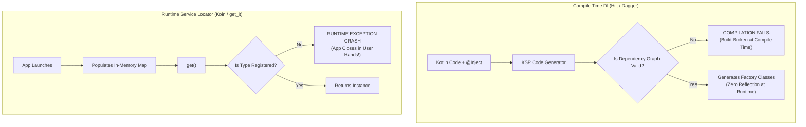

# Chapter 04: Dependency Injection & Service Locators (Hilt, Koin, Injectable)

> "Dependency injection is not about frameworks; it is about writing code where objects receive their collaborators from the outside rather than creating them directly. This single practice makes systems testable, modular, and refactorable."  
> — *Martin Fowler, Inversion of Control Containers and the Dependency Injection Pattern*
>
> "Dagger and Hilt prove their worth at scale. By validating the entire dependency graph at compile-time, they ensure that if your app compiles, you will never experience a runtime crash due to a missing dependency."  
> — *Google Modern Android Architecture Guide*

---

## 💉 1. Theoretical Foundations: Compile-Time DI vs. Runtime Service Locators

```
===================================================================================================
                             DEPENDENCY INJECTION PARADIGM COMPARISON
===================================================================================================

[ Paradigm 1: Compile-Time Dependency Injection (Dagger 2 / Hilt) ]
Source Code ──► KSP / Annotation Processor ──► Generates Factory Code & Validates Graph
- Pros: Catches missing dependencies at COMPILE TIME; zero reflection overhead; fastest runtime.
- Cons: Slower build times due to code generation.

[ Paradigm 2: Runtime Service Locator (Koin / get_it) ]
Source Code ──► App boots ──► Registers types in an in-memory hash map registry
- Pros: Blazing fast compilation; clean idiomatic DSL; minimal boilerplate.
- Cons: Missing dependencies or mismatched types crash at RUNTIME when requested!
```



---

## 🏛️ 2. Android: Hilt Lifecycle Component Hierarchy

Google built **Hilt** on top of Dagger to provide standardized dependency scopes mapped directly to Android OS lifecycle components:

```
===================================================================================================
                                  HILT COMPONENT LIFECYCLE HIERARCHY
===================================================================================================

  [ SingletonComponent ] (@Singleton)
  - Created at Application.onCreate()
  - Lives for the entire app process lifetime.
  - Injected: OkHttpClient, Database, SharedPreferences, Network API.
          │
          ▼
  [ ActivityRetainedComponent ] (@ActivityRetainedScoped)
  - Survives Android screen rotation / configuration changes!
  - Injected: ViewModels, NavGraph controllers.
          │
          ▼
  [ ActivityComponent ] (@ActivityScoped)
  - Recreated whenever Activity rotates.
  - Injected: Screen Navigators, Dialog Managers.
          │
          ▼
  [ FragmentComponent / ViewComponent ]
  - Scoped strictly to UI Fragment / View lifecycle.
===================================================================================================
```

---

## 💻 3. Side-by-Side Production Implementations: E-Commerce DI Graph

We implement a complete production dependency graph providing:
1. HTTP Network Client (OkHttp / Dio)
2. Remote API Client (Retrofit / Dio)
3. Repository Implementation
4. Injection into ViewModel / BLoC

---

### 3.1 Android Implementation: Hilt with Kotlin Symbol Processing (KSP)

```kotlin
package com.enterprise.mobile.di

import android.app.Application
import com.enterprise.mobile.data.remote.OrderApiService
import com.enterprise.mobile.data.repository.OrderRepositoryImpl
import com.enterprise.mobile.domain.repository.OrderRepository
import dagger.Binds
import dagger.Module
import dagger.Provides
import dagger.hilt.InstallIn
import dagger.hilt.android.HiltAndroidApp
import dagger.hilt.components.SingletonComponent
import okhttp3.OkHttpClient
import okhttp3.logging.HttpLoggingInterceptor
import retrofit2.Retrofit
import retrofit2.converter.gson.GsonConverterFactory
import java.util.concurrent.TimeUnit
import javax.inject.Singleton

// 1. Application entry point initializing Hilt
@HiltAndroidApp
class EnterpriseApplication : Application()

// 2. Network Infrastructure Module
@Module
@InstallIn(SingletonComponent::class)
object NetworkModule {

    @Provides
    @Singleton
    fun provideOkHttpClient(): OkHttpClient {
        return OkHttpClient.Builder()
            .connectTimeout(10, TimeUnit.SECONDS)
            .readTimeout(10, TimeUnit.SECONDS)
            .addInterceptor(HttpLoggingInterceptor().apply {
                level = HttpLoggingInterceptor.Level.BODY
            })
            .build()
    }

    @Provides
    @Singleton
    fun provideRetrofit(okHttpClient: OkHttpClient): Retrofit {
        return Retrofit.Builder()
            .baseUrl("https://api.enterprise.com/")
            .client(okHttpClient)
            .addConverterFactory(GsonConverterFactory.create())
            .build()
    }

    @Provides
    @Singleton
    fun provideOrderApiService(retrofit: Retrofit): OrderApiService {
        return retrofit.create(OrderApiService::class.java)
    }
}

// 3. Interface Binding Module (Inverting Dependencies)
@Module
@InstallIn(SingletonComponent::class)
abstract class RepositoryModule {

    @Binds
    @Singleton
    abstract fun bindOrderRepository(
        impl: OrderRepositoryImpl
    ): OrderRepository
}
```

```kotlin
package com.enterprise.mobile.presentation

import androidx.lifecycle.ViewModel
import com.enterprise.mobile.domain.repository.OrderRepository
import dagger.hilt.android.lifecycle.HiltViewModel
import javax.inject.Inject

// 4. Injected ViewModel
@HiltViewModel
class OrderViewModel @Inject constructor(
    private val repository: OrderRepository
) : ViewModel() {
    // ViewModel receives repository without knowing about Retrofit or OkHttp!
}
```

---

### 3.2 Flutter Implementation: `get_it` & `injectable` (Dart 3)

```dart
import 'package:dio/dio.dart';
import 'package:get_it/get_it.dart';
import 'package:injectable/injectable.dart';

final getIt = GetIt.instance;

// 1. Third-Party Library Module
@module
abstract class RegisterModule {
  @lazySingleton
  Dio get dio => Dio(BaseOptions(
        baseUrl: 'https://api.enterprise.com/',
        connectTimeout: const Duration(seconds: 10),
        receiveTimeout: const Duration(seconds: 10),
      ));
}

// 2. Domain Interface
abstract class OrderRepository {
  Future<String> submitOrder(List<String> itemIds);
}

// 3. Concrete Data Implementation with @LazySingleton
@LazySingleton(as: OrderRepository)
class OrderRepositoryImpl implements OrderRepository {
  final Dio dio;

  OrderRepositoryImpl(this.dio);

  @override
  Future<String> submitOrder(List<String> itemIds) async {
    final resp = await dio.post('/orders', data: {'items': itemIds});
    return resp.data['orderId'];
  }
}

// 4. Injectable BLoC / Controller
@injectable
class OrderBloc {
  final OrderRepository repository;

  OrderBloc(this.repository);
}

// 5. Generated DI Initializer Configuration
@InjectableInit(
  initializerName: 'init',
  preferRelativeImports: true,
  asExtension: true,
)
void configureDependencies() => getIt.init();
```

---

## 🚨 4. Production Pitfalls & Triage Runbook

```
===================================================================================================
                                   DI ANOMALY TRIAGE RUNBOOK
===================================================================================================

  Anomaly: Scoping Memory Leak (Android Activity Context Leak)
  ├── Symptom: OutOfMemoryError in Android; heap dump shows 15 destroyed Activities retained.
  ├── Root Cause: Injecting an '@ActivityContext' into a '@Singleton' repository or manager.
  └── Triage: Rule: Never inject Activity contexts into singletons; use '@ApplicationContext' instead.

  Anomaly: Circular Dependency Graph Deadlock
  ├── Symptom: Build fails with "Dependency cycle detected: ServiceA -> ServiceB -> ServiceA".
  ├── Root Cause: Two classes mutually dependent on each other via constructor injection.
  └── Triage: Break cycle using Domain Events / Interfaces, or inject 'dagger.Lazy<ServiceB>' in Java.

  Anomaly: Missing Type Runtime Crash in Koin / get_it
  ├── Symptom: Flutter app crashes in production on a specific screen: 'Object of type X not found'.
  ├── Root Cause: Developer forgot to register dependency in test environment or release flavor.
  └── Triage: Always write a graph-validation unit test verifying that all required types resolve cleanly!
===================================================================================================
```
