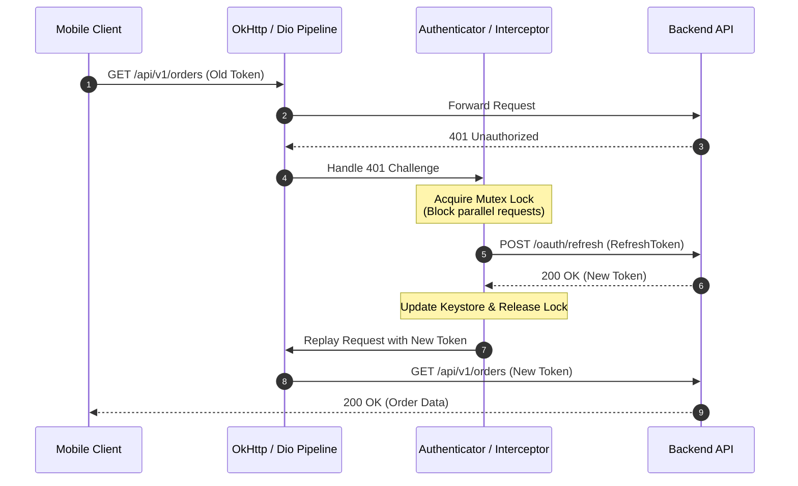

# Chapter 06: Networking, Serialization & Real-Time Sync

> "Mobile networking is fundamentally hostile: cellular towers drop connections, Wi-Fi handshakes stall, and user devices roam between cell networks. An enterprise network stack must implement connection pooling, certificate pinning, automatic token refresh, and robust offline caching."  
> — *Square Mobile Architecture Guidelines*
>
> "Reflection-based JSON parsers (such as legacy Gson) bypass language null-safety checks and incur severe runtime performance penalties. Modern mobile engineering mandates compile-time code-generated serializers like Kotlinx Serialization and Freezed."  
> — *Modern Android & Flutter Performance Standards*

---

## 🌐 1. The Mobile Radio State Machine & Network Optimization

Unlike desktop computers plugged into wired Ethernet, mobile cellular modems transition between distinct power states:

```
===================================================================================================
                                CELLULAR RADIO STATE MACHINE
===================================================================================================

  [ Standby / Idle ] (0 mW)
          │
          ▼ (App sends 500-byte network request)
  [ Full Power Radio State ] (~2500 mW battery drain!)
          │
          ▼ (Request completes; Tail Timer begins: 10 to 20 seconds!)
  [ Low Power State ] (~1000 mW battery drain)
          │
          ▼ (Tail timer expires)
  [ Standby / Idle ]
```

> [!IMPORTANT]
> **The Battery Drain Trap:** Sending a single small network packet every 15 seconds keeps the mobile cellular radio locked in high-power state $100\%$ of the time, draining the user's battery within hours!
> **Production Fix:** Batch network requests together, reuse connections via HTTP/2 multiplexing, and leverage local disk caches.

---

## 🔐 2. The Interceptor Chain & Atomic Token Refresh

When an access token expires, multiple concurrent requests can fail with **HTTP 401 Unauthorized** simultaneously. A naive app attempts to refresh the token 10 times in parallel.

Under the **Queued Authenticator Pattern**, the first 401 locks a mutex, executes a single refresh call, updates the token, and replays all queued requests:

```
===================================================================================================
                             ATOMIC TOKEN REFRESH INTERCEPTOR FLOW
===================================================================================================

  Request A (401) ──┐
  Request B (401) ──┼──► [ Mutex Lock Acquired ] ──► POST /oauth/refresh ──► New Token Acquired
  Request C (401) ──┘           │                                                    │
                                └── Queued until refresh completes                   │
                                                                                     ▼
  Replays Request A, B, C with NEW Token! ◄──────────────────────────────────────────┘
```



---

## 💻 3. Side-by-Side Production Implementations: Network Client

We implement a complete production network client featuring:
1. Base configuration with timeouts and logging
2. Certificate Pinning
3. Atomic 401 Token Refresh Interceptor
4. Compile-Time JSON Serialization

---

### 3.1 Android Implementation: Retrofit 2 + OkHttp + Kotlinx Serialization

```kotlin
package com.enterprise.mobile.network

import kotlinx.coroutines.runBlocking
import kotlinx.coroutines.sync.Mutex
import kotlinx.coroutines.sync.withLock
import kotlinx.serialization.Serializable
import okhttp3.*
import retrofit2.Retrofit
import retrofit2.converter.kotlinx.serialization.asConverterFactory
import kotlinx.serialization.json.Json
import okhttp3.MediaType.Companion.toMediaType
import retrofit2.http.GET
import java.util.concurrent.TimeUnit

// 1. Compile-Time Type-Safe DTO
@Serializable
data class OrderResponseDto(
    val orderId: String,
    val status: String,
    val totalCents: Long
)

// 2. Retrofit API Interface
interface OrderApi {
    @GET("api/v1/orders")
    suspend fun getOrders(): List<OrderResponseDto>
}

// 3. Thread-Safe Token Authenticator with Mutex
class TokenAuthenticator(
    private val tokenStorage: TokenStorage,
    private val authService: AuthRefreshService
) : Authenticator {

    private val refreshMutex = Mutex()

    override fun authenticate(route: Route?, response: Response): Request? {
        // Prevent infinite loops if refresh itself returned 401
        if (responseCount(response) >= 3) return null

        val currentToken = tokenStorage.getAccessToken()

        return runBlocking {
            refreshMutex.withLock {
                // Double-checked locking: check if another thread already refreshed it
                val latestToken = tokenStorage.getAccessToken()
                val tokenToUse = if (latestToken != currentToken && latestToken != null) {
                    latestToken
                } else {
                    val newToken = authService.refreshToken(tokenStorage.getRefreshToken())
                    if (newToken != null) {
                        tokenStorage.saveTokens(newToken.accessToken, newToken.refreshToken)
                        newToken.accessToken
                    } else {
                        return@withLock null // Refresh failed; user must re-login
                    }
                }

                response.request.newBuilder()
                    .header("Authorization", "Bearer $tokenToUse")
                    .build()
            }
        }
    }

    private fun responseCount(response: Response): Int {
        var count = 1
        var prior = response.priorResponse
        while (prior != null) {
            count++
            prior = prior.priorResponse
        }
        return count
    }
}

// 4. OkHttpClient Builder with Certificate Pinning
fun createProductionOkHttpClient(authenticator: TokenAuthenticator): OkHttpClient {
    val certificatePinner = CertificatePinner.Builder()
        .add("api.enterprise.com", "sha256/k2v657xUM4MpNGnCWMYST6L9PpxFYG/orjyVPOW30zg=")
        .build()

    return OkHttpClient.Builder()
        .connectTimeout(15, TimeUnit.SECONDS)
        .readTimeout(15, TimeUnit.SECONDS)
        .certificatePinner(certificatePinner)
        .authenticator(authenticator)
        .build()
}

// Mock helpers
interface TokenStorage {
    fun getAccessToken(): String?
    fun getRefreshToken(): String?
    fun saveTokens(access: String, refresh: String)
}
interface AuthRefreshService {
    suspend fun refreshToken(refresh: String?): TokenPair?
}
data class TokenPair(val accessToken: String, val refreshToken: String)
```

---

### 3.2 Flutter Implementation: Dio with QueuedInterceptorsWrapper

```dart
import 'package:dio/dio.dart';
import 'package:flutter_secure_storage/flutter_secure_storage.dart';

// 1. Production Dio Client Configuration
class ApiClient {
  final Dio dio;
  final FlutterSecureStorage secureStorage;

  ApiClient({required this.dio, required this.secureStorage}) {
    dio.options = BaseOptions(
      baseUrl: 'https://api.enterprise.com/',
      connectTimeout: const Duration(seconds: 15),
      receiveTimeout: const Duration(seconds: 15),
      headers: {'Content-Type': 'application/json'},
    );

    // QueuedInterceptorsWrapper queues concurrent requests while token is refreshing!
    dio.interceptors.add(
      QueuedInterceptorsWrapper(
        onRequest: (options, handler) async {
          final token = await secureStorage.read(key: 'jwt_token');
          if (token != null) {
            options.headers['Authorization'] = 'Bearer $token';
          }
          return handler.next(options);
        },
        onError: (DioException error, handler) async {
          if (error.response?.statusCode == 401) {
            try {
              // 1. Attempt token refresh
              final refreshToken = await secureStorage.read(key: 'refresh_token');
              if (refreshToken == null) return handler.next(error);

              // Use clean Dio instance to avoid recursive interceptor loops!
              final refreshDio = Dio();
              final response = await refreshDio.post(
                'https://api.enterprise.com/oauth/refresh',
                data: {'refreshToken': refreshToken},
              );

              final newAccessToken = response.data['accessToken'];
              final newRefreshToken = response.data['refreshToken'];

              await secureStorage.write(key: 'jwt_token', value: newAccessToken);
              await secureStorage.write(key: 'refresh_token', value: newRefreshToken);

              // 2. Replay original failed request with fresh token
              final requestOptions = error.requestOptions;
              requestOptions.headers['Authorization'] = 'Bearer $newAccessToken';

              final clonedResponse = await dio.fetch(requestOptions);
              return handler.resolve(clonedResponse);
            } catch (refreshErr) {
              // Refresh failed: clear credentials and redirect to login
              await secureStorage.deleteAll();
              return handler.next(error);
            }
          }
          return handler.next(error);
        },
      ),
    );
  }
}
```

---

## 🚨 4. Production Pitfalls & Network Triage Runbook

```
===================================================================================================
                                  NETWORK ANOMALY TRIAGE RUNBOOK
===================================================================================================

  Anomaly: Infinite 401 Token Refresh Storm
  ├── Symptom: App makes 500 refresh requests per second; backend auth service crashes.
  ├── Root Cause: The refresh endpoint itself returns HTTP 401, triggering the interceptor recursively.
  └── Triage: (1) Use an isolated HTTP client without the interceptor for the refresh endpoint;
              (2) Enforce max retry count <= 2 using 'priorResponse' checking.

  Anomaly: SSL Certificate Pinning Blackout
  ├── Symptom: All network calls fail with 'SSLHandshakeException' or 'CERTIFICATE_VERIFY_FAILED'.
  ├── Root Cause: Backend rotated its TLS certificate; mobile app pin hashes were hardcoded.
  └── Triage: Always pin at least 2 backup public key hashes (including intermediate CA);
              deploy a remote config mechanism to update pins dynamically.

  Anomaly: Memory Leak from Uncancelled Requests on Screen Exit
  ├── Symptom: User navigates away, but 5MB image download continues, holding View in memory.
  ├── Root Cause: Network calls not bound to CoroutineScope cancellation or Dio CancelToken.
  └── Triage: In Android, launch network calls inside 'viewModelScope' (auto-cancelled on cleared);
              in Flutter, pass a 'CancelToken' to Dio and invoke cancel() in dispose().
===================================================================================================
```
