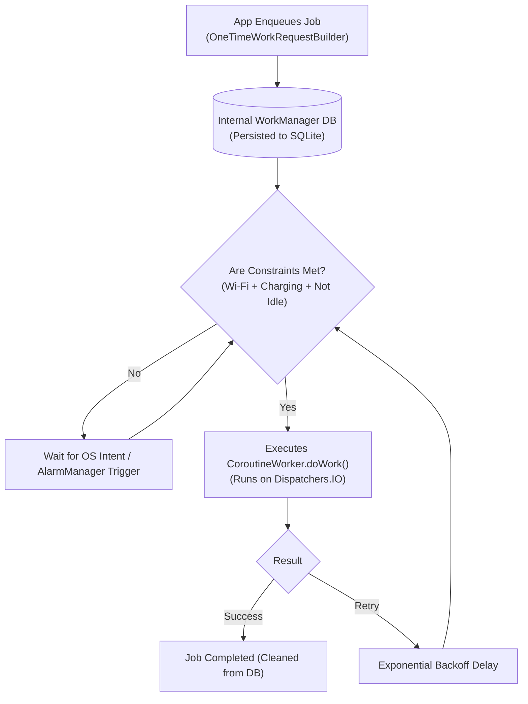

# Chapter 07: Background Processing, Concurrency & Push Notifications

> "Mobile operating systems are ruthless resource managers. If your background process burns CPU cycles or holds wake-locks while the user is not actively engaging with your app, the OS will terminate your process without warning."  
> — *Android OS Power Management Architectural Guidelines*
>
> "WorkManager is the only approved mechanism for deferrable, guaranteed background work in modern Android. It negotiates Doze Mode, battery optimizations, and network constraints on behalf of your application."  
> — *Google Guide to Android Background Work*

---

## 🔋 1. Android OS Power Management: Doze Mode & Standby Buckets

To maximize battery life, Android implements strict background execution throttles:

```
===================================================================================================
                                  DOZE MODE MAINTENANCE WINDOWS
===================================================================================================

  Device Unplugged & Screen Off
             │
             ▼
  [ Light Doze ] ──► Restricts network access; runs jobs only during periodic sync windows.
             │
             ▼ (Stationary for 30+ minutes)
  [ Deep Doze ]
  - Suspends all network access.
  - Ignores all WakeLocks.
  - Defers standard AlarmManager alarms and WorkManager jobs.
             │
             ▼
     Maintenance Window (5 min) ──► Deep Doze (Longer) ──► Maintenance Window
     (Network briefly restored)
```

### 1.1 App Standby Buckets
Android dynamically groups apps into five execution buckets based on recency of user interaction:

| Bucket | Inactivity Criteria | Network Access | WorkManager Job Frequency |
| :--- | :--- | :--- | :--- |
| **Active** | App currently running or in foreground. | Unrestricted | Immediate |
| **Working Set** | Used frequently, not active today. | Minor restrictions | Up to 1 run every 2 hours |
| **Frequent** | Used regularly, e.g. 3 times a week. | Throttled | Up to 1 run every 8 hours |
| **Rare** | Used infrequently, e.g. weekly. | Heavily throttled | Up to 1 run every 24 hours |
| **Restricted** | Consumes excess battery in background. | Zero background network | Blocked completely |

---

## 🛠️ 2. WorkManager Architecture (The Production Standard)

**WorkManager** guarantees task execution even if the user swipes the app out of the Recents menu or the device reboots!

```
===================================================================================================
                                WORKMANAGER JOB SCHEDULING PIPELINE
===================================================================================================

  [ OneTimeWorkRequest / PeriodicWorkRequest ]
  - Constraints: Requires Unmetered Network + Battery Not Low + Charging
  - Backoff: Exponential (10s, 20s, 40s...)
             │
             ▼
  [ WorkManager Database (Internal Room SQLite) ] <── Job metadata persisted to disk!
             │
             ▼ (Checks OS Constraints)
  Are Constraints Met?
     ├── NO  ──► Enqueues in JobScheduler / AlarmManager; waits for charging/Wi-Fi.
     └── YES ──► Boots App Process in Background ──► Invokes CoroutineWorker.doWork()
```



---

## 💻 3. Side-by-Side Production Implementations: Background Sync & FCM

We implement:
1. **Android WorkManager CoroutineWorker** performing offline database sync with exponential retry backoff.
2. **Flutter Firebase Cloud Messaging (FCM)** background push notification handler with Android Notification Channels.

---

### 3.1 Android Implementation: WorkManager CoroutineWorker with Constraints

```kotlin
package com.enterprise.mobile.background

import android.content.Context
import androidx.work.*
import com.enterprise.mobile.data.local.AppDatabase
import com.enterprise.mobile.network.OrderApi
import kotlinx.coroutines.Dispatchers
import kotlinx.coroutines.withContext
import java.util.concurrent.TimeUnit

// 1. Production CoroutineWorker executing background sync
class DatabaseSyncWorker(
    appContext: Context,
    workerParams: WorkerParameters
) : CoroutineWorker(appContext, workerParams) {

    override suspend fun doWork(): Result = withContext(Dispatchers.IO) {
        try {
            println("Starting background database synchronization...")

            // Fetch unsynced local records and push to server
            // orderApi.syncPendingOrders(...)

            println("Database synchronization completed successfully.")
            Result.success()
        } catch (e: Exception) {
            println("Sync failed: ${e.message}. Retrying with exponential backoff...")
            if (runAttemptCount < 3) {
                Result.retry()
            } else {
                Result.failure()
            }
        }
    }

    companion object {
        private const val SYNC_WORK_TAG = "periodic_database_sync"

        // 2. Schedule Enqueue Helper with Constraints
        fun schedulePeriodicSync(context: Context) {
            val constraints = Constraints.Builder()
                .setRequiredNetworkType(NetworkType.UNMETERED) // Requires Wi-Fi!
                .setRequiresBatteryNotLow(true)               // Battery > 15%
                .setRequiresCharging(false)
                .build()

            val syncRequest = PeriodicWorkRequestBuilder<DatabaseSyncWorker>(
                repeatInterval = 6, TimeUnit.HOURS, // Runs every 6 hours
                flexTimeInterval = 30, TimeUnit.MINUTES // Allows 30m flexibility for battery optimization
            )
                .setConstraints(constraints)
                .setBackoffCriteria(
                    BackoffPolicy.EXPONENTIAL,
                    15, TimeUnit.SECONDS
                )
                .addTag(SYNC_WORK_TAG)
                .build()

            WorkManager.getInstance(context).enqueueUniquePeriodicWork(
                SYNC_WORK_TAG,
                ExistingPeriodicWorkPolicy.KEEP, // Retain existing job if already scheduled
                syncRequest
            )
        }
    }
}
```

---

### 3.2 Flutter Implementation: Firebase Cloud Messaging (FCM) & Channels

```dart
import 'package:firebase_core/firebase_core.dart';
import 'package:firebase_messaging/firebase_messaging.dart';
import 'package:flutter_local_notifications/flutter_local_notifications.dart';

// 1. Mandatory Top-Level Background Handler (Runs in an isolated Dart Isolate!)
@pragma('vm:entry-point')
Future<void> _firebaseMessagingBackgroundHandler(RemoteMessage message) async {
  await Firebase.initializeApp();
  print('Handling a background message: ${message.messageId}');
  print('Payload data: ${message.data}');
}

// 2. Production Push Notification Manager
class PushNotificationManager {
  final FirebaseMessaging _firebaseMessaging = FirebaseMessaging.instance;
  final FlutterLocalNotificationsPlugin _localNotifications =
      FlutterLocalNotificationsPlugin();

  static const AndroidNotificationChannel _orderChannel =
      AndroidNotificationChannel(
    'order_updates_channel',
    'Order Updates',
    description: 'Critical notifications regarding order fulfillment',
    importance: Importance.high,
  );

  Future<void> initialize() async {
    // Request permission (iOS & Android 13+)
    NotificationSettings settings = await _firebaseMessaging.requestPermission(
      alert: true,
      badge: true,
      sound: true,
    );

    if (settings.authorizationStatus == AuthorizationStatus.authorized) {
      // Setup Android Notification Channel
      await _localNotifications
          .resolvePlatformSpecificImplementation<
              AndroidFlutterLocalNotificationsPlugin>()
          ?.createNotificationChannel(_orderChannel);

      // Register background handler
      FirebaseMessaging.onBackgroundMessage(_firebaseMessagingBackgroundHandler);

      // Handle Foreground Messages
      FirebaseMessaging.onMessage.listen((RemoteMessage message) {
        final notification = message.notification;
        if (notification != null) {
          _localNotifications.show(
            notification.hashCode,
            notification.title,
            notification.body,
            NotificationDetails(
              android: AndroidNotificationDetails(
                _orderChannel.id,
                _orderChannel.name,
                channelDescription: _orderChannel.description,
                icon: '@mipmap/ic_launcher',
              ),
            ),
          );
        }
      });

      // Obtain device FCM token for backend push targeting
      final token = await _firebaseMessaging.getToken();
      print('Device FCM Registration Token: $token');
    }
  }
}
```

---

## 🚨 4. Production Pitfalls & Background Triage Runbook

```
===================================================================================================
                                BACKGROUND ANOMALY TRIAGE RUNBOOK
===================================================================================================

  Anomaly: FCM Background Notifications Silent / Not Delivered
  ├── Symptom: Push notifications display in foreground, but never appear when app is killed or device idle.
  ├── Root Cause: Backend sent message as 'notification' instead of High Priority 'data' payload.
  └── Triage: Backend must specify 'priority: "high"' and 'content_available: true' to pierce Doze mode.

  Anomaly: Missing Android 14+ Foreground Service Type Crash
  ├── Symptom: App crashes with 'MissingForegroundServiceTypeException' on Android 14 (API 34).
  ├── Root Cause: Starting a foreground service without declaring its type in AndroidManifest.xml.
  └── Triage: Declare 'android:foregroundServiceType="dataSync|location"' in manifest and specify type in startForeground().

  Anomaly: WorkManager Deadlock from Unconstrained Periodic Work
  ├── Symptom: Battery drain reported by Google Play Vitals; background worker triggers every 15 minutes.
  ├── Root Cause: PeriodicWorkRequest interval set too low without Network/Battery constraints.
  └── Triage: Minimum periodic interval allowed is 15 minutes; always attach 'setRequiresBatteryNotLow(true)'.
===================================================================================================
```
