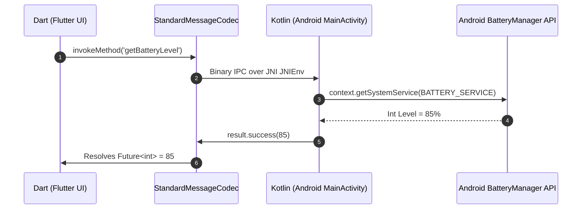

# Chapter 08: Native Platform Channels & Hardware Integration

> "Cross-platform frameworks are not an escape from native development. To build a serious production application, you must master the bridge: Platform Channels and Foreign Function Interfaces (FFI) connecting the cross-platform runtime to the underlying native Android APIs and hardware sensors."  
> — *Flutter Platform Engineering Principles*
>
> "CameraX and BiometricPrompt are prime examples of modern Android APIs built around hardware abstractions. Integrating them safely into Flutter requires understanding asynchronous IPC serialization over binary message buses."  
> — *Android Hardware Integration Manual*

---

## 🌉 1. The Platform Channel Architecture

Flutter runs inside its own C++ engine and Dart VM. When a Flutter application needs access to native hardware (e.g. Battery Manager, Bluetooth Low Energy, Biometric Sensors, CameraX), it communicates with the native Android host via **Platform Channels**:

```
===================================================================================================
                                PLATFORM CHANNEL BINARY MESSAGE BUS
===================================================================================================

  [ Flutter / Dart Layer ]                                        [ Native Android / Kotlin Layer ]
  MethodChannel('com.enterprise/battery')                         MethodChannel(flutterEngine, ...)
             │                                                                   │
             ├── 1. invokeMethod('getBatteryLevel') ────────►                    │
             │                                              │                    │
             ▼                                              ▼                    ▼
  +-----------------------------------------------------------------------------------------------+
  |                              StandardMessageCodec BINARY BUS                                  |
  |  - Serializes Dart types (String, int, Map) into compact binary ByteBuffer (UTF-8 / Little-Endian)|
  +-----------------------------------------------------------------------------------------------+
             ▲                                              │                    │
             │                                              ├── 2. Decodes binary args           │
             │                                              ├── 3. Queries Android BatteryManager│
             │                                              └── 4. result.success(batteryLevel)  │
             │                                                                   │
             ◄── 5. Returns Binary Payload ──────────────────────────────────────┘
```



### 1.1 The Three Channel Paradigms
1. **`MethodChannel`:** Asynchronous Request/Response (RPC). Used for one-off method calls (e.g., query battery level, authenticate biometric).
2. **`EventChannel`:** Continuous Asynchronous Data Streaming. Used for ongoing sensor events (e.g., accelerometer, GPS coordinates, Bluetooth packet stream).
3. **`BasicMessageChannel`:** Semi-structured message passing for custom binary codecs or custom image buffer streaming.

### 1.2 Dart FFI (Foreign Function Interface)
For ultra-performance scenarios (e.g., C/C++ computer vision, image manipulation, native cryptography), Platform Channels introduce JNI serialization overhead.
**Dart FFI (`dart:ffi`)** bypasses the platform channel entirely, invoking compiled C dynamic libraries (`.so`) directly from Dart in **$< 1\mu\text{s}$**!

---

## 💻 2. Side-by-Side Production Implementations: Biometric Authentication Bridge

We implement a complete **Biometric Authentication Bridge** where Flutter delegates to Android's native `BiometricPrompt`:
1. **Android Native Side (Kotlin `MainActivity`)**
2. **Flutter Client Side (Dart 3 `MethodChannel`)**

---

### 2.1 Android Host Implementation (Kotlin + BiometricPrompt)

```kotlin
package com.enterprise.mobile

import android.os.Build
import androidx.annotation.NonNull
import androidx.biometric.BiometricManager
import androidx.biometric.BiometricPrompt
import androidx.core.content.ContextCompat
import androidx.fragment.app.FragmentActivity
import io.flutter.embedding.android.FlutterFragmentActivity
import io.flutter.embedding.engine.FlutterEngine
import io.flutter.plugin.common.MethodChannel

// Must inherit from FlutterFragmentActivity to support AndroidX BiometricPrompt!
class MainActivity : FlutterFragmentActivity() {

    private val CHANNEL = "com.enterprise.security/biometrics"

    override fun configureFlutterEngine(@NonNull flutterEngine: FlutterEngine) {
        super.configureFlutterEngine(flutterEngine)

        MethodChannel(flutterEngine.dartExecutor.binaryMessenger, CHANNEL).setMethodCallHandler { call, result ->
            when (call.method) {
                "canAuthenticate" -> {
                    val biometricManager = BiometricManager.from(this)
                    val authenticators = BiometricManager.Authenticators.BIOMETRIC_STRONG
                    val canAuth = biometricManager.canAuthenticate(authenticators) == BiometricManager.BIOMETRIC_SUCCESS
                    result.success(canAuth)
                }

                "authenticateUser" -> {
                    val title = call.argument<String>("title") ?: "Biometric Authentication"
                    val subtitle = call.argument<String>("subtitle") ?: "Verify your identity"

                    executeBiometricAuthentication(title, subtitle, result)
                }

                else -> result.notImplemented()
            }
        }
    }

    private fun executeBiometricAuthentication(
        title: String,
        subtitle: String,
        result: MethodChannel.Result
    ) {
        val executor = ContextCompat.getMainExecutor(this)

        val promptInfo = BiometricPrompt.PromptInfo.Builder()
            .setTitle(title)
            .setSubtitle(subtitle)
            .setNegativeButtonText("Cancel")
            .setAllowedAuthenticators(BiometricManager.Authenticators.BIOMETRIC_STRONG)
            .build()

        val biometricPrompt = BiometricPrompt(
            this,
            executor,
            object : BiometricPrompt.AuthenticationCallback() {
                override fun onAuthenticationSucceeded(authResult: BiometricPrompt.AuthenticationResult) {
                    super.onAuthenticationSucceeded(authResult)
                    // Return success boolean to Flutter
                    result.success(true)
                }

                override fun onAuthenticationError(errorCode: Int, errString: CharSequence) {
                    super.onAuthenticationError(errorCode, errString)
                    result.error("AUTH_ERROR", errString.toString(), errorCode)
                }

                override fun onAuthenticationFailed() {
                    super.onAuthenticationFailed()
                    // Soft failure (e.g. unrecognised fingerprint); user can retry
                }
            }
        )

        biometricPrompt.authenticate(promptInfo)
    }
}
```

---

### 2.2 Flutter Client Implementation (Dart 3 MethodChannel)

```dart
import 'package:flutter/services.dart';

class BiometricAuthService {
  static const MethodChannel _channel =
      MethodChannel('com.enterprise.security/biometrics');

  // Query hardware capability
  Future<bool> isBiometricsAvailable() async {
    try {
      final bool canAuth = await _channel.invokeMethod('canAuthenticate');
      return canAuth;
    } on PlatformException catch (e) {
      print('Failed to check biometrics: ${e.message}');
      return false;
    }
  }

  // Trigger Native Biometric Prompt
  Future<bool> authenticate({
    String title = 'Authorize Payment',
    String subtitle = 'Confirm \$149.99 purchase',
  }) async {
    try {
      final bool success = await _channel.invokeMethod('authenticateUser', {
        'title': title,
        'subtitle': subtitle,
      });
      return success;
    } on PlatformException catch (e) {
      print('Biometric error: code=${e.code}, message=${e.message}');
      return false;
    }
  }
}
```

---

## 🚨 3. Production Pitfalls & Hardware Bridge Triage Runbook

```
===================================================================================================
                             HARDWARE BRIDGE ANOMALY TRIAGE RUNBOOK
===================================================================================================

  Anomaly: MissingPluginException Crash on Flutter Launch
  ├── Symptom: App throws 'MissingPluginException(No implementation found for method X on channel Y)'.
  ├── Root Cause: Channel name string mismatch between Dart and Kotlin, or MainActivity not registered.
  └── Triage: Verify exact channel name matching; ensure 'configureFlutterEngine()' is invoked.

  Anomaly: Thread Deadlock on Synchronous Platform Call
  ├── Symptom: Android app freezes completely during platform channel execution.
  ├── Root Cause: Invoking a blocking synchronous method on the Android Main UI Thread.
  └── Triage: In Kotlin, offload heavy native work to 'Dispatchers.IO' or Java Executor;
              always return the result on the Main thread via 'runOnUiThread { result.success(...) }'.

  Anomaly: BiometricPrompt FragmentActivity Cast Crash
  ├── Symptom: App crashes with 'ClassCastException: MainActivity cannot be cast to FragmentActivity'.
  ├── Root Cause: MainActivity inherits from standard 'FlutterActivity' instead of 'FlutterFragmentActivity'.
  └── Triage: Update MainActivity to extend 'io.flutter.embedding.android.FlutterFragmentActivity'.
===================================================================================================
```
