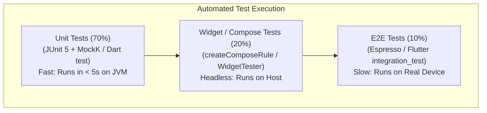

# Chapter 10: CI-CD, Release Engineering & Testing (Unit, Widget, E2E)

> "A test suite that runs in 45 minutes on a local machine will eventually be skipped by developers. Automated mobile pipelines must leverage fast local JVM unit tests, headless widget tests, and hermetic cloud emulators for end-to-end regression validation."  
> — *Enterprise Mobile Release Engineering Guidelines*
>
> "The Google Play App Bundle (.aab) changed mobile deployment: developers no longer ship monolithic APKs. The Play Store generates optimized, device-specific split APKs tailored to the user's exact CPU architecture and screen density."  
> — *Google Play Release Management Manual*

---

## 🧪 1. The Mobile Testing Pyramid

```
===================================================================================================
                                     THE MOBILE TESTING PYRAMID
===================================================================================================

                /\
               /  \       [ 10% End-to-End UI Tests ]
              / UI \      - Runs on Real Devices / Emulators (Espresso / Flutter IntegrationTest)
             /------\     - Validates end-to-end checkout, payment gateway, native hardware.
            /        \
           / Component\   [ 20% Component & Widget Tests ]
          /  & Widget  \  - Runs headless on host machine (Compose UI Test / Flutter WidgetTester)
         /--------------\ - Verifies visual rendering, user clicks, and state transitions.
        /                \
       /   Unit Tests     \ [ 70% Unit Tests (The Foundation) ]
      /   (Pure Logic)     \- Runs on local JVM / Dart VM in < 5 seconds!
     /----------------------\- Verifies UseCases, ViewModels, BLoCs, Repositories, Reducers.
```



---

## 💻 2. Side-by-Side Production Test Implementations

We implement unit tests for a ViewModel and BLoC asserting asynchronous state transitions and effects in:
1. **Kotlin (JUnit 5 + MockK + Turbine)**
2. **Dart (Flutter `test` + `bloc_test`)**

---

### 2.1 Android Implementation: Testing StateFlow & Channels with Turbine

```kotlin
package com.enterprise.mobile.cart.presentation

import app.cash.turbine.test
import io.mockk.coEvery
import io.mockk.mockk
import kotlinx.coroutines.Dispatchers
import kotlinx.coroutines.ExperimentalCoroutinesApi
import kotlinx.coroutines.test.*
import org.junit.jupiter.api.AfterEach
import org.junit.jupiter.api.Assertions.assertEquals
import org.junit.jupiter.api.BeforeEach
import org.junit.jupiter.api.Test

@OptIn(ExperimentalCoroutinesApi::class)
class CartViewModelTest {

    private val testDispatcher = StandardTestDispatcher()
    private val mockCheckoutUseCase = mockk<CheckoutUseCase>()
    private lateinit var viewModel: CartViewModel

    @BeforeEach
    fun setUp() {
        Dispatchers.setMain(testDispatcher) // Replace Android Main dispatcher with Test dispatcher
        viewModel = CartViewModel(mockCheckoutUseCase)
    }

    @AfterEach
    fun tearDown() {
        Dispatchers.resetMain()
    }

    @Test
    fun `checkout success emits loading state and navigates to receipt`() = runTest {
        // Arrange
        val expectedOrderId = "ORD-9999"
        coEvery { mockCheckoutUseCase.execute(any()) } returns expectedOrderId

        // Assert StateFlow emissions using Turbine
        viewModel.uiState.test {
            // Initial state
            assertEquals(false, awaitItem().isLoading)

            // Act
            viewModel.handleIntent(CartIntent.CheckoutClicked)

            // Assert Loading state
            assertEquals(true, awaitItem().isLoading)

            // Assert Loading completes
            assertEquals(false, awaitItem().isLoading)
        }

        // Assert Channel Side-Effect using Turbine
        viewModel.effect.test {
            val effect = awaitItem()
            assert(effect is CartUiEffect.NavigateToReceipt)
            assertEquals(expectedOrderId, (effect as CartUiEffect.NavigateToReceipt).orderId)
        }
    }
}
```

---

### 2.2 Flutter Implementation: Unit & BLoC Testing (`bloc_test`)

```dart
import 'package:bloc_test/bloc_test.dart';
import 'package:flutter_test/flutter_test.dart';
import 'package:mocktail/mocktail.dart';

// Mock dependency
class MockCheckoutService extends Mock implements CheckoutService {}

void main() {
  late MockCheckoutService mockCheckoutService;

  setUp(() {
    mockCheckoutService = MockCheckoutService();
  });

  group('CartBloc Tests', () {
    blocTest<CartBloc, CartState>(
      'emits [CartLoadingState, CartCheckoutSuccessState] when checkout succeeds',
      build: () {
        when(() => mockCheckoutService.checkout(any()))
            .thenAnswer((_) async => 'ORD-5555');
        return CartBloc(mockCheckoutService);
      },
      act: (bloc) => bloc.add(SubmitCheckoutEvent()),
      expect: () => [
        isA<CartLoadingState>(),
        isA<CartCheckoutSuccessState>().having(
          (state) => state.orderId,
          'orderId',
          'ORD-5555',
        ),
      ],
      verify: (_) {
        verify(() => mockCheckoutService.checkout(any())).called(1);
      },
    );
  });
}
```

---

## 🚀 3. CI/CD Release Automation Pipeline: Fastlane & GitHub Actions

```
===================================================================================================
                                MOBILE CI/CD DEPLOYMENT PIPELINE
===================================================================================================

  Git Commit (PR / Main)
            │
            ▼ (GitHub Actions Workflow)
  +-----------------------------------------------------------------------------------------------+
  |  1. Static Code Analysis: Ktlint / Detekt (Kotlin) | Dart Analyze / Custom Lints              |
  |  2. Fast Unit & Widget Tests: ./gradlew test | flutter test --coverage                        |
  |  3. Build Android App Bundle: ./gradlew bundleRelease | flutter build appbundle               |
  +-----------------------------------------------------------------------------------------------+
            │
            ▼ (Fastlane Release Execution)
  +-----------------------------------------------------------------------------------------------+
  |  4. Code Signing: Signs bundle with Production Keystore (Stored in Secret Vault)              |
  |  5. Upload to Google Play: Distributes .aab to 'Internal Testing' Track via Play API          |
  |  6. Notifies Engineering Team via Slack / Datadog Webhook                                     |
  +-----------------------------------------------------------------------------------------------+
```

### 3.1 Production Fastlane Configuration (`Fastfile`)
```ruby
default_platform(:android)

platform :android do
  desc "Run unit tests and build release Android App Bundle"
  lane :build_and_test do
    gradle(task: "clean test")
  end

  desc "Deploy new build to Google Play Console Internal Track"
  lane :deploy_internal do
    build_and_test
    gradle(
      task: "bundle",
      build_type: "Release"
    )
    upload_to_play_store(
      track: "internal",
      package_name: "com.enterprise.mobile",
      aab: "app/build/outputs/bundle/release/app-release.aab",
      skip_upload_images: true,
      skip_upload_screenshots: true
    )
  end
end
```

---

## 🚨 4. Production Release Triage & Google Play Rejection Runbook

```
===================================================================================================
                                  RELEASE ANOMALY TRIAGE RUNBOOK
===================================================================================================

  Anomaly: Google Play Store Policy Rejection (SMS / Foreground Service)
  ├── Symptom: Release submission rejected: 'Use of high-risk permissions is not compliant'.
  ├── Root Cause: Requesting 'RECEIVE_SMS' or undeclared 'FOREGROUND_SERVICE' permissions.
  └── Triage: Replace SMS permission with Google SMS Retriever API; declare explicit foreground service types.

  Anomaly: App Bundle Signature Verification Mismatch
  ├── Symptom: Play Store rejects upload: 'The Android App Bundle was signed with the wrong key'.
  ├── Root Cause: Play App Signing enabled; local keystore used instead of Play Upload Key.
  └── Triage: Generate dedicated Upload Keystore; submit upload certificate reset request in Play Console.

  Anomaly: Flaky CI UI Tests on Headless Emulators
  ├── Symptom: Espresso or integration tests fail randomly (10% flake rate) in GitHub Actions runner.
  ├── Root Cause: Emulator hardware acceleration disabled; animations causing race conditions.
  └── Triage: Disable all window/transition animations on emulator:
              'adb shell settings put global window_animation_scale 0'.
===================================================================================================
```
