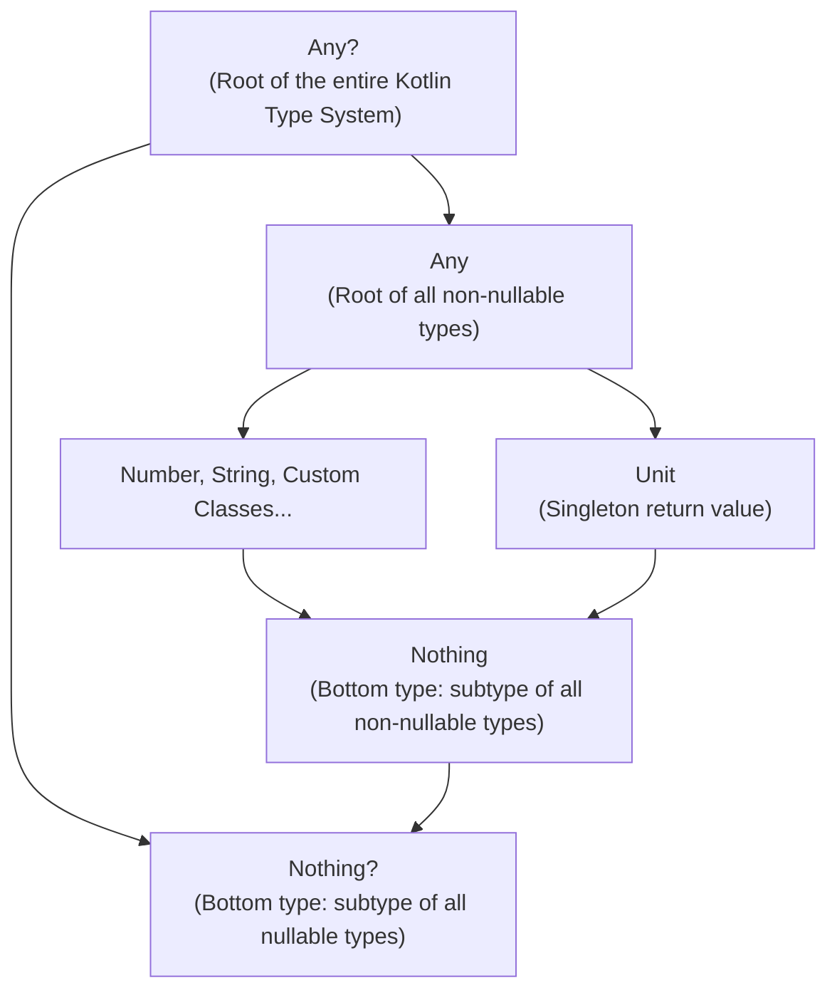
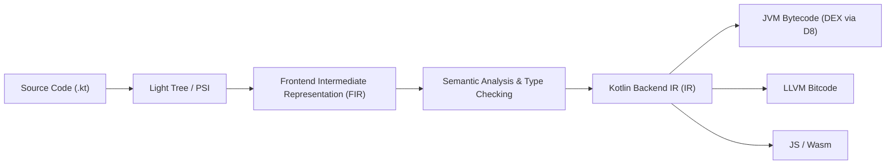

# 01. Kotlin Language In-Depth & Type System Internals

> "To truly master Android engineering, one cannot treat Kotlin as mere syntax sugar over Java. Kotlin is an advanced, statically typed, expression-oriented language with a sophisticated type hierarchy, unique variance rules, compiler-generated bytecode machinery, and zero-cost abstractions."  
> — *Referencing Kotlin in Action (2nd Edition) & Effective Kotlin (Marcin Moskala)*

---

## 1. The Kotlin Type Hierarchy: Theory & Mechanics

Kotlin does not have primitive types at the language level. Every type is an object conceptually, although the Kotlin compiler optimizes them into JVM primitive types (`int`, `long`, `double`, `boolean`) whenever possible.



### 1.1 `Any` vs `Any?`
* `Any` is the supertype of all non-nullable types in Kotlin. It declares three member methods: `equals()`, `hashCode()`, and `toString()`. Unlike Java's `java.lang.Object`, it does not declare concurrency synchronization methods (`wait()`, `notify()`).
* `Any?` is the true top type of the entire Kotlin type system. Both nullable and non-nullable types are subtypes of `Any?`.

### 1.2 `Unit` vs `Nothing`
* `Unit`: Corresponds to `void` in Java, but is a real singleton object instance (`kotlin.Unit`). Functions returning `Unit` return a concrete instance, enabling higher-order generic functions to treat them homogeneously (`Function0<Unit>` instead of requiring special `Void` adapters).
* `Nothing`: The **bottom type** in Kotlin. It has no instances. It represents an expression that can never complete normally (e.g., a function that always throws an exception or enters an infinite loop). Because `Nothing` is a subtype of all types, it allows expressions like:
  ```kotlin
  val port: Int = config["port"]?.toInt() ?: throw IllegalStateException("Missing port")
  ```
  The Elvis right-hand side is of type `Nothing`, which is a subtype of `Int`, satisfying the type checker.

### 1.3 Nullable Types & Platform Types (`T!`)
When interoperating with Java code without nullability annotations (`@Nullable` / `@NonNull`), the Kotlin compiler creates **Platform Types**, denoted with an exclamation mark (`String!`).
* The compiler relaxes null-safety checks on platform types: you can treat them as either nullable or non-nullable.
* If a platform type is treated as non-nullable and Java returns `null`, the Kotlin runtime immediately throws a `NullPointerException` at the call-site via compiler-generated intrinsic checks: `Intrinsics.checkNotNullExpressionValue(result, "...")`.

---

## 2. Generics, Subtyping & Variance

Subtyping is a binary relation: $A \le B$ means $A$ is a subtype of $B$. If $A \le B$, a value of type $A$ can be used anywhere a value of type $B$ is expected. However, generic types are **invariant** by default: `List<Dog>` is not a subtype of `List<Animal>`.

### 2.1 Covariance (`out`)
A generic type $G<T>$ is **covariant** if $A \le B \implies G<A> \le G<B>$.
* In Kotlin, covariance is declared using the `out` modifier.
* Types marked with `out` can only be **produced** (returned from methods), never consumed (passed as arguments).

```kotlin
// Declaration-site Covariance
interface Source<out T> {
    fun produce(): T // Allowed: T is in 'out' position
    // fun consume(item: T) // Compile-time Error! T cannot be in 'in' position
}

fun copyAnimals(source: Source<Dog>) {
    val animalSource: Source<Animal> = source // Valid because Source is covariant
}
```

### 2.2 Contravariance (`in`)
A generic type $G<T>$ is **contravariant** if $A \le B \implies G<B> \le G<A>$.
* In Kotlin, contravariance is declared using the `in` modifier.
* Types marked with `in` can only be **consumed** (passed as method arguments), never produced.

```kotlin
// Declaration-site Contravariance
interface Consumer<in T> {
    fun consume(item: T) // Allowed: T is in 'in' position
    // fun produce(): T // Compile-time Error!
}

val animalConsumer: Consumer<Animal> = object : Consumer<Animal> {
    override fun consume(item: Animal) { println(item.name) }
}
val dogConsumer: Consumer<Dog> = animalConsumer // Valid: Consumer<Animal> can consume Dogs!
```

### 2.3 Use-Site Variance (Type Projections) vs Declaration-Site
Java only supports use-site variance (`? extends T` and `? super T`). Kotlin supports both. Use-site variance in Kotlin projects an invariant type:

```kotlin
fun <T> copy(from: Array<out T>, to: Array<in T>) {
    for (i in from.indices) {
        to[i] = from[i]
    }
}
```

### 2.4 Reified Type Parameters
Because the JVM uses type erasure, generic type arguments are erased at runtime (`List<String>` becomes `List` in bytecode). You cannot check `if (value is T)` normally.
Using `inline` functions with `reified` type parameters instructs the compiler to inline the function body directly at the call-site, preserving the concrete class reference in bytecode:

```kotlin
inline fun <reified T> Bundle.getParcelableExtra(key: String): T? {
    val value = this.getParcelable(key) as? Any
    return if (value is T) value else null
}
```

---

## 3. Inline Value Classes & Zero-Cost Abstractions

Allocating heap objects for domain models (e.g., `UserId`, `OrderId`, `CurrencyAmount`) incurs heap allocation overhead, pointer dereferences, and Garbage Collection pressure.

Kotlin introduces **Inline Value Classes** (`@JvmInline value class`).

```kotlin
@JvmInline
value class AccountId(val rawId: Long) {
    init {
        require(rawId > 0) { "Account ID must be positive" }
    }
    
    val formatted: String
        get() = "ACC-$rawId"
}
```

### 3.1 Bytecode Decompilation & Name Mangling
In the generated bytecode, instances of `AccountId` are erased to a primitive `long`. There is **zero memory allocation** for instances on the stack.
To prevent method signature clashes when two functions differ only by value class wrappers:
```kotlin
fun process(id: AccountId) {}
fun process(id: Long) {} // Would clash in bytecode if erased to process(long id)
```
The Kotlin compiler uses **Name Mangling**, appending a hash of the type name to the method:
```java
// Bytecode representation
public static final void process-xY78a(long id) { ... }
public static final void process(long id) { ... }
```

### 3.2 The Boxing Trap
An inline value class is boxed into a full JVM object whenever:
1. It is used as a generic type argument (`List<AccountId>`).
2. It is assigned to a nullable type (`AccountId?`).
3. It is passed as an interface type that it implements (`val x: Identifiable = AccountId(10)`).

---

## 4. Property Delegation Internals

Delegation in Kotlin is implemented using the `by` keyword. For properties, the compiler delegates reads and writes to an underlying delegate object:

```kotlin
class Example {
    var p: String by Delegate()
}
```

### 4.1 Compiler Bytecode Desugaring
The compiler generates a hidden delegate field and transforms property accessors:
```java
public final class Example {
    private final Delegate p$delegate = new Delegate();
    
    public final String getP() {
        return this.p$delegate.getValue(this, $$delegatedProperties[0]);
    }
    
    public final void setP(String value) {
        this.p$delegate.setValue(this, $$delegatedProperties[0], value);
    }
}
```

### 4.2 Production Custom Delegate: Thread-Safe Expiring Cache
Here is an enterprise-grade property delegate implementing sliding-window expiration:

```kotlin
import kotlin.properties.ReadOnlyProperty
import kotlin.reflect.KProperty
import java.util.concurrent.atomic.AtomicReference

class ExpiringCacheDelegate<T>(
    private val ttlMillis: Long,
    private val clock: () -> Long = System::currentTimeMillis,
    private val loader: () -> T
) : ReadOnlyProperty<Any?, T> {

    private data class CacheEntry<T>(val value: T, val expiresAt: Long)
    private val entryRef = AtomicReference<CacheEntry<T>?>(null)

    override fun getValue(thisRef: Any?, property: KProperty<*>): T {
        val now = clock()
        val current = entryRef.get()
        
        if (current != null && current.expiresAt > now) {
            return current.value
        }
        
        // Value expired or uninitialized: compute new value atomically
        val newValue = loader()
        val newEntry = CacheEntry(newValue, now + ttlMillis)
        entryRef.set(newEntry)
        return newValue
    }
}

// Extension factory for ergonomic use
fun <T> expiringCache(ttlMillis: Long, loader: () -> T) = 
    ExpiringCacheDelegate(ttlMillis, loader = loader)
```

---

## 5. Kotlin K2 Compiler Architecture

The Kotlin 2.0 compiler (K2) completely rewrites the frontend pipeline for dramatic performance improvements and deeper multiplatform parity.



1. **Frontend IR (FIR)**: Replaces the old descriptor-based frontend with a unified semantic model. FIR provides faster resolution, accurate control-flow analysis, and unified type checking.
2. **Backend IR**: The unified compiler backend that enables writing compiler plugins once (e.g., Jetpack Compose Compiler, Kotlinx Serialization) and running them across JVM, Native, and Wasm targets.
3. **Kotlin Symbol Processing (KSP)**: KSP operates directly on the compiler's syntax trees rather than generating Java stubs like KAPT, achieving up to 2x faster annotation processing in large Android codebases.
