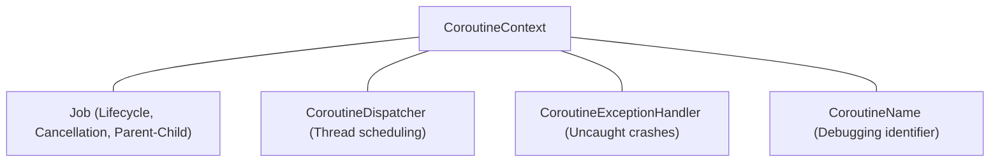
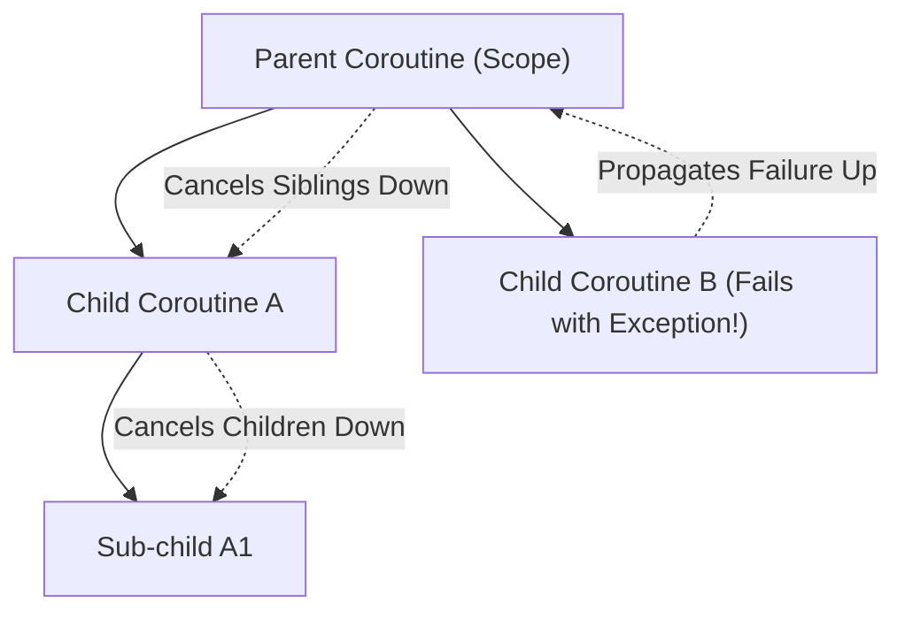
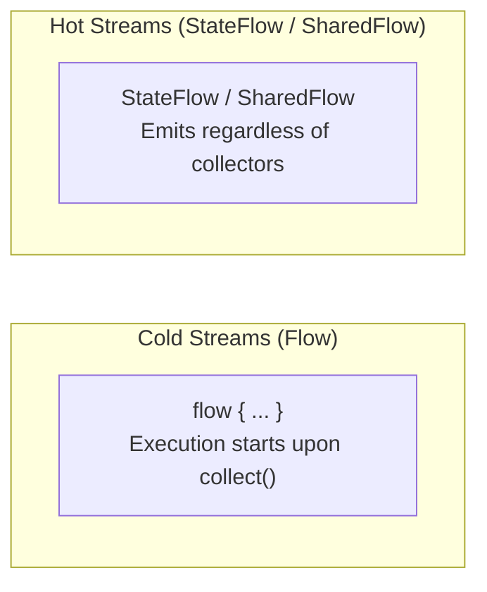

# 02. Kotlin Coroutines & Structured Concurrency Under the Hood

> "Coroutines are not magical green threads. A coroutine is a user-space, stackless continuation-passing-style state machine that cooperatively yields execution to a thread pool dispatcher without blocking underlying OS threads."  
> — *Referencing Kotlin Coroutines: Deep Dive (Marcin Moskala) & Roman Elizarov's Concurrency Architecture*

---

## 1. The Continuation-Passing Style (CPS) Transformation

When the Kotlin compiler encounters a function marked with `suspend`, it modifies its signature and transforms the entire function body into a state machine.

### 1.1 The Transformed Signature
Consider the following Kotlin function:
```kotlin
suspend fun fetchUserProfile(userId: String): UserProfile
```
During compilation, the compiler strips the `suspend` keyword and appends an extra parameter of type `Continuation<T>`, transforming the return type to `Any?`:
```java
// Bytecode representation of the suspend function
public static final Object fetchUserProfile(String userId, Continuation<? super UserProfile> $completion)
```
The return value is `Any?` because the function can either:
1. Return the actual `UserProfile` immediately if the data was already cached.
2. Return a sentinel value `kotlin.coroutines.intrinsics.COROUTINE_SUSPENDED` if the execution yielded asynchronously.

### 1.2 State Machine Decompilation
Every suspension point splits the function into discrete states. Consider:

```kotlin
suspend fun syncData() {
    println("Step 1: Auth")
    val token = authenticate()
    println("Step 2: Fetch Data with $token")
    val data = fetchData(token)
    println("Step 3: Save Data $data")
    saveData(data)
}
```

The compiler desugars this into a class extending `ContinuationImpl`:

```java
public final class SyncDataStateMachine extends ContinuationImpl {
    int label = 0;
    Object result;
    String token;
    Data data;
    
    @Override
    public Object invokeSuspend(Object $result) {
        this.result = $result;
        this.label |= Integer.MIN_VALUE;
        return syncData(this);
    }
}

public static Object syncData(Continuation<? super Unit> $completion) {
    SyncDataStateMachine sm = ($completion instanceof SyncDataStateMachine) 
        ? (SyncDataStateMachine) $completion 
        : new SyncDataStateMachine($completion);
        
    switch (sm.label) {
        case 0:
            // Step 1: Initial invocation
            sm.label = 1;
            Object res1 = authenticate(sm);
            if (res1 == COROUTINE_SUSPENDED) return COROUTINE_SUSPENDED;
            sm.result = res1;
            // fall through or resume
        case 1:
            // Step 2: Resumed after authenticate
            sm.token = (String) sm.result;
            sm.label = 2;
            Object res2 = fetchData(sm.token, sm);
            if (res2 == COROUTINE_SUSPENDED) return COROUTINE_SUSPENDED;
            sm.result = res2;
        case 2:
            // Step 3: Resumed after fetchData
            sm.data = (Data) sm.result;
            sm.label = 3;
            Object res3 = saveData(sm.data, sm);
            if (res3 == COROUTINE_SUSPENDED) return COROUTINE_SUSPENDED;
            return Unit.INSTANCE;
        case 3:
            return Unit.INSTANCE;
        default:
            throw new IllegalStateException("Call to 'resume' before 'invoke' with coroutine");
    }
}
```

---

## 2. Coroutine Context & Elements

A `CoroutineContext` is an indexed, immutable set of `Element` instances, conceptually similar to a type-safe heterogeneous map.



### 2.1 Combining and Querying Contexts
Contexts are combined using the operator `+` (`CombinedContext`):
```kotlin
val context = Dispatchers.IO + CoroutineName("NetworkSyncWorker") + SupervisorJob()
val job: Job? = context[Job] // Looks up the Job element by its Key
```

### 2.2 CoroutineDispatcher Internals
Dispatchers determine which thread pool executes the coroutine:
* **`Dispatchers.Main`**: Android UI main thread (backed by Android `Looper.getMainLooper()`).
* **`Dispatchers.Default`**: CPU-bound tasks (backed by a shared thread pool sized to available CPU cores: $\max(2, N_{\text{cores}})$).
* **`Dispatchers.IO`**: Blocking I/O tasks. Dynamically scales up to 64 threads (or core count if greater), sharing worker threads with `Dispatchers.Default` via cooperative thread stealing.
* **`Dispatchers.Unconfined`**: Runs in the current caller thread until the first suspension point, resuming on whatever thread resumed the continuation.

---

## 3. Structured Concurrency: Hierarchy, Cancellation & Exceptions

Structured concurrency guarantees that when a coroutine scope completes, all child coroutines launched within it have also completed.



### 3.1 Cancellation Propagation & Cooperative Checking
Cancellation in Kotlin coroutines is **cooperative**. Setting `job.cancel()` sets the state to `Cancelling`, but does not preemptively kill the executing thread.
A coroutine must yield or check its cancellation status:
```kotlin
suspend fun computePrimes() = withContext(Dispatchers.Default) {
    for (i in 0..1_000_000) {
        ensureActive() // Throws CancellationException if cancelled
        // or check: if (!isActive) break
    }
}
```
> **Critical Rule**: Never swallow `CancellationException` in a `try-catch(e: Exception)` block, or cancellation will be broken. Always rethrow it:
> ```kotlin
> try {
>     doWork()
> } catch (e: Exception) {
>     if (e is CancellationException) throw e
>     handleError(e)
> }
> ```

### 3.2 `SupervisorJob` vs `Job`
* With a regular `Job`, an unhandled exception in any child cancels the parent, which cancels all sibling coroutines.
* With a `SupervisorJob`, failure in a child coroutine does not propagate upward to cancel the parent or other siblings.
  * In Android `viewModelScope`, a `SupervisorJob` is used so that if one user action fails, the entire ViewModel is not terminated.

---

## 4. Cold vs Hot Streams: Flow, StateFlow & SharedFlow



### 4.1 Cold Streams (`Flow`)
A standard `Flow` is cold: the builder block does not execute until `collect()` is called. Each collector executes the flow block independently.

### 4.2 Hot State Streams: `StateFlow`
`StateFlow` is a hot, replay-1, conflated state-holder. It requires an initial value, holds the current value in memory (`.value`), and only emits to collectors when the new value is not structurally equal (`!equals`) to the previous value.

```kotlin
// Production StateFlow implementation pattern
class OrderViewModel(private val repository: OrderRepository) : ViewModel() {
    private val _uiState = MutableStateFlow<OrderUiState>(OrderUiState.Loading)
    val uiState: StateFlow<OrderUiState> = _uiState.asStateFlow()

    fun loadOrder(orderId: String) {
        viewModelScope.launch {
            _uiState.value = OrderUiState.Loading
            repository.getOrderStream(orderId)
                .catch { e -> _uiState.value = OrderUiState.Error(e.message) }
                .collect { order -> _uiState.value = OrderUiState.Success(order) }
        }
    }
}
```

### 4.3 Event Streams: `SharedFlow` & Channels
`SharedFlow` does not conflate by default and can replay $N$ values.
For one-time side-effects (e.g., showing a Toast or navigating), buffered `Channel` or `SharedFlow(extraBufferCapacity = 1)` is preferred to avoid dropped events during screen rotations.

---

## 5. Production Stock Ticker Engine Implementation

Here is an enterprise-grade stock price streaming pipeline with automatic reconnection, exponential backoff, and backpressure handling:

```kotlin
import kotlinx.coroutines.*
import kotlinx.coroutines.flow.*
import java.io.IOException
import kotlin.math.min
import kotlin.math.pow

data class TickerQuote(val symbol: String, val price: Double, val timestamp: Long)

interface MarketDataSource {
    fun connectAndStream(symbol: String): Flow<TickerQuote>
}

class ResilientTickerEngine(
    private val dataSource: MarketDataSource,
    private val dispatcher: CoroutineDispatcher = Dispatchers.IO
) {
    fun streamPrices(symbol: String): Flow<TickerQuote> {
        return flow {
            var attempt = 0
            while (currentCoroutineContext().isActive) {
                try {
                    // Connect and collect from the market source
                    dataSource.connectAndStream(symbol)
                        .collect { quote ->
                            attempt = 0 // Reset backoff on successful receipt
                            emit(quote)
                        }
                } catch (e: IOException) {
                    attempt++
                    val delayMillis = min(30_000L, 1000L * (2.0.pow(attempt.toDouble())).toLong())
                    println("Connection dropped. Retrying attempt $attempt in ${delayMillis}ms...")
                    delay(delayMillis)
                }
            }
        }
        .flowOn(dispatcher)
        // Conflate slow collectors: UI will only receive the latest quote if frame renders are slow
        .conflate()
    }
}
```
