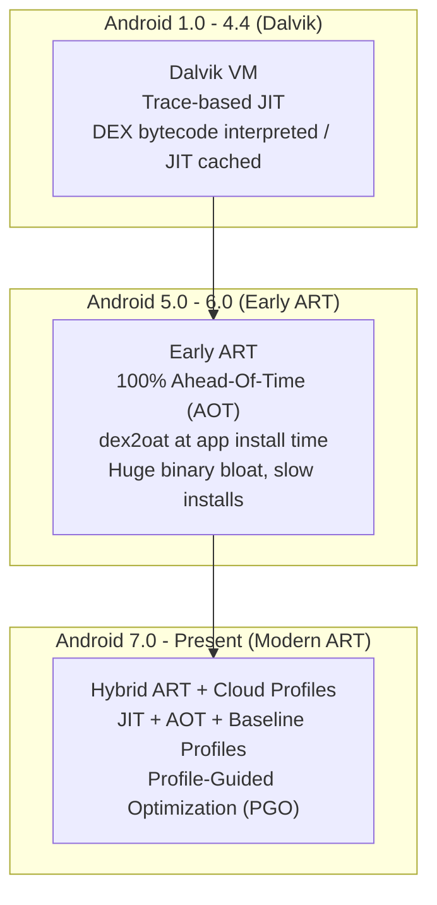
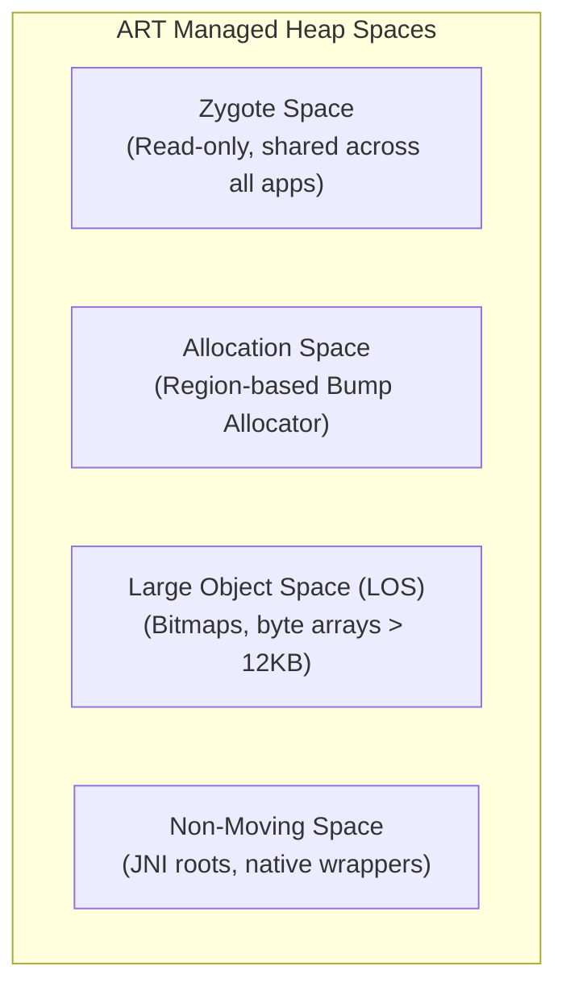
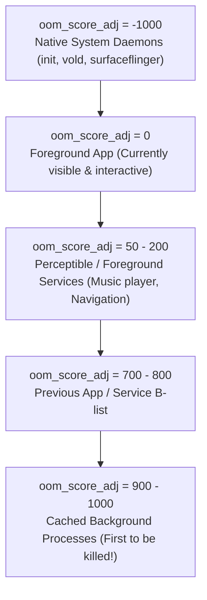
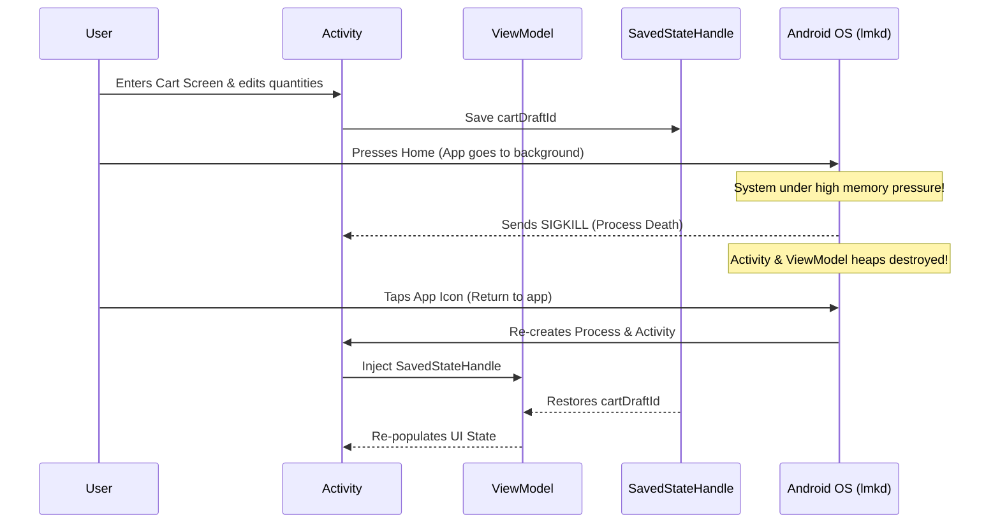

# 03. Android Runtime (ART), Memory Management & Process Lifecycle

> "To write high-performance Android applications, an engineer must grasp the low-level operating system mechanics: how the Android Runtime executes DEX bytecode, how the Generational Concurrent Copying garbage collector moves objects in memory, and how the Linux kernel's low memory killer daemon (`lmkd`) terminates processes."  
> — *Referencing Android Internals: A Confectioner's Cookbook (Jonathan Levin) & AOSP Runtime Architecture*

---

## 1. Dalvik VM vs Android Runtime (ART) Evolution

Android's virtual machine has undergone three major architectural eras:



### 1.1 The Modern Hybrid Execution Engine
Modern ART achieves fast installs and optimal runtime performance through a layered approach:
1. **Initial Install**: App installs instantly; DEX bytecode is interpreted, and frequently executed methods are compiled in-memory by the JIT compiler.
2. **Profile Generation**: The JIT compiler monitors hot code methods and writes a profile to disk (`/data/misc/profiles/cur/0/<pkg>/primary.prof`).
3. **Background dex2oat**: When the device is idle and charging, the `dex2oat` daemon compiles hot methods into native ARM64 machine code (`.oat` / `.odex` files) using Profile-Guided Optimization (PGO).
4. **Cloud & Baseline Profiles**: Google Play delivers pre-computed cloud baseline profiles, allowing the device to AOT-compile critical startup paths before the app is even launched for the first time.

---

## 2. ART Garbage Collection & Memory Spaces

ART manages heap memory using a **Generational Concurrent Copying (CC)** garbage collection algorithm (introduced in Android 8.0, refined through Android 15).



### 2.1 The Region-Based Concurrent Copying (CC) GC
* **Region Allocation**: The allocation space is divided into discrete memory regions (typically 256 KB each).
* **Bump Pointer Allocation**: Memory allocation is $O(1)$: thread-local allocation blocks (TLAB) allow threads to allocate objects simply by bumping a pointer, avoiding global locks.
* **Compaction without Long Pauses**: The collector evacuates live objects from fragmented "From-spaces" to contiguous "To-spaces" concurrently while the application threads are running. Read barriers intercept application threads accessing moved objects to fix pointer references on the fly.
* **Stop-The-World (STW) Pauses**: Pauses are reduced to microsecond windows (typically $< 2\text{ms}$), eliminating the notorious GC jank of earlier Android versions.

### 2.2 Zygote Initialization & Shared Memory (Copy-On-Write)
During boot, the `app_process` starts the **Zygote** process:
1. Zygote preloads core framework classes (Android SDK, Android resources) into its heap.
2. When an app is launched, the system forks Zygote.
3. Because Linux uses **Copy-On-Write (COW)** page tables, the preloaded SDK classes are shared across all processes in physical RAM until modified.

---

## 3. The Linux Low Memory Killer Daemon (`lmkd`) & OOM Adj

The Linux kernel does not have an infinite swap space on mobile devices. When RAM is exhausted, Android's `lmkd` daemon terminates processes based on their **`oom_score_adj`** (Out-Of-Memory adjustment score, ranging from `-1000` to `1000`).



When available memory drops below system watermarks, `lmkd` sends a `SIGKILL` to processes with the highest `oom_score_adj`.

---

## 4. Android OS Process Lifecycle & State Restoration

Because Android kills background processes under memory pressure, an app must survive process death without losing user state.



### 4.1 ViewModel vs SavedStateHandle vs Disk
* **ViewModel**: Survives configuration changes (screen rotations, font changes, dark mode toggles), but is completely destroyed upon process death.
* **`SavedStateHandle`**: Survives both configuration changes and OS process death. Data is serialized into an in-memory `Bundle` passed to `ActivityManagerService` via Binder.
  * **Critical Constraint**: Total Binder transaction buffer is capped at **1 MB** for the entire process. Storing large objects (e.g., bitmaps, large lists) in `SavedStateHandle` will crash the app with a `TransactionTooLargeException`. Store only IDs/keys, and reload entity data from the local database.

### 4.2 Production State Preservation with `SavedStateHandle`

```kotlin
import androidx.lifecycle.SavedStateHandle
import androidx.lifecycle.ViewModel
import androidx.lifecycle.viewModelScope
import kotlinx.coroutines.flow.*
import kotlinx.coroutines.launch

class CheckoutViewModel(
    private val savedStateHandle: SavedStateHandle,
    private val cartRepository: CartRepository
) : ViewModel() {

    companion object {
        private const val KEY_CART_ID = "checkout_cart_id"
    }

    // Survives Process Death automatically
    val cartId: StateFlow<String?> = savedStateHandle.getStateFlow(KEY_CART_ID, null)

    private val _uiState = MutableStateFlow<CheckoutUiState>(CheckoutUiState.Loading)
    val uiState: StateFlow<CheckoutUiState> = _uiState.asStateFlow()

    init {
        cartId.filterNotNull().onEach { id ->
            loadCartDetails(id)
        }.launchIn(viewModelScope)
    }

    fun selectCart(id: String) {
        savedStateHandle[KEY_CART_ID] = id
    }

    private fun loadCartDetails(id: String) {
        viewModelScope.launch {
            _uiState.value = CheckoutUiState.Loading
            try {
                val details = cartRepository.getCart(id)
                _uiState.value = CheckoutUiState.Success(details)
            } catch (e: Exception) {
                _uiState.value = CheckoutUiState.Error(e.localizedMessage ?: "Unknown Error")
            }
        }
    }
}
```
