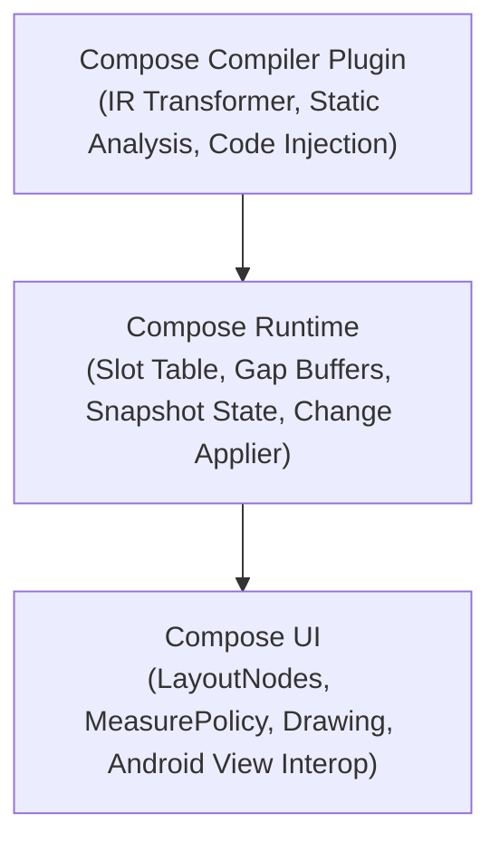
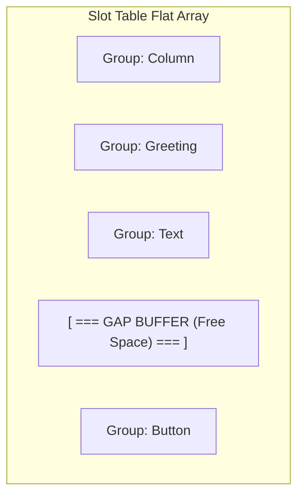
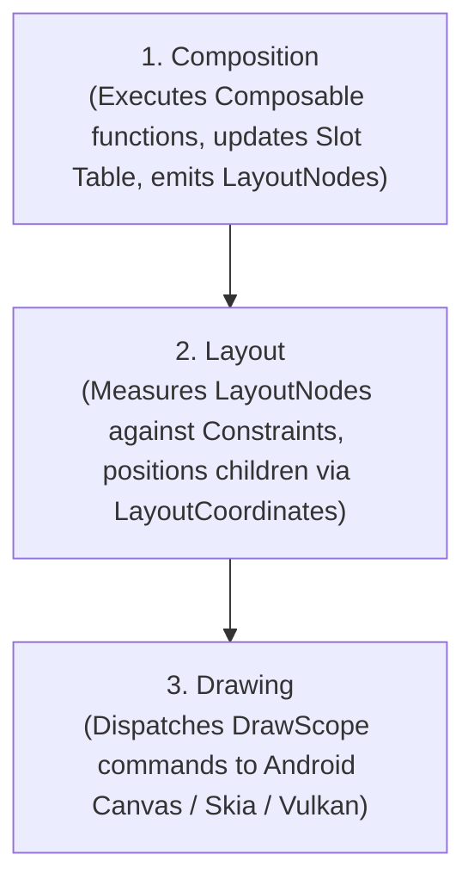

# 04. Jetpack Compose Compiler, Runtime & Layout Architecture

> "Jetpack Compose is not an Android UI toolkit; it is a general-purpose reactive tree manipulation runtime powered by a Kotlin compiler plugin. What React did for the DOM, Compose does for any hierarchical tree node structure."  
> — *Referencing Under the Hood of Jetpack Compose (Jorge Castillo) & Leland Richardson's Compose Architecture*

---

## 1. The Three Pillars of Compose

Jetpack Compose is split into three distinct architectural layers:



1. **Compose Compiler**: A Kotlin Backend IR plugin. It transforms `@Composable` functions, injects the `$composer` parameter, generates static integer keys, and performs stability analysis.
2. **Compose Runtime**: The engine that maintains the reactive tree in memory using a **Slot Table** (gap buffer data structure). It tracks snapshot reads and coordinates recomposition.
3. **Compose UI**: The platform-specific rendering layer that translates runtime tree operations into `LayoutNode` hierarchies, measures layout constraints, and renders pixels onto the Android `Canvas`.

---

## 2. Compiler IR Transformations: The `$composer` Parameter

Every function annotated with `@Composable` undergoes AST rewriting during compilation.

### 2.1 The Injected Signature
```kotlin
// Source code
@Composable
fun Greeting(name: String) {
    Text(text = "Hello $name")
}
```

The Compose Compiler rewrites this into:
```kotlin
// Transformed bytecode representation
fun Greeting(name: String, $composer: Composer, $changed: Int) {
    $composer.startRestartGroup(123456789) // Unique compiler-generated hash key
    // ...
    if ($changed and 0b0001 != 0 || !$composer.skipping) {
        Text("Hello $name", $composer, 0)
    } else {
        $composer.skipToGroupEnd()
    }
    $composer.endRestartGroup()?.updateScope { nextComposer ->
        Greeting(name, nextComposer, updateChangedFlags($changed or 1))
    }
}
```

* **`$composer`**: The context passed implicitly down the call graph, representing the connection to the active Slot Table.
* **`$changed`**: A bitmask encoding whether each parameter has changed since the previous composition.
* **`startRestartGroup` / `endRestartGroup`**: Demarcates the boundary of a recomposable unit of UI. If inputs haven't changed and are stable, `skipToGroupEnd()` is called, skipping function execution entirely.

---

## 3. The Slot Table & Gap Buffer Architecture

The Compose Runtime does not build an immutable AST on every frame. Instead, it maintains a mutable flat array structure called a **Slot Table**, implemented using a **Gap Buffer**.



* **Gap Buffer**: An array with an internal movable empty gap. Inserting or updating items at the current cursor is $O(1)$. When the cursor moves, the gap is shifted via fast `System.arraycopy`.
* **Slots**: Store group headers, composable keys, state objects, and cached lambdas (`remember`).
* **Change List Generation**: When recomposition runs, the runtime compares the new execution against the existing Slot Table and emits a batch `ChangeList` applied to the `LayoutNode` tree in a single pass.

---

## 4. The Three Phases of Compose

Compose processes frames in three sequential, pipelined phases:



### Phase Optimization Rule
Reading state in a later phase avoids executing earlier phases:
* Reading state during **Composition**: Triggers Recomposition $\to$ Relayout $\to$ Redraw (Most expensive).
* Reading state during **Layout** (`Modifier.offset { ... }`): Bypasses Composition; triggers only Relayout $\to$ Redraw.
* Reading state during **Drawing** (`Modifier.drawBehind { ... }`): Bypasses Composition and Layout; triggers only Redraw (Fastest, 120 FPS).

---

## 5. Compose Stability & The Unstable Collection Trap

Compose skips recomposition only if all parameters passed to a composable function are **Stable**.

### 5.1 Stability Rules
1. **Immutable**: All primitive types (`Int`, `String`), and classes where all public properties are `val` and have stable types.
2. **Stable**: Mutable objects that notify Compose when mutated (e.g., `MutableState<T>`).
3. **Unstable**: Any class with a mutable `var` property, or classes from external modules without Compose compiler metadata.

### 5.2 The Standard `List<T>` Trap
In Kotlin standard library, `List<T>` is an interface. Because an implementation might be a mutable `ArrayList<T>`, the Compose compiler classifies standard `List<T>` as **Unstable**!
```kotlin
// Recomposition will NEVER be skipped for this composable, even if the list is identical!
@Composable
fun ProductList(items: List<ProductItem>) { ... }
```

### 5.3 Fixing Unstable Collections
1. **Use KotlinX Immutable Collections**:
   ```kotlin
   @Composable
   fun ProductList(items: kotlinx.collections.immutable.ImmutableList<ProductItem>) { ... }
   ```
2. **Annotate domain models with `@Immutable` or `@Stable`**:
   ```kotlin
   @Immutable
   data class ProductStateWrapper(val items: List<ProductItem>)
   ```

---

## 6. Production Custom Layout: Fluid Waterfall Grid

Here is an enterprise-grade custom Compose layout implementing a dynamic 2-column staggered waterfall grid using low-level `Layout` and `MeasurePolicy`:

```kotlin
import androidx.compose.runtime.Composable
import androidx.compose.ui.Modifier
import androidx.compose.ui.layout.Layout
import androidx.compose.ui.unit.Dp
import androidx.compose.ui.unit.dp
import kotlin.math.max

@Composable
fun StaggeredWaterfallGrid(
    columns: Int = 2,
    horizontalSpacing: Dp = 8.dp,
    verticalSpacing: Dp = 8.dp,
    modifier: Modifier = Modifier,
    content: @Composable () -> Unit
) {
    Layout(
        content = content,
        modifier = modifier
    ) { measurables, constraints ->
        require(columns > 0) { "Columns must be > 0" }
        
        val hSpacingPx = horizontalSpacing.roundToPx()
        val vSpacingPx = verticalSpacing.roundToPx()
        
        val totalSpacing = hSpacingPx * (columns - 1)
        val columnWidth = max(0, (constraints.maxWidth - totalSpacing) / columns)
        val childConstraints = constraints.copy(minWidth = columnWidth, maxWidth = columnWidth)

        // Measure all children with the fixed column width
        val placeables = measurables.map { measurable ->
            measurable.measure(childConstraints)
        }

        // Track vertical heights of each column
        val columnHeights = IntArray(columns) { 0 }
        val itemPositions = mutableListOf<Pair<Int, Int>>() // Pair(x, y)

        for (placeable in placeables) {
            // Find column with minimum height
            var shortestCol = 0
            for (i in 1 until columns) {
                if (columnHeights[i] < columnHeights[shortestCol]) {
                    shortestCol = i
                }
            }

            val x = shortestCol * (columnWidth + hSpacingPx)
            val y = columnHeights[shortestCol]
            itemPositions.add(x to y)

            // Update column height
            columnHeights[shortestCol] += placeable.height + vSpacingPx
        }

        val totalHeight = (columnHeights.maxOrNull() ?: 0).coerceIn(constraints.minHeight, constraints.maxHeight)

        layout(constraints.maxWidth, totalHeight) {
            placeables.forEachIndexed { index, placeable ->
                val (x, y) = itemPositions[index]
                placeable.placeRelative(x = x, y = y)
            }
        }
    }
}
```
