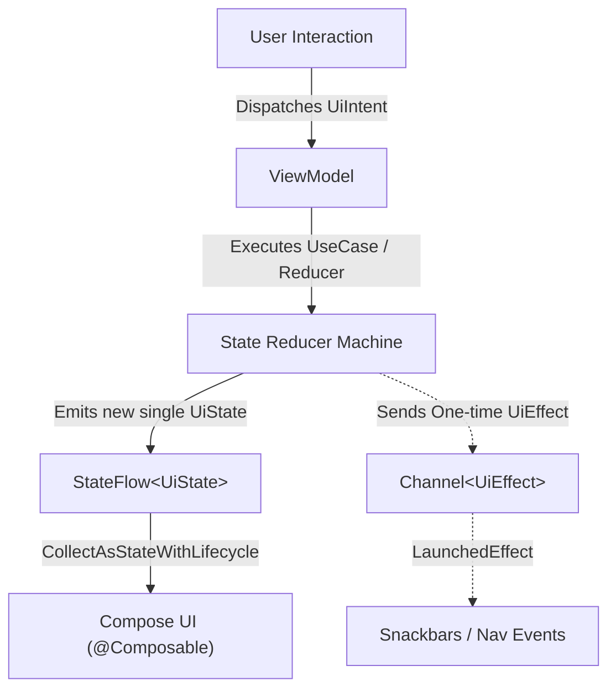

# 05. Modern Android Application Architecture (MVI, UDF & Clean Architecture)

> "Architecture is the art of drawing boundaries between software components so that changes to one boundary do not cascade into catastrophic failures across the system. In modern Android, this means strict Unidirectional Data Flow, single-state models, and zero-framework domain logic."  
> — *Referencing Clean Architecture (Robert C. Martin) & Guide to Android App Architecture (Google MAD)*

---

## 1. Unidirectional Data Flow (UDF) & MVI Principles

Modern Android architecture rejects bidirectional observation and fragmented UI state. It is anchored on **Unidirectional Data Flow (UDF)** and **Model-View-Intent (MVI)**:



### 1.1 The Three Core Contract Pillars
1. **`UiState`**: A single immutable data class or sealed interface representing the entire visual state of a screen. The UI is a pure function of this state: $UI = f(\text{State})$.
2. **`UiIntent` / `UiAction`**: A sealed class representing all user actions or system events dispatched from the UI to the ViewModel.
3. **`UiEffect`**: A sealed class representing ephemeral, one-time events that must not be re-emitted upon screen rotation or recomposition (e.g., showing a Snackbar, triggering biometrics, navigating to a new destination).

---

## 2. Handling One-Time UI Events Without Anti-Patterns

A common anti-pattern in Android was using `SingleLiveEvent` or setting flags in mutable state (`state.copy(showSnackbar = true)`), which often caused double-trigger bugs or missed events.

### 2.1 The Buffered Channel Pattern
The gold standard in production MVI uses a `Channel<UiEffect>(capacity = Channel.BUFFERED)` exposed as a `Flow`:

```kotlin
// In ViewModel
private val _effectChannel = Channel<CheckoutEffect>(capacity = Channel.BUFFERED)
val effect = _effectChannel.receiveAsFlow()

// In Composable
val lifecycleOwner = LocalLifecycleOwner.current
LaunchedEffect(viewModel.effect, lifecycleOwner) {
    lifecycleOwner.repeatOnLifecycle(Lifecycle.State.STARTED) {
        viewModel.effect.collect { effect ->
            when (effect) {
                is CheckoutEffect.ShowErrorSnackbar -> snackbarHostState.showSnackbar(effect.message)
                is CheckoutEffect.NavigateToSuccess -> navController.navigate("success/${effect.orderId}")
            }
        }
    }
}
```

---

## 3. Production Clean Architecture Implementation: Checkout Subsystem

Below is a complete, production-grade implementation of an enterprise Checkout flow spanning Domain, Data, and Presentation layers.

### 3.1 Domain Layer: Models, Invariants & UseCase
The domain layer has **zero dependencies** on the Android SDK or third-party frameworks.

```kotlin
// Domain Model with Business Invariants
data class CartItem(val productId: String, val quantity: Int, val unitPriceCents: Long)

data class OrderSummary(
    val orderId: String,
    val items: List<CartItem>,
    val totalCents: Long
) {
    init {
        require(items.isNotEmpty()) { "Order must contain at least one item" }
        require(totalCents > 0) { "Order total must be greater than zero" }
    }
}

// Domain Repository Contract
interface CheckoutRepository {
    suspend fun processPayment(orderId: String, paymentToken: String): Result<String>
    suspend fun getActiveCart(): OrderSummary
}

// Domain Use Case
class ProcessCheckoutUseCase(private val repository: CheckoutRepository) {
    suspend operator fun invoke(paymentToken: String): Result<String> {
        if (paymentToken.isBlank()) {
            return Result.failure(IllegalArgumentException("Payment authorization token is missing"))
        }
        val cart = repository.getActiveCart()
        return repository.processPayment(cart.orderId, paymentToken)
    }
}
```

### 3.2 Presentation Layer: MVI Contracts & ViewModel

```kotlin
import androidx.lifecycle.ViewModel
import androidx.lifecycle.viewModelScope
import kotlinx.coroutines.channels.Channel
import kotlinx.coroutines.flow.*
import kotlinx.coroutines.launch

// 1. Immutable UI State
sealed interface CheckoutUiState {
    data object Loading : CheckoutUiState
    data class Content(
        val order: OrderSummary,
        val isProcessing: Boolean = false,
        val errorMessage: String? = null
    ) : CheckoutUiState
    data class OrderCompleted(val transactionId: String) : CheckoutUiState
}

// 2. Sealed UI Intents
sealed interface CheckoutIntent {
    data object LoadInitialData : CheckoutIntent
    data class SubmitPayment(val paymentToken: String) : CheckoutIntent
    data object DismissError : CheckoutIntent
}

// 3. One-Time UI Effects
sealed interface CheckoutEffect {
    data class ShowToast(val message: String) : CheckoutEffect
    data class NavigateToReceipt(val transactionId: String) : CheckoutEffect
}

// 4. Production ViewModel
class CheckoutViewModel(
    private val repository: CheckoutRepository,
    private val processCheckoutUseCase: ProcessCheckoutUseCase
) : ViewModel() {

    private val _uiState = MutableStateFlow<CheckoutUiState>(CheckoutUiState.Loading)
    val uiState: StateFlow<CheckoutUiState> = _uiState.asStateFlow()

    private val _effects = Channel<CheckoutEffect>(Channel.BUFFERED)
    val effects = _effects.receiveAsFlow()

    init {
        dispatch(CheckoutIntent.LoadInitialData)
    }

    fun dispatch(intent: CheckoutIntent) {
        when (intent) {
            is CheckoutIntent.LoadInitialData -> loadCart()
            is CheckoutIntent.SubmitPayment -> handlePayment(intent.paymentToken)
            is CheckoutIntent.DismissError -> dismissError()
        }
    }

    private fun loadCart() {
        viewModelScope.launch {
            _uiState.value = CheckoutUiState.Loading
            try {
                val cart = repository.getActiveCart()
                _uiState.value = CheckoutUiState.Content(order = cart)
            } catch (e: Exception) {
                _effects.send(CheckoutEffect.ShowToast("Failed to load cart: ${e.message}"))
            }
        }
    }

    private fun handlePayment(token: String) {
        val current = _uiState.value
        if (current !is CheckoutUiState.Content || current.isProcessing) return

        _uiState.value = current.copy(isProcessing = true, errorMessage = null)

        viewModelScope.launch {
            val result = processCheckoutUseCase(token)
            result.onSuccess { txId ->
                _uiState.value = CheckoutUiState.OrderCompleted(txId)
                _effects.send(CheckoutEffect.NavigateToReceipt(txId))
            }.onFailure { error ->
                _uiState.value = current.copy(isProcessing = false, errorMessage = error.message)
                _effects.send(CheckoutEffect.ShowToast(error.message ?: "Payment Failed"))
            }
        }
    }

    private fun dismissError() {
        val current = _uiState.value
        if (current is CheckoutUiState.Content) {
            _uiState.value = current.copy(errorMessage = null)
        }
    }
}
```
