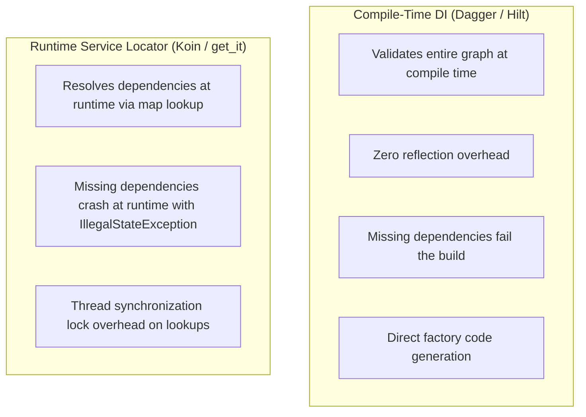
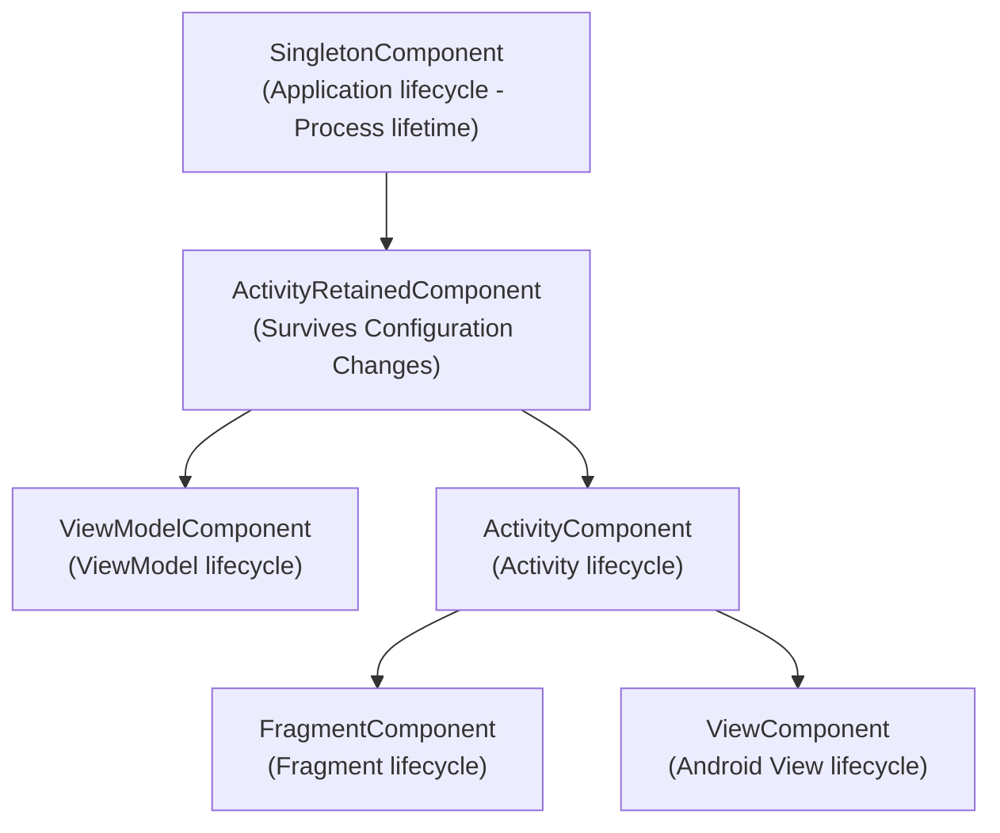

# 06. Compile-Time Dependency Injection with Dagger & Hilt

> "Dependency injection is often confused with dynamic reflection frameworks. In high-performance Android engineering, reflection is prohibited due to startup latency and memory overhead. Dagger and Hilt transform dependency graphs into static, ahead-of-time generated Java code verified at compile time."  
> — *Referencing Dagger 2 Architecture & Google Hilt Engineering Documentation*

---

## 1. Compile-Time DI vs Runtime Service Locators



In mission-critical enterprise applications, compile-time validation eliminates entire classes of runtime crash bugs before code reaches QA.

---

## 2. Dagger Code Generation Internals

When Dagger processes an `@Inject` constructor:
```kotlin
class PaymentProcessor @Inject constructor(
    private val client: ApiClient,
    private val database: AppDatabase
)
```

The annotation processor (via KSP) generates a factory class extending `Factory<T>`:

```java
// Compiler Generated Factory
public final class PaymentProcessor_Factory implements Factory<PaymentProcessor> {
    private final Provider<ApiClient> clientProvider;
    private final Provider<AppDatabase> databaseProvider;

    public PaymentProcessor_Factory(Provider<ApiClient> clientProvider, Provider<AppDatabase> databaseProvider) {
        this.clientProvider = clientProvider;
        this.databaseProvider = databaseProvider;
    }

    @Override
    public PaymentProcessor get() {
        return newInstance(clientProvider.get(), databaseProvider.get());
    }

    public static PaymentProcessor newInstance(ApiClient client, AppDatabase database) {
        return new PaymentProcessor(client, database);
    }
}
```

There is **no reflection**. Object instantiation resolves to direct Java `new` operator invocations.

---

## 3. Hilt Component Hierarchy & Lifecycles

Hilt standardizes Dagger for Android by defining a predefined hierarchy of components tied directly to the Android OS lifecycle:



### Component Scopes & Retention
* Objects scoped with `@Singleton` in `SingletonComponent` live for the entire process duration.
* Objects scoped with `@ViewModelScoped` in `ViewModelComponent` live as long as their corresponding `ViewModel` survives, enabling shared use-cases or state holders between fragments belonging to the same ViewModel owner.

---

## 4. Multi-Bindings with `@IntoSet` and Dynamic Plugin Architectures

Dagger multi-bindings allow independent feature modules to contribute implementations to a central collection without the core module having compile-time dependencies on the feature modules.

```kotlin
// In Core Module: Central interface
interface AppInitializer {
    fun initialize(application: Application)
}

// In Feature Analytics Module: Feature contribution
@Module
@InstallIn(SingletonComponent::class)
object AnalyticsModule {
    @Provides
    @IntoSet
    fun provideAnalyticsInitializer(analyticsTracker: AnalyticsTracker): AppInitializer {
        return object : AppInitializer {
            override fun initialize(application: Application) {
                analyticsTracker.start(application)
            }
        }
    }
}

// In Application Class: Automatic iteration over all contributed plugins
@HiltAndroidApp
class EnterpriseApplication : Application() {

    @Inject
    lateinit var initializers: Set<@JvmSuppressWildcards AppInitializer>

    override fun onCreate() {
        super.onCreate()
        initializers.forEach { it.initialize(this) }
    }
}
```

---

## 5. Production Hilt Module Implementation

Below is a complete, production-grade Hilt module establishing a resilient network and repository architecture:

```kotlin
package com.enterprise.app.di

import com.enterprise.app.data.AuthInterceptor
import com.enterprise.app.data.OrderApi
import com.enterprise.app.data.OrderRepository
import com.enterprise.app.data.OrderRepositoryImpl
import dagger.Binds
import dagger.Module
import dagger.Provides
import dagger.hilt.InstallIn
import dagger.hilt.components.SingletonComponent
import okhttp3.CertificatePinner
import okhttp3.OkHttpClient
import retrofit2.Retrofit
import retrofit2.converter.kotlinx.serialization.asConverterFactory
import kotlinx.serialization.json.Json
import okhttp3.MediaType.Companion.toMediaType
import java.util.concurrent.TimeUnit
import javax.inject.Singleton

@Module
@InstallIn(SingletonComponent::class)
abstract class RepositoryBindingModule {

    @Binds
    @Singleton
    abstract fun bindOrderRepository(
        impl: OrderRepositoryImpl
    ): OrderRepository
}

@Module
@InstallIn(SingletonComponent::class)
object NetworkModule {

    private const val BASE_URL = "https://api.enterprise.com/v1/"
    private val json = Json { ignoreUnknownKeys = true; isLenient = false }

    @Provides
    @Singleton
    fun provideCertificatePinner(): CertificatePinner {
        return CertificatePinner.Builder()
            .add("api.enterprise.com", "sha256/k2v657xBsOwg11+/VZada5iTd462n13DFqJWc46CTwA=")
            .build()
    }

    @Provides
    @Singleton
    fun provideOkHttpClient(
        authInterceptor: AuthInterceptor,
        pinner: CertificatePinner
    ): OkHttpClient {
        return OkHttpClient.Builder()
            .addInterceptor(authInterceptor)
            .certificatePinner(pinner)
            .connectTimeout(15, TimeUnit.SECONDS)
            .readTimeout(15, TimeUnit.SECONDS)
            .writeTimeout(15, TimeUnit.SECONDS)
            .retryOnConnectionFailure(true)
            .build()
    }

    @Provides
    @Singleton
    fun provideRetrofit(okHttpClient: OkHttpClient): Retrofit {
        val contentType = "application/json".toMediaType()
        return Retrofit.Builder()
            .baseUrl(BASE_URL)
            .client(okHttpClient)
            .addConverterFactory(json.asConverterFactory(contentType))
            .build()
    }

    @Provides
    @Singleton
    fun provideOrderApi(retrofit: Retrofit): OrderApi {
        return retrofit.create(OrderApi::class.java)
    }
}
```
