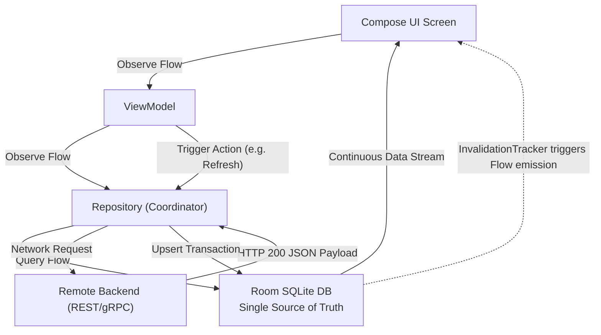
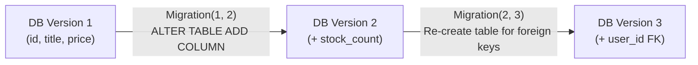

# 07. Enterprise Data Layer, Room SQLite Engine & Offline-First Sync

> "A mobile device is a distributed client operating over unreliable wireless networks. An enterprise mobile application must treat local persistence as the authoritative Single Source of Truth (SSOT), with network calls serving merely as asynchronous replication streams."  
> — *Referencing Designing Data-Intensive Applications & Google Offline-First Architecture Guides*

---

## 1. The Offline-First SSOT Architecture

In an offline-first architecture, UI components never observe network responses directly. The UI observes local database tables via reactive streams (`Flow`). Network operations write exclusively to the local database:



---

## 2. SQLite Engine Mechanics & Write-Ahead Logging (WAL)

Android uses an embedded SQLite engine storing B-tree structures on disk.

### 2.1 Rollback Journal vs Write-Ahead Logging (WAL)
* **Rollback Journal (Legacy)**: Any write lock prevents all concurrent reads. Readers block writers, and writers block readers.
* **Write-Ahead Logging (WAL, Modern Android Default)**: Writes are appended to a separate `-wal` file while original pages in the `.db` file remain untouched.
  * **Concurrency Guarantee**: 1 writer can execute concurrently with $N$ readers without blocking.
  * **Checkpointing**: Background checkpoint threads periodically flush modified pages from the WAL file back to the primary database file.

### 2.2 Room `InvalidationTracker` Internals
How does `Room` know when a table changes to emit a new value to a `Flow`?
1. Room creates a shadow tracking table: `room_table_modification_log`.
2. Room attaches SQLite `AFTER INSERT`, `AFTER UPDATE`, and `AFTER DELETE` triggers to each observed table.
3. When any transaction modifies the table, the triggers update the modification log.
4. Room's `InvalidationTracker` polls or receives transaction callbacks, identifies changed table IDs, and dispatches refresh queries to active coroutine Flow collectors.

---

## 3. Database Migrations & Safe Schema Evolution

In production apps with millions of users, failing to handle database schema migrations correctly causes fatal `IllegalStateException` crashes on app update.



### 3.1 Migration Strategy Rules
1. **Never use `fallbackToDestructiveMigration()` in production**: It deletes user data.
2. **Automated Migration Testing**: Use `MigrationTestHelper` to run real SQLite schema migrations against actual SQLite instances during unit tests.

---

## 4. Modern Preferences & Proto DataStore

`SharedPreferences` is obsolete due to blocking synchronous I/O on the main thread (`apply()` can cause ANRs during Activity pauses) and lack of type safety.

* **Preferences DataStore**: Replaces SharedPreferences with asynchronous coroutine I/O via Flow and transactional consistency.
* **Proto DataStore**: Uses **Protocol Buffers** schema to provide compile-time type safety, binary serialization speed, and zero reflection overhead.

---

## 5. Production Offline-First Repository Implementation

Below is an enterprise-grade offline-first repository with Room entities, DAOs, and continuous background network synchronization:

```kotlin
package com.enterprise.app.data.local

import androidx.room.*
import kotlinx.coroutines.flow.Flow

@Entity(tableName = "products")
data class ProductEntity(
    @PrimaryKey val id: String,
    val title: String,
    val priceCents: Long,
    val currency: String,
    val updatedAt: Long
)

@Dao
interface ProductDao {
    @Query("SELECT * FROM products ORDER BY updatedAt DESC")
    fun observeAllProducts(): Flow<List<ProductEntity>>

    @Query("SELECT * FROM products WHERE id = :id")
    suspend fun getProductById(id: String): ProductEntity?

    @Upsert
    suspend fun upsertAll(products: List<ProductEntity>)

    @Query("DELETE FROM products WHERE updatedAt < :cutoffTimestamp")
    suspend fun deleteExpiredCache(cutoffTimestamp: Long)
}

@Database(entities = [ProductEntity::class], version = 2, exportSchema = true)
abstract class AppDatabase : RoomDatabase() {
    abstract fun productDao(): ProductDao

    companion object {
        val MIGRATION_1_2 = object : androidx.room.migration.Migration(1, 2) {
            override fun migrate(db: androidx.sqlite.db.SupportSQLiteDatabase) {
                db.execSQL("ALTER TABLE products ADD COLUMN currency TEXT NOT NULL DEFAULT 'USD'")
            }
        }
    }
}
```

```kotlin
package com.enterprise.app.data.repository

import com.enterprise.app.data.local.ProductDao
import com.enterprise.app.data.local.ProductEntity
import com.enterprise.app.data.remote.ProductApiService
import kotlinx.coroutines.CoroutineDispatcher
import kotlinx.coroutines.Dispatchers
import kotlinx.coroutines.flow.*
import kotlinx.coroutines.withContext
import java.io.IOException

data class Product(val id: String, val title: String, val priceCents: Long, val currency: String)

class OfflineFirstProductRepository(
    private val dao: ProductDao,
    private val api: ProductApiService,
    private val ioDispatcher: CoroutineDispatcher = Dispatchers.IO
) {

    // 1. Continuous stream directly from Room (Single Source of Truth)
    fun streamProducts(): Flow<List<Product>> {
        return dao.observeAllProducts()
            .map { entities ->
                entities.map { Product(it.id, it.title, it.priceCents, it.currency) }
            }
            .flowOn(ioDispatcher)
    }

    // 2. Synchronize network data into local database
    suspend fun syncRemoteProducts(): Result<Unit> = withContext(ioDispatcher) {
        try {
            val response = api.fetchProducts()
            val now = System.currentTimeMillis()
            val entities = response.map { dto ->
                ProductEntity(
                    id = dto.id,
                    title = dto.title,
                    priceCents = dto.priceCents,
                    currency = dto.currency,
                    updatedAt = now
                )
            }
            // Atomic upsert: InvalidationTracker triggers streamProducts() emission automatically
            dao.upsertAll(entities)
            Result.success(Unit)
        } catch (e: IOException) {
            Result.failure(e)
        }
    }
}
```
