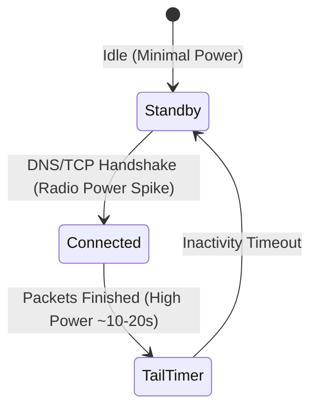
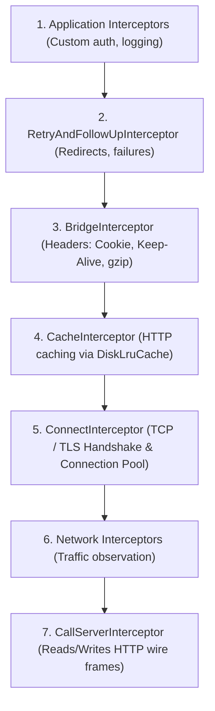

# 08. Resilient Networking, Protocol Buffers & OkHttp Engine

> "Mobile networking is characterized by high latency, packet loss, cellular radio transitions, and hostile network environments. Writing production network layers requires mastering the OkHttp interceptor chain, connection pooling, mutual TLS, and certificate pinning."  
> — *Referencing High Performance Browser Networking (Ilya Grigorik) & Square OkHttp Architecture*

---

## 1. The Cellular Radio State Machine

Unlike wired ethernet or Wi-Fi, cellular radios (LTE / 5G) operate with an energy state machine managed by baseband processors:



### The Radio Tail Battery Drain Trap
Sending periodic network requests every 15 seconds keeps the cellular radio continuously in the high-power state, draining the device battery rapidly.
* **Production Fix**: Batch requests together, leverage HTTP/2 multiplexing, and use cache-control headers with local disk caching to prevent redundant queries.

---

## 2. OkHttp Interceptor Chain Architecture

At the core of Android networking is the OkHttp **Chain of Responsibility** pattern. Every HTTP call passes through a series of layered interceptors:



---

## 3. Thread-Safe Token Refresh with Atomic Mutex

When multiple concurrent requests fail with `401 Unauthorized`, an uncoordinated client will trigger $N$ redundant refresh token calls.

### 3.1 The Synchronized Mutex Authenticator Pattern
OkHttp provides the `Authenticator` interface specifically for this. Below is a production-grade token refresh authenticator using Kotlin Coroutines `Mutex`:

```kotlin
package com.enterprise.app.network

import kotlinx.coroutines.runBlocking
import kotlinx.coroutines.sync.Mutex
import kotlinx.coroutines.sync.withLock
import okhttp3.Authenticator
import okhttp3.Request
import okhttp3.Response
import okhttp3.Route
import javax.inject.Inject
import javax.inject.Singleton

@Singleton
class TokenAuthenticator @Inject constructor(
    private val tokenStorage: TokenStorage,
    private val authClient: AuthRemoteService
) : Authenticator {

    private val refreshMutex = Mutex()

    override fun authenticate(route: Route?, response: Response): Request? {
        // Guard against infinite refresh loops: abort if already retried 3 times
        if (responseCount(response) >= 3) return null

        val currentToken = tokenStorage.getAccessToken()
        val requestAuthHeader = response.request.header("Authorization")

        val refreshedToken = runBlocking {
            refreshMutex.withLock {
                val latestStoredToken = tokenStorage.getAccessToken()
                // If another concurrent thread has already refreshed the token, use it directly!
                if (latestStoredToken != null && "Bearer $latestStoredToken" != requestAuthHeader) {
                    return@withLock latestStoredToken
                }

                // Perform the actual network refresh call
                val refreshToken = tokenStorage.getRefreshToken() ?: return@withLock null
                val newTokens = authClient.refreshSession(refreshToken)
                if (newTokens != null) {
                    tokenStorage.saveTokens(newTokens.accessToken, newTokens.refreshToken)
                    newTokens.accessToken
                } else {
                    tokenStorage.clearTokens()
                    null
                }
            }
        } ?: return null // Returning null aborts the request and bubbles 401 to the caller

        // Retry the original request with the fresh token
        return response.request.newBuilder()
            .header("Authorization", "Bearer $refreshedToken")
            .build()
    }

    private fun responseCount(response: Response): Int {
        var result = 1
        var prior = response.priorResponse
        while (prior != null) {
            result++
            prior = prior.priorResponse
        }
        return result
    }
}
```

---

## 4. High-Performance Serialization: Kotlinx vs Reflection

Traditional reflection-based serializers (e.g. Gson) inspect runtime type metadata via JVM reflection, causing slow cold starts and substantial memory allocation.

* **`kotlinx.serialization`**: A compiler plugin that inspects classes at compile time and generates a synthetic `KSerializer` class with direct type-safe field assignments:
  ```kotlin
  @Serializable
  data class UserAccount(val id: String, val email: String, val balance: Long)
  ```
* **Protocol Buffers (Proto3)**: For high-throughput internal APIs, binary protobuf eliminates JSON parsing overhead entirely, encoding data into compact binary varints.

---

## 5. Security: Certificate Pinning & TLS 1.3

To defend against Man-in-the-Middle (MitM) attacks via compromised root certificates (e.g., corporate proxy certificates or compromised Certificate Authorities), production applications enforce **Certificate Pinning**:

```kotlin
val certificatePinner = CertificatePinner.Builder()
    .add("api.enterprise.com", "sha256/WoiWRyIOVNa9ihaBciRSC7XHjliYS9VwUGOIud4PB18=")
    // Always include a backup pin from an independent Certificate Authority
    .add("api.enterprise.com", "sha256/r/mItsNd4ok/5VewkcguEgea8oLY2qTykMegv_fY6CS8=")
    .build()

val client = OkHttpClient.Builder()
    .certificatePinner(certificatePinner)
    .build()
```
