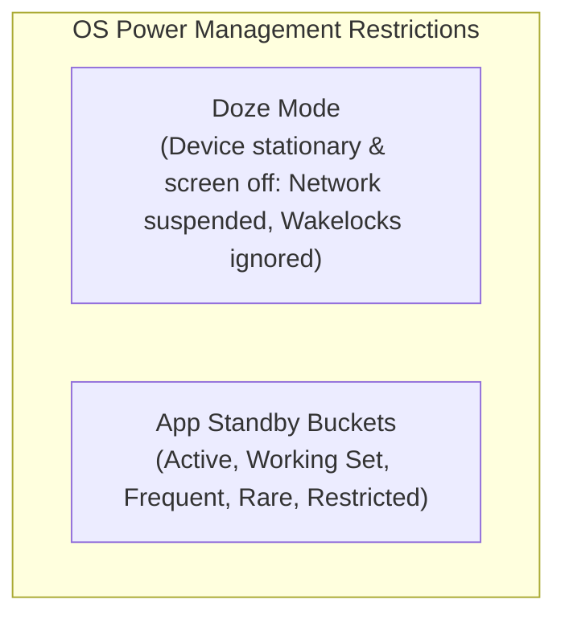
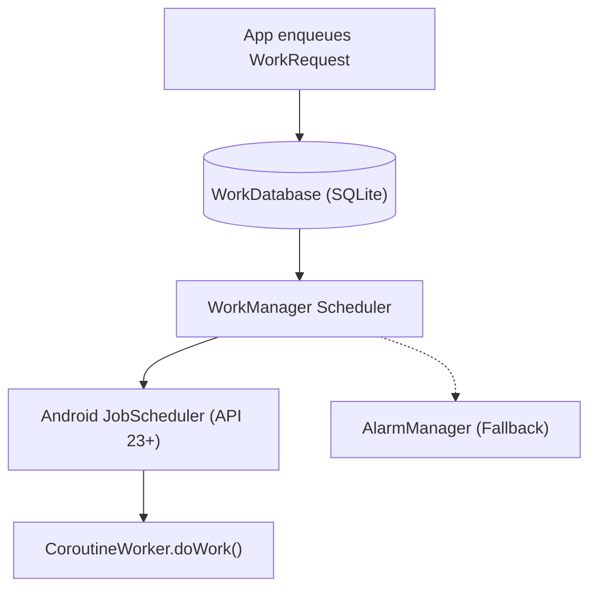
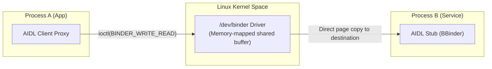

# 09. WorkManager, IPC (Binder/AIDL) & Background Services

> "Modern Android has systematically locked down background execution to conserve battery. An engineer must understand the operating system's exact execution constraints: Doze Mode, App Standby Buckets, WorkManager's scheduler architecture, and low-level Linux Binder IPC transactions."  
> — *Referencing Android System Architecture (AOSP) & Google WorkManager Internals*

---

## 1. Android Background Execution Restrictions

Android limits background execution via two complementary systems:



### 1.1 App Standby Buckets Limits
1. **Active**: App is currently in use. No job/alarm throttling.
2. **Working Set**: App is used frequently. Jobs can run every few hours.
3. **Frequent**: Used regularly but not daily. Max 10 job runs per day.
4. **Rare**: Rarely opened. Max 1-2 job runs per day; network access strictly throttled.
5. **Restricted (Android 12+)**: Placed here if the app causes high battery drain. WorkManager jobs can only run once a day, and network access is suspended.

---

## 2. WorkManager Architecture & `CoroutineWorker`

WorkManager is Google's guaranteed background processing engine. It persists job metadata into an internal SQLite database (`androidx.work.workdatabase`) so that scheduled tasks survive device reboots.



### 2.1 Production `CoroutineWorker` Implementation
Below is an enterprise background database synchronization worker with battery and unmetered network constraints:

```kotlin
package com.enterprise.app.background

import android.content.Context
import androidx.hilt.work.HiltWorker
import androidx.work.*
import com.enterprise.app.data.repository.OfflineFirstProductRepository
import dagger.assisted.Assisted
import dagger.assisted.AssistedInject
import java.io.IOException
import java.util.concurrent.TimeUnit

@HiltWorker
class CatalogSyncWorker @AssistedInject constructor(
    @Assisted appContext: Context,
    @Assisted workerParams: WorkerParameters,
    private val repository: OfflineFirstProductRepository
) : CoroutineWorker(appContext, workerParams) {

    override suspend fun doWork(): Result {
        // Enforce max 3 retry attempts before permanent failure
        if (runAttemptCount >= 3) {
            return Result.failure()
        }

        return try {
            val syncResult = repository.syncRemoteProducts()
            if (syncResult.isSuccess) {
                Result.success()
            } else {
                Result.retry()
            }
        } catch (e: IOException) {
            // Transient network failure: schedule backoff retry
            Result.retry()
        } catch (e: Exception) {
            // Unrecoverable business error
            Result.failure()
        }
    }

    companion object {
        private const val UNIQUE_WORK_NAME = "catalog_periodic_sync"

        fun enqueuePeriodicSync(workManager: WorkManager) {
            val constraints = Constraints.Builder()
                .setRequiredNetworkType(NetworkType.UNMETERED) // Wi-Fi only
                .setRequiresBatteryNotLow(true)
                .setRequiresStorageNotLow(true)
                .build()

            val syncRequest = PeriodicWorkRequestBuilder<CatalogSyncWorker>(
                repeatInterval = 6,
                repeatIntervalTimeUnit = TimeUnit.HOURS,
                flexTimeInterval = 30,
                flexTimeIntervalTimeUnit = TimeUnit.MINUTES
            )
            .setConstraints(constraints)
            .setBackoffCriteria(
                BackoffPolicy.EXPONENTIAL,
                WorkRequest.MIN_BACKOFF_MILLIS,
                TimeUnit.MILLISECONDS
            )
            .build()

            workManager.enqueueUniquePeriodicWork(
                UNIQUE_WORK_NAME,
                ExistingPeriodicWorkPolicy.KEEP,
                syncRequest
            )
        }
    }
}
```

---

## 3. The Linux Binder IPC Driver & AIDL

In Android, every app runs in its own sandboxed Linux process with a dedicated User ID (UID). Direct cross-process memory access is blocked by kernel memory protections.

All Inter-Process Communication (IPC) flows through the Linux **`/dev/binder`** kernel driver:



### 3.1 The 1 MB Binder Transaction Buffer Limit
The Binder kernel driver allocates a memory-mapped buffer of **1 MB** per process (shared across all ongoing binder calls). Exceeding this limit immediately throws a fatal `TransactionTooLargeException`.
* **IPC Best Practice**: Never transfer bulk data, lists of thousands of items, or image bytes over Binder or `Bundle`. Transfer IDs or use shared memory / file descriptors (`Ashmem` / `ParcelFileDescriptor`).

---

## 4. AIDL (Android Interface Definition Language) Implementation

AIDL defines the programming interface that both the client and service agree upon to communicate over IPC:

```java
// ITransactionService.aidl
package com.enterprise.app.ipc;

interface ITransactionService {
    int getServiceVersion();
    boolean submitPayment(String transactionId, long amountCents);
}
```

### 4.2 Kotlin Service Implementation with Thread-Safe IPC Stub

```kotlin
package com.enterprise.app.ipc

import android.app.Service
import android.content.Intent
import android.os.IBinder
import android.os.Process

class TransactionRemoteService : Service() {

    private val binder = object : ITransactionService.Stub() {
        override fun getServiceVersion(): Int = 1

        override fun submitPayment(transactionId: String, amountCents: Long): Boolean {
            // Verify caller identity via Binder UID check
            val callingUid = getCallingUid()
            val callingPid = getCallingPid()
            
            // Check if caller possesses the required system signature permission
            enforceCallingOrSelfPermission(
                "com.enterprise.app.permission.PAYMENT_IPC",
                "Unauthorized IPC Caller UID: $callingUid"
            )

            // Business logic executed on a Binder worker thread pool
            return true
        }
    }

    override fun onBind(intent: Intent?): IBinder = binder
}
```
