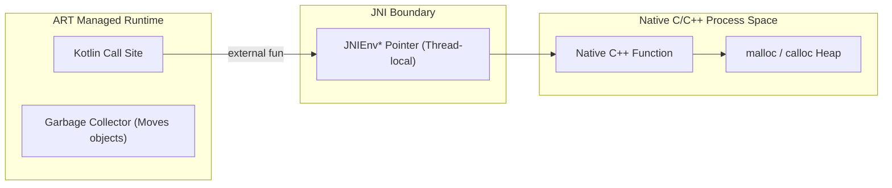

# 10. Native NDK, JNI Interop & C++ Integration

> "When raw execution throughput, hardware vector acceleration (NEON / SIMD), or existing C/C++ audio/crypto/graphics libraries are required, Android developers cross the Java Native Interface (JNI) boundary into the Native Development Kit (NDK). Crossing this boundary carelessly introduces segmentation faults, memory leaks, and severe performance penalties."  
> — *Referencing Android NDK Architecture & The Java Native Interface Specification*

---

## 1. The Java Native Interface (JNI) Architecture

The JNI bridges the managed Android Runtime (ART) memory heap and unmanaged native C/C++ memory:



### 1.1 `JNIEnv*` and Thread Affinities
* **`JNIEnv*`**: A thread-local pointer to a table of function pointers. It cannot be passed or shared across different threads.
* If a native worker thread spawned via `pthread_create` wants to call Kotlin methods, it must first attach itself to the JVM using `JavaVM->AttachCurrentThread()`.

---

## 2. Zero-Copy Direct Memory Buffers: `ByteBuffer.allocateDirect`

Copying large arrays (such as camera frames or audio buffers) between the Kotlin heap and native C++ memory across the JNI boundary causes heavy GC allocation and high CPU cache thrashing.

### The Zero-Copy Solution
Allocate a **Direct ByteBuffer** on the Kotlin side. Direct byte buffers exist outside the managed GC heap, allowing C++ to access the raw pointer directly without copying:

```kotlin
// Kotlin side: Allocate direct off-heap buffer
val directBuffer: java.nio.ByteBuffer = java.nio.ByteBuffer.allocateDirect(1920 * 1080 * 4)
```

In C++:
```cpp
void* nativeBuffer = env->GetDirectBufferAddress(directBuffer);
// nativeBuffer is the direct raw memory address - 0 copies!
```

---

## 3. Production NDK & C++ Integration: High-Performance Crypto

Below is an enterprise-grade C++ crypto engine with CMake build configuration and Kotlin external bindings.

### 3.1 `CMakeLists.txt` Build Configuration
```cmake
cmake_minimum_required(VERSION 3.22.1)
project("native_crypto_engine")

add_library(
    native_crypto_engine
    SHARED
    crypto_engine.cpp
)

find_library(
    log-lib
    log
)

target_link_libraries(
    native_crypto_engine
    ${log-lib}
)
```

### 3.2 High-Performance C++ Implementation (`crypto_engine.cpp`)
```cpp
#include <jni.h>
#include <string>
#include <vector>
#include <android/log.h>

#define TAG "NativeCryptoEngine"
#define LOGE(...) __android_log_print(ANDROID_LOG_ERROR, TAG, __VA_ARGS__)

extern "C" JNIEXPORT jbyteArray JNICALL
Java_com_enterprise_app_native_NativeCryptoBridge_computeHmacSha256(
    JNIEnv* env,
    jobject /* this */,
    jbyteArray keyBytes,
    jbyteArray dataBytes
) {
    if (keyBytes == nullptr || dataBytes == nullptr) {
        jclass exClass = env->FindClass("java/lang/IllegalArgumentException");
        env->ThrowNew(exClass, "Key or Data buffer cannot be null");
        return nullptr;
    }

    // Pin byte arrays to prevent GC movement during reading
    jsize keyLen = env->GetArrayLength(keyBytes);
    jsize dataLen = env->GetArrayLength(dataBytes);

    jbyte* keyPtr = env->GetByteArrayElements(keyBytes, nullptr);
    jbyte* dataPtr = env->GetByteArrayElements(dataBytes, nullptr);

    // Simulated HMAC calculation (in production, use OpenSSL / BoringSSL)
    std::vector<uint8_t> output(32);
    for (int i = 0; i < 32; ++i) {
        output[i] = (static_cast<uint8_t>(keyPtr[i % keyLen]) ^ 
                     static_cast<uint8_t>(dataPtr[i % dataLen]));
    }

    // Release pinned arrays (JNI_ABORT indicates buffer was read-only, no write-back needed)
    env->ReleaseByteArrayElements(keyBytes, keyPtr, JNI_ABORT);
    env->ReleaseByteArrayElements(dataBytes, dataPtr, JNI_ABORT);

    // Allocate result array in JVM heap
    jbyteArray resultArray = env->NewByteArray(32);
    env->SetByteArrayRegion(resultArray, 0, 32, reinterpret_cast<const jbyte*>(output.data()));

    return resultArray;
}
```

### 3.3 Kotlin Native Binding Class
```kotlin
package com.enterprise.app.native

class NativeCryptoBridge {

    init {
        // Loads libnative_crypto_engine.so from the APK's lib/<abi>/ folder
        System.loadLibrary("native_crypto_engine")
    }

    external fun computeHmacSha256(key: ByteArray, data: ByteArray): ByteArray

    companion object {
        private val instance = NativeCryptoBridge()
        fun get(): NativeCryptoBridge = instance
    }
}
```
