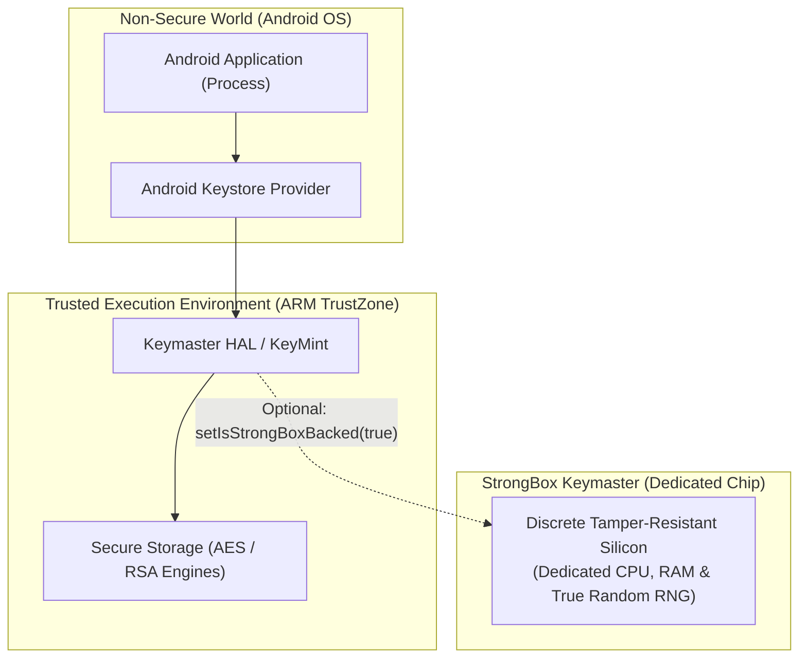
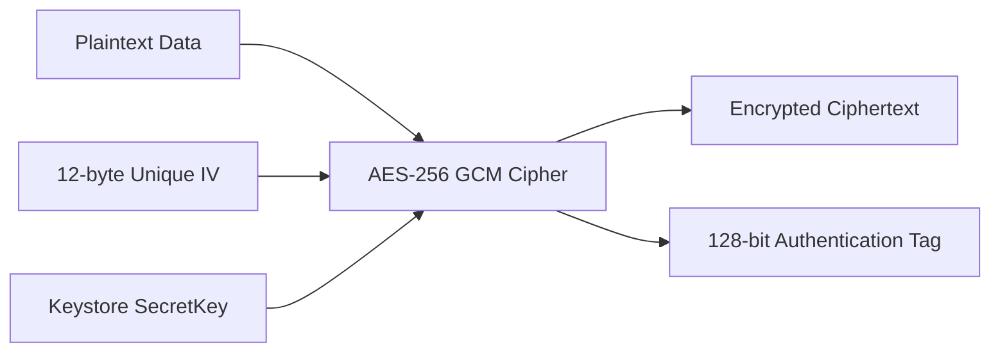

# 11. Security Hardening, Hardware Keystore, StrongBox & Cryptography

> "Securing mobile secrets is fundamentally different from backend server security. A mobile client executes on untrusted, user-controlled hardware where reverse engineers have full root access, memory debuggers, and dynamic instrumentation frameworks like Frida. Security must be anchored in silicon: the Android Keystore, ARM TrustZone, and StrongBox Keymaster."  
> — *Referencing Android Security Internals (Nikolay Elenkov) & NIST Cryptographic Guidelines*

---

## 1. Hardware Security Architecture: TEE vs StrongBox

Android secures cryptographic keys using dedicated hardware isolation:



### 1.1 TEE (Trusted Execution Environment)
Runs concurrently with the Linux kernel on the main application processor using ARM TrustZone security extensions. Memory and execution states are isolated from the Android OS.

### 1.2 StrongBox Keymaster
Introduced in Android 9.0, StrongBox executes on a **physically dedicated tamper-resistant microchip** (Secure Element) with its own CPU, memory, and crypto hardware. It is impervious to CPU side-channel attacks (Spectre/Meltdown) affecting the main processor.

---

## 2. Authenticated Encryption with AES-256-GCM

Never use legacy `ECB` or `CBC` modes without HMAC. In modern Android, always use **AES-256 in Galois/Counter Mode (GCM)**, which provides authenticated encryption with associated data (AEAD):



The authentication tag detects any unauthorized tampering or ciphertext modification before decryption.

---

## 3. Production Hardware Keystore & Biometric Cipher Implementation

Below is a complete, production-grade security manager that generates hardware-backed AES-256 keys and performs authenticated encryption linked to `BiometricPrompt`:

```kotlin
package com.enterprise.app.security

import android.content.Context
import android.content.pm.PackageManager
import android.os.Build
import android.security.keystore.KeyGenParameterSpec
import android.security.keystore.KeyProperties
import java.security.KeyStore
import javax.crypto.Cipher
import javax.crypto.KeyGenerator
import javax.crypto.SecretKey
import javax.crypto.spec.GCMParameterSpec

class HardwareKeystoreManager(private val context: Context) {

    companion object {
        private const val ANDROID_KEYSTORE = "AndroidKeyStore"
        private const val KEY_ALIAS = "enterprise_master_key"
        private const val TRANSFORMATION = "AES/GCM/NoPadding"
        private const val GCM_TAG_LENGTH = 128
        private const val IV_LENGTH_BYTES = 12
    }

    private val keyStore = KeyStore.getInstance(ANDROID_KEYSTORE).apply { load(null) }

    init {
        ensureKeyGenerated()
    }

    private fun ensureKeyGenerated() {
        if (!keyStore.containsAlias(KEY_ALIAS)) {
            val keyGenerator = KeyGenerator.getInstance(
                KeyProperties.KEY_ALGORITHM_AES,
                ANDROID_KEYSTORE
            )

            val purposes = KeyProperties.PURPOSE_ENCRYPT or KeyProperties.PURPOSE_DECRYPT
            val builder = KeyGenParameterSpec.Builder(KEY_ALIAS, purposes)
                .setBlockModes(KeyProperties.BLOCK_MODE_GCM)
                .setEncryptionPaddings(KeyProperties.ENCRYPTION_PADDING_NONE)
                .setKeySize(256)
                .setRandomizedEncryptionRequired(true)

            // Leverage StrongBox if hardware chip is physically present
            if (Build.VERSION.SDK_INT >= Build.VERSION_CODES.P) {
                val hasStrongBox = context.packageManager.hasSystemFeature(
                    PackageManager.FEATURE_STRONGBOX_KEYSTORE
                )
                if (hasStrongBox) {
                    builder.setIsStrongBoxBacked(true)
                }
            }

            keyGenerator.init(builder.build())
            keyGenerator.generateKey()
        }
    }

    private fun getSecretKey(): SecretKey {
        return (keyStore.getEntry(KEY_ALIAS, null) as KeyStore.SecretKeyEntry).secretKey
    }

    fun encrypt(plaintext: ByteArray): EncryptedPayload {
        val cipher = Cipher.getInstance(TRANSFORMATION)
        cipher.init(Cipher.ENCRYPT_MODE, getSecretKey())
        val iv = cipher.iv // 12-byte secure random IV generated by Keystore
        val ciphertext = cipher.doFinal(plaintext)
        return EncryptedPayload(iv = iv, ciphertext = ciphertext)
    }

    fun decrypt(payload: EncryptedPayload): ByteArray {
        val cipher = Cipher.getInstance(TRANSFORMATION)
        val spec = GCMParameterSpec(GCM_TAG_LENGTH, payload.iv)
        cipher.init(Cipher.DECRYPT_MODE, getSecretKey(), spec)
        return cipher.doFinal(payload.ciphertext)
    }

    data class EncryptedPayload(val iv: ByteArray, val ciphertext: ByteArray)
}
```

---

## 4. Runtime Application Self-Protection (RASP)

To defend against tampering on rooted devices and memory inspection via Frida/Xposed:

```kotlin
package com.enterprise.app.security

import java.io.File

object IntegrityGuard {

    private val KNOWN_ROOT_BINARIES = arrayOf(
        "/system/bin/su",
        "/system/xbin/su",
        "/sbin/su",
        "/data/local/xbin/su",
        "/data/local/bin/su",
        "/system/sd/xbin/su",
        "/system/bin/failsafe/su",
        "/data/local/su"
    )

    fun isDeviceCompromised(): Boolean {
        return checkRootBinaries() || checkTestKeys() || detectFridaServer()
    }

    private fun checkRootBinaries(): Boolean {
        for (path in KNOWN_ROOT_BINARIES) {
            if (File(path).exists()) return true
        }
        return false
    }

    private fun checkTestKeys(): Boolean {
        val buildTags = android.os.Build.TAGS
        return buildTags != null && buildTags.contains("test-keys")
    }

    private fun detectFridaServer(): Boolean {
        // Frida default control port check
        return try {
            val socket = java.net.Socket("127.0.0.1", 27042)
            socket.close()
            true // Frida server is listening!
        } catch (e: Exception) {
            false
        }
    }
}
```
