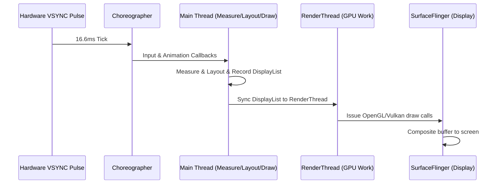
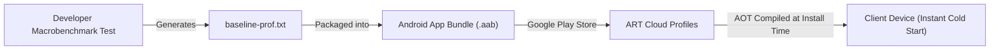
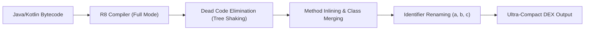

# 12. Profiling, Memory Leaks, Baseline Profiles & R8 Optimization

> "A production mobile app cannot afford frame drops, runaway memory leaks, or sluggish cold starts. Achieving butter-smooth 120 FPS rendering and sub-500ms cold starts requires mastering VSYNC rendering pipelines, Macrobenchmark tests, Baseline Profiles, and R8 full-mode optimization."  
> — *Referencing Android Performance Patterns & Google Macrobenchmark Guidelines*

---

## 1. Frame Rendering Budgets & VSYNC Pipelines

To render animations at 60 Hz or 120 Hz without stutter (jank), each frame must execute within a strict hardware budget:
* **60 FPS**: $1000\text{ms} / 60 \approx \mathbf{16.66\text{ms}}$ per frame.
* **120 FPS**: $1000\text{ms} / 120 \approx \mathbf{8.33\text{ms}}$ per frame.



If the main thread or render thread exceeds the time budget, Choreographer drops the frame, producing visible jank.

---

## 2. Baseline Profiles: Cold Start Optimization

When users install an app from Google Play, code is initially interpreted or JIT-compiled, causing slow startup times.

### How Baseline Profiles Work
**Baseline Profiles** contain a human-readable and compiled list of classes and methods executed during critical user journeys (app startup, first screen render, scrolling feeds).



### 2.1 Writing a Startup Macrobenchmark
```kotlin
package com.enterprise.benchmark

import androidx.benchmark.macro.StartupMode
import androidx.benchmark.macro.StartupTimingMetric
import androidx.benchmark.macro.junit4.BaselineProfileRule
import androidx.test.ext.junit.runners.AndroidJUnit4
import org.junit.Rule
import org.junit.Test
import org.junit.runner.RunWith

@RunWith(AndroidJUnit4::class)
class StartupBenchmark {

    @get:Rule
    val baselineRule = BaselineProfileRule()

    @Test
    fun generateBaselineProfile() = baselineRule.collect(
        packageName = "com.enterprise.app",
        includeInStartupProfile = true
    ) {
        // Defines the critical startup journey
        pressHome()
        startActivityAndWait()
    }
}
```

Apps using Baseline Profiles typically see **30% to 50% faster cold starts** out of the box.

---

## 3. R8 Full Mode & ProGuard Rules

R8 is Google's code shrinker, optimizer, and obfuscator that replaces ProGuard in modern Android builds.



### Production `proguard-rules.pro` Hardening
```proguard
# 1. Enable R8 Full Mode optimization
# Defined in gradle.properties: android.enableR8.fullMode=true

# 2. Preserve Kotlinx Serialization Metadata
-keepattributes *Annotation*, InnerClasses, Signature, Exceptions
-keepclassmembers class * {
    *** Companion;
}
-keepclasseswithmembers class * {
    kotlinx.serialization.KSerializer serializer(...);
}

# 3. Preserve Room generated database implementations
-keep class * extends androidx.room.RoomDatabase
-dontwarn androidx.room.paging.**

# 4. Retain Line Numbers and Source File attributes for Sentry / Crashlytics deobfuscation
-renamesourcefileattribute SourceFile
-keepattributes SourceFile, LineNumberTable

# 5. Remove Android Log calls completely in release builds
-assumenosideeffects class android.util.Log {
    public static boolean isLoggable(java.lang.String, int);
    public static int v(...);
    public static int d(...);
    public static int i(...);
}
```

---

## 4. Automated Testing: Turbine & MockK

Testing asynchronous coroutine flows requires verifying emissions sequentially without race conditions. Google and Cash App developed **Turbine** for this purpose.

```kotlin
package com.enterprise.app.test

import app.cash.turbine.test
import com.enterprise.app.data.repository.CartRepository
import com.enterprise.app.domain.model.Cart
import com.enterprise.app.presentation.CartViewModel
import com.enterprise.app.presentation.CartUiState
import io.mockk.coEvery
import io.mockk.mockk
import kotlinx.coroutines.Dispatchers
import kotlinx.coroutines.ExperimentalCoroutinesApi
import kotlinx.coroutines.test.*
import org.junit.After
import org.junit.Assert.assertEquals
import org.junit.Before
import org.junit.Test

@OptIn(ExperimentalCoroutinesApi::class)
class CartViewModelTest {

    private val testDispatcher = StandardTestDispatcher()
    private val repository = mockk<CartRepository>()
    private lateinit var viewModel: CartViewModel

    @Before
    fun setup() {
        Dispatchers.setMain(testDispatcher)
    }

    @After
    fun tearDown() {
        Dispatchers.resetMain()
    }

    @Test
    fun `when loadCart succeeds, uiState transitions from Loading to Success`() = runTest {
        val mockCart = Cart(items = emptyList(), totalCents = 0)
        coEvery { repository.getCart() } returns mockCart

        viewModel = CartViewModel(repository)

        // Test the StateFlow emissions sequentially with Turbine
        viewModel.uiState.test {
            // Initial state
            assertEquals(CartUiState.Loading, awaitItem())
            
            // Advance virtual time to execute coroutine
            testScheduler.advanceUntilIdle()

            // Success state received
            assertEquals(CartUiState.Success(mockCart), awaitItem())
            cancelAndIgnoreRemainingEvents()
        }
    }
}
```
