# 13. Production Android Architecture & Multi-Module Project Structure

> "In large-scale enterprise Android development, a single `:app` module leads to excruciating Gradle build times, tangled circular dependencies, broken feature boundaries, and lack of team autonomy. Production Android applications are organized as multi-module, highly decoupled directed acyclic graphs (DAGs) using Modern Android Architecture."  
> — *Referencing Guide to Android App Architecture (Google MAD) & Modularization Architecture Guidelines*

---

## 1. Multi-Module Architecture: Layer vs Feature Modularization

There are two primary paradigms for modularizing Android codebases:

```mermaid
flowchart TD
    subgraph FlatLayer["Layer-Based Modularization (Anti-Pattern at Scale)"]
        UIModule[":feature-ui"]
        DomainModule[":domain"]
        DataModule[":data"]
        UIModule --> DomainModule --> DataModule
    end

    subgraph MatrixFeature["Feature-Based Multi-Module (Enterprise Standard)"]
        App[":app (Application Shell / Navigation Graph)"]
        
        subgraph Features["Feature Modules"]
            FeatAuth[":feature:auth"]
            FeatCheckout[":feature:checkout"]
            FeatCatalog[":feature:catalog"]
        end

        subgraph Core["Core / Shared Modules"]
            CoreModel[":core:model (Domain Entities)"]
            CoreUI[":core:ui (Design System & Reusable Composables)"]
            CoreNetwork[":core:network (Retrofit/OkHttp Client)"]
            CoreDatabase[":core:database (Room DB Engine)"]
            CoreDatastore[":core:datastore (Proto DataStore)"]
        end

        App --> FeatAuth
        App --> FeatCheckout
        App --> FeatCatalog

        FeatAuth --> CoreModel
        FeatAuth --> CoreUI
        FeatAuth --> CoreNetwork

        FeatCheckout --> CoreModel
        FeatCheckout --> CoreUI
        FeatCheckout --> CoreDatabase

        FeatCatalog --> CoreModel
        FeatCatalog --> CoreUI
        FeatCatalog --> CoreNetwork
        FeatCatalog --> CoreDatabase
    end
```



### Why Feature-Based Modularization Wins:
1. **Incremental Compilation**: Gradle only recompiles the feature module that changed. Modifying `:feature:checkout` does not trigger a recompile of `:feature:catalog` or `:feature:auth`.
2. **Strict Encapsulation**: Internal helper classes in `:feature:checkout` are marked `internal`, preventing `:feature:catalog` from illegally accessing them.
3. **Parallel Builds**: Gradle can build independent feature modules concurrently across multiple CPU worker threads.
4. **Dynamic Feature Delivery**: Feature modules can be compiled into Dynamic Feature Modules (Play Feature Delivery) downloaded on demand by Google Play.

---

## 2. Complete Enterprise Android Directory Structure

Below is the standard, production-proven Android repository layout following the official Google Now-in-Android (NiA) and Uber/Square architecture standards:

```
my-enterprise-android-app/
├── build-logic/                                # Convention Plugins (Gradle Version Catalogs)
│   ├── convention/
│   │   ├── src/main/kotlin/
│   │   │   ├── AndroidApplicationConventionPlugin.kt
│   │   │   ├── AndroidLibraryConventionPlugin.kt
│   │   │   ├── AndroidComposeConventionPlugin.kt
│   │   │   ├── AndroidHiltConventionPlugin.kt
│   │   │   └── AndroidRoomConventionPlugin.kt
│   │   └── build.gradle.kts
│   ├── settings.gradle.kts
│   └── build.gradle.kts
│
├── gradle/
│   ├── libs.versions.toml                      # Version Catalog (Single Source of Truth for dependencies)
│   └── wrapper/
│       ├── gradle-wrapper.jar
│       └── gradle-wrapper.properties
│
├── app/                                        # Application Shell (Orchestrator)
│   ├── build.gradle.kts
│   ├── proguard-rules.pro
│   └── src/
│       └── main/
│           ├── AndroidManifest.xml             # Root manifest (Application, Permissions)
│           ├── java/com/enterprise/app/
│           │   ├── EnterpriseApp.kt            # @HiltAndroidApp Application class
│           │   ├── MainActivity.kt             # Single Activity host with ComponentActivity
│           │   ├── navigation/
│           │   │   ├── AppNavHost.kt           # Central Jetpack Compose NavHost
│           │   │   └── TopLevelDestination.kt  # Bottom bar destinations
│           │   └── di/
│           │       └── AppModule.kt            # App-level bindings
│           └── res/
│
├── core/                                       # Reusable Infrastructure Modules
│   ├── model/                                  # Pure Kotlin domain entities & business rules (Zero Android SDK)
│   │   ├── build.gradle.kts
│   │   └── src/main/java/com/enterprise/core/model/
│   │       ├── User.kt
│   │       ├── Product.kt
│   │       └── Order.kt
│   │
│   ├── common/                                 # Coroutine dispatchers, Result monad, extensions
│   │   ├── build.gradle.kts
│   │   └── src/main/java/com/enterprise/core/common/
│   │       ├── Dispatcher.kt                   # Custom @Dispatcher qualifiers
│   │       ├── AppDispatchers.kt               # Enum (IO, Default, Main)
│   │       └── result/Result.kt                # Sealed Result<T> hierarchy
│   │
│   ├── ui/                                     # Material 3 Design System, custom widgets, tokens
│   │   ├── build.gradle.kts
│   │   └── src/main/java/com/enterprise/core/ui/
│   │       ├── theme/
│   │       │   ├── Color.kt
│   │       │   ├── Type.kt
│   │       │   └── Theme.kt
│   │       └── component/
│   │           ├── EnterpriseButton.kt
│   │           ├── LoadingIndicator.kt
│   │           └── ErrorBanner.kt
│   │
│   ├── database/                               # Room SQLite tables, DAOs, Migrations
│   │   ├── build.gradle.kts
│   │   └── src/main/java/com/enterprise/core/database/
│   │       ├── AppDatabase.kt
│   │       ├── dao/
│   │       │   ├── ProductDao.kt
│   │       │   └── OrderDao.kt
│   │       ├── model/
│   │       │   ├── ProductEntity.kt
│   │       │   └── OrderEntity.kt
│   │       └── di/
│   │           └── DatabaseModule.kt
│   │
│   ├── network/                                # OkHttp, Retrofit, Interceptors, Cert Pinning
│   │   ├── build.gradle.kts
│   │   └── src/main/java/com/enterprise/core/network/
│   │       ├── RetrofitNetwork.kt
│   │       ├── interceptor/
│   │       │   ├── AuthInterceptor.kt
│   │       │   └── LoggingInterceptor.kt
│   │       └── model/
│   │           └── NetworkProduct.kt
│   │
│   └── data/                                   # Repositories reconciling Local + Remote
│       ├── build.gradle.kts
│       └── src/main/java/com/enterprise/core/data/
│           ├── repository/
│           │   ├── ProductRepository.kt        # Public interface
│           │   └── ProductRepositoryImpl.kt    # Internal implementation
│           └── di/
│               └── DataModule.kt               # @Binds repository implementation
│
├── feature/                                    # Autonomous Feature Modules
│   ├── auth/
│   │   ├── build.gradle.kts
│   │   └── src/main/java/com/enterprise/feature/auth/
│   │       ├── navigation/
│   │       │   └── AuthNavigation.kt           # Feature route & entry point
│   │       ├── AuthScreen.kt                   # @Composable UI
│   │       ├── AuthViewModel.kt                # MVI ViewModel
│   │       ├── AuthUiState.kt                  # Sealed UI State
│   │       └── AuthIntent.kt                   # Sealed User Actions
│   │
│   ├── catalog/
│   │   ├── build.gradle.kts
│   │   └── src/main/java/com/enterprise/feature/catalog/
│   │       ├── navigation/
│   │       │   └── CatalogNavigation.kt
│   │       ├── CatalogScreen.kt
│   │       └── CatalogViewModel.kt
│   │
│   └── checkout/
│       ├── build.gradle.kts
│       └── src/main/java/com/enterprise/feature/checkout/
│           ├── navigation/
│           │   └── CheckoutNavigation.kt
│           ├── CheckoutScreen.kt
│           └── CheckoutViewModel.kt
│
├── settings.gradle.kts                         # Included modules list
└── build.gradle.kts                            # Root build file
```

---

## 3. Dependency Governance with Gradle Version Catalogs (`libs.versions.toml`)

In production multi-module projects, dependency versions must be centralized in `gradle/libs.versions.toml` to avoid version conflicts between modules:

```toml
[versions]
agp = "8.4.0"
kotlin = "2.0.0"
coreKtx = "1.13.1"
coroutines = "1.8.1"
lifecycle = "2.8.0"
composeBom = "2024.05.00"
hilt = "2.51.1"
ksp = "2.0.0-1.0.21"
room = "2.6.1"
retrofit = "2.11.0"
okhttp = "4.12.0"
kotlinxSerialization = "1.6.3"

[libraries]
# AndroidX & Core
androidx-core-ktx = { group = "androidx.core", name = "core-ktx", version.ref = "coreKtx" }
androidx-lifecycle-runtimeCompose = { group = "androidx.lifecycle", name = "lifecycle-runtime-compose", version.ref = "lifecycle" }
androidx-lifecycle-viewModelCompose = { group = "androidx.lifecycle", name = "lifecycle-viewmodel-compose", version.ref = "lifecycle" }

# Coroutines
kotlinx-coroutines-core = { group = "org.jetbrains.kotlinx", name = "kotlinx-coroutines-core", version.ref = "coroutines" }
kotlinx-coroutines-android = { group = "org.jetbrains.kotlinx", name = "kotlinx-coroutines-android", version.ref = "coroutines" }

# Compose BOM & UI
androidx-compose-bom = { group = "androidx.compose", name = "compose-bom", version.ref = "composeBom" }
androidx-compose-ui = { group = "androidx.compose.ui", name = "ui" }
androidx-compose-material3 = { group = "androidx.compose.material3", name = "material3" }
androidx-compose-ui-tooling-preview = { group = "androidx.compose.ui", name = "ui-tooling-preview" }

# Hilt & KSP
hilt-android = { group = "com.google.dagger", name = "hilt-android", version.ref = "hilt" }
hilt-compiler = { group = "com.google.dagger", name = "hilt-compiler", version.ref = "hilt" }

# Room
room-runtime = { group = "androidx.room", name = "room-runtime", version.ref = "room" }
room-ktx = { group = "androidx.room", name = "room-ktx", version.ref = "room" }
room-compiler = { group = "androidx.room", name = "room-compiler", version.ref = "room" }

# Networking
retrofit = { group = "com.squareup.retrofit2", name = "retrofit", version.ref = "retrofit" }
retrofit-kotlinx-serialization = { group = "com.squareup.retrofit2", name = "converter-kotlinx-serialization", version.ref = "retrofit" }
okhttp-logging = { group = "com.squareup.okhttp3", name = "logging-interceptor", version.ref = "okhttp" }

[plugins]
android-application = { id = "com.android.application", version.ref = "agp" }
android-library = { id = "com.android.library", version.ref = "agp" }
kotlin-android = { id = "org.jetbrains.kotlin.android", version.ref = "kotlin" }
kotlin-compose = { id = "org.jetbrains.kotlin.plugin.compose", version.ref = "kotlin" }
hilt = { id = "com.google.dagger.hilt.android", version.ref = "hilt" }
ksp = { id = "com.google.devtools.ksp", version.ref = "ksp" }
```

---

## 4. Decoupled Navigation Between Feature Modules

If `:feature:catalog` needs to navigate to `:feature:checkout`, a direct dependency would cause circular dependency issues if checkout also needed something from catalog.

### The Navigation Contract Pattern
Each feature module exposes an extension function on `NavGraphBuilder` defining its route and parameters, without exposing its internal screens or ViewModels:

```kotlin
// In :feature:checkout/src/main/java/.../navigation/CheckoutNavigation.kt
package com.enterprise.feature.checkout.navigation

import androidx.navigation.NavController
import androidx.navigation.NavGraphBuilder
import androidx.navigation.NavOptions
import androidx.navigation.compose.composable
import com.enterprise.feature.checkout.CheckoutRoute

const val CHECKOUT_ROUTE = "checkout_route/{orderId}"

fun NavController.navigateToCheckout(orderId: String, navOptions: NavOptions? = null) {
    this.navigate("checkout_route/$orderId", navOptions)
}

fun NavGraphBuilder.checkoutScreen(
    onCheckoutSuccess: (String) -> Unit,
    onBackClick: () -> Unit
) {
    composable(route = CHECKOUT_ROUTE) { backStackEntry ->
        val orderId = backStackEntry.arguments?.getString("orderId") ?: return@composable
        CheckoutRoute(
            orderId = orderId,
            onCheckoutSuccess = onCheckoutSuccess,
            onBackClick = onBackClick
        )
    }
}
```

The `:app` module simply aggregates these navigation extension functions into its `AppNavHost`:

```kotlin
// In :app/src/main/java/.../navigation/AppNavHost.kt
@Composable
fun AppNavHost(navController: NavHostController, modifier: Modifier = Modifier) {
    NavHost(
        navController = navController,
        startDestination = CATALOG_ROUTE,
        modifier = modifier
    ) {
        catalogScreen(
            onProductClick = { productId -> navController.navigateToProductDetail(productId) },
            onCheckoutClick = { orderId -> navController.navigateToCheckout(orderId) }
        )
        checkoutScreen(
            onCheckoutSuccess = { txId -> navController.navigateToReceipt(txId) },
            onBackClick = { navController.popBackStack() }
        )
    }
}
```
