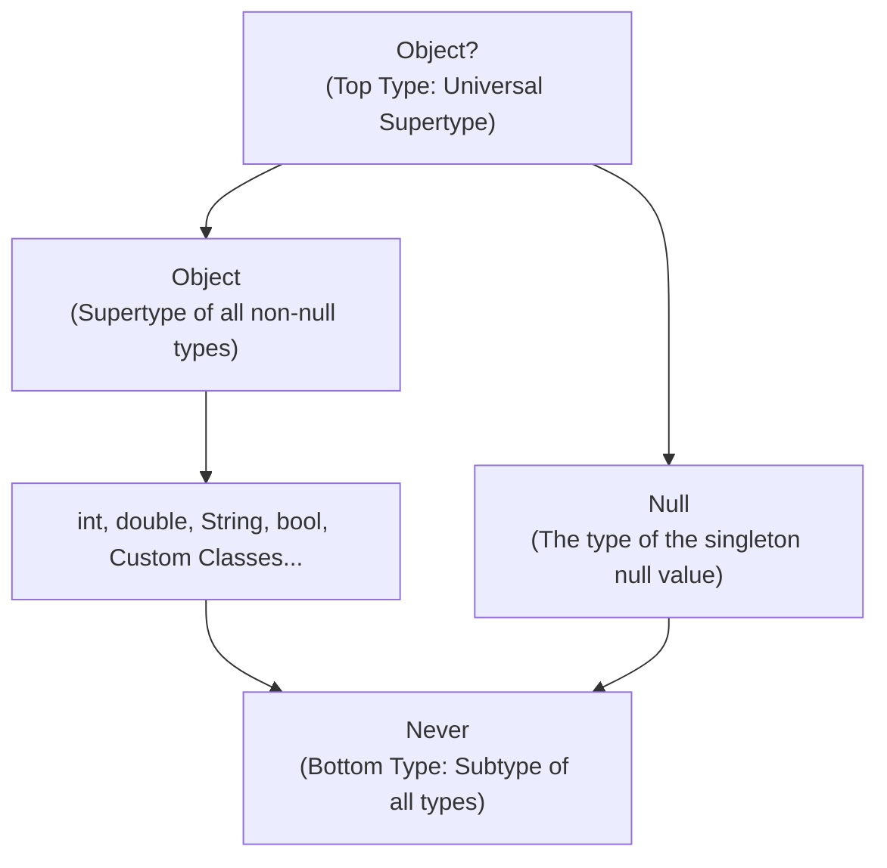
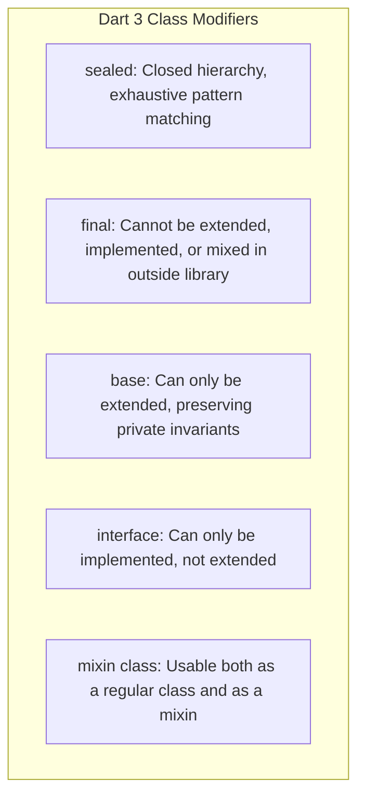
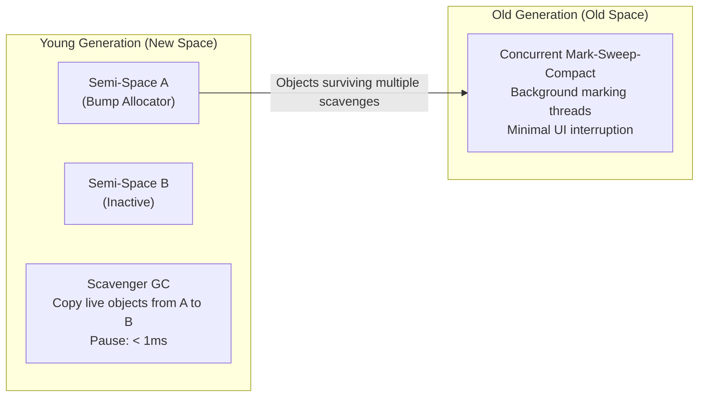
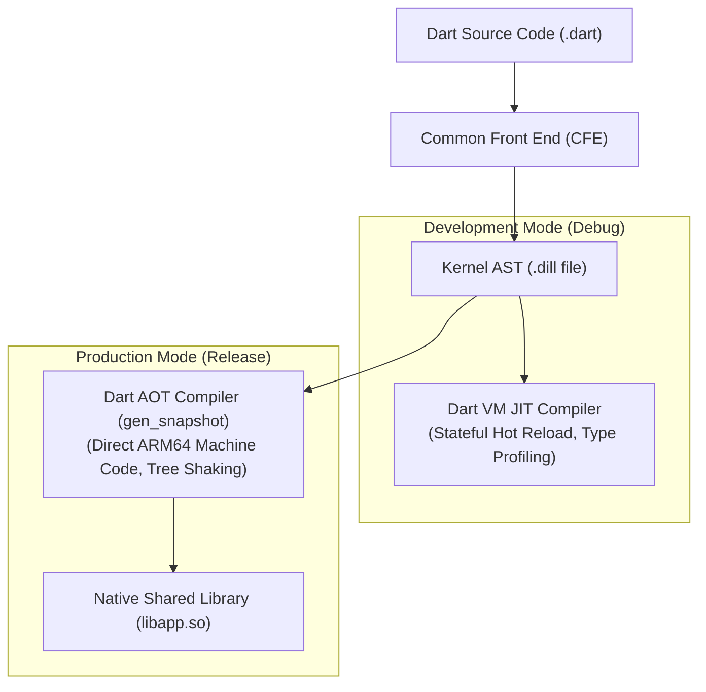

# 01. Dart 3+ Language In-Depth, Type System & Memory Model

> "Dart is not merely an alternative to JavaScript or Java. With Dart 3, it became a soundly-typed, multi-paradigm language featuring mathematical type boundaries, algebraic data types via class modifiers, records, pattern matching, and a highly tuned generation-scavenging virtual machine."  
> — *Referencing The Dart Programming Language Specification (Ecma-408) & Effective Dart*

---

## 1. The Dart 3 Sound Type System

Dart 3 enforces **Sound Null Safety**. If an expression has a non-nullable type $T$, it is mathematically guaranteed to never evaluate to `null` at runtime. The compiler relies on this guarantee to optimize compiled ARM64 machine code, eliminating defensive null checks and boxing overhead.



### 1.1 Top Type (`Object?`) vs Bottom Type (`Never`)
* **`Object?`**: The universal top type. Any Dart value can be assigned to `Object?`.
* **`Never`**: The bottom type. It represents an evaluation that never returns (e.g., an infinite loop or a function that unconditionally throws an exception).
  ```dart
  Never fail(String message) {
    throw StateError(message);
  }

  // Type inference leverages Never:
  int parsePort(String? raw) {
    return int.tryParse(raw ?? '') ?? fail('Invalid port provided');
  }
  ```

---

## 2. Dart 3 Class Modifiers & Algebraic Data Types

Dart 3 introduces strict class modifiers that allow library authors to govern how classes are consumed across library boundaries:



### 2.1 Exhaustive Pattern Matching with `sealed` Classes
Sealed classes form closed type hierarchies. The Dart 3 compiler enforces **exhaustiveness checking** at compile time:

```dart
sealed class NetworkState<T> {
  const NetworkState();
}

final class Idle<T> extends NetworkState<T> {
  const Idle();
}

final class Loading<T> extends NetworkState<T> {
  const Loading();
}

final class Success<T> extends NetworkState<T> {
  final T data;
  const Success(this.data);
}

final class Failure<T> extends NetworkState<T> {
  final Exception error;
  const Failure(this.error);
}

// Compile error if ANY state is omitted!
String renderUi<T>(NetworkState<T> state) => switch (state) {
  Idle() => 'Waiting for user action...',
  Loading() => 'Loading remote payload...',
  Success(:final data) => 'Loaded data: $data',
  Failure(:final error) => 'Failed with: $error',
};
```

---

## 3. Extension Types: Zero-Cost Abstractions

Prior to Dart 3.3, wrapping a primitive or foreign object into a strongly-typed domain identifier (e.g., `UserId`) required allocating a full heap wrapper class.
Dart 3.3 introduced **Extension Types**, which provide static type wrappers that are **completely erased at runtime**:

```dart
extension type const UserId(int rawId) {
  // Can define validation or extension methods
  bool get isValid => rawId > 0;
  String get formatted => 'USER-$rawId';
}

void processUser(UserId id) {
  print(id.formatted);
}

void main() {
  const id = UserId(42);
  processUser(id);
  // At runtime, 'id' is a raw unboxed 64-bit integer. Zero heap allocation!
}
```

---

## 4. Dart VM Memory Architecture & Garbage Collection

The Dart Virtual Machine employs a high-throughput, **generation-based garbage collection** strategy designed specifically for UI workloads:



### 4.1 The Young Generation & Scavenger
* **Ephemerality**: Most objects in UI frameworks (such as Flutter's `Widget` configurations) live for only a single frame ($< 16\text{ms}$).
* **Semi-Space Scavenging**: The nursery consists of two contiguous memory buffers. Objects are allocated rapidly via bump-pointer allocation in Space A. During garbage collection, live objects are copied to Space B, and Space A is wiped instantly in a single memory operation.
* **Low Latency**: Scavenging completes in fractions of a millisecond, preventing UI frame drops.

### 4.2 The Old Generation: Concurrent Mark-Sweep
Objects that survive multiple nursery scavenge cycles are promoted to the Old Generation. The Old Generation uses concurrent marking threads that run in parallel with the main Dart UI thread, performing compaction only when fragmentation exceeds predefined limits.

---

## 5. Dart Compilation Modes: JIT vs AOT

Dart features a dual-engine compilation pipeline:



* **JIT (Just-In-Time)**: Powers Flutter's **Stateful Hot Reload**. The VM retains the running heap state and injects updated Kernel AST deltas on the fly.
* **AOT (Ahead-Of-Time)**: For release builds, `gen_snapshot` compiles the Kernel AST directly into native ARM64 / x86_64 machine code (`libapp.so`). There is no interpreter or JIT runtime overhead in production.
