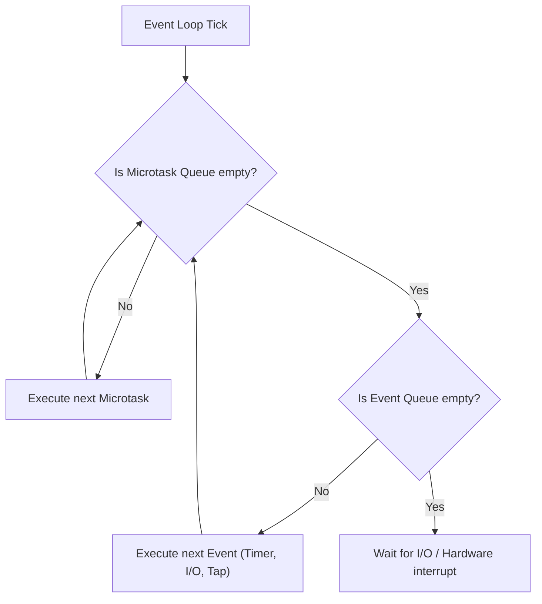
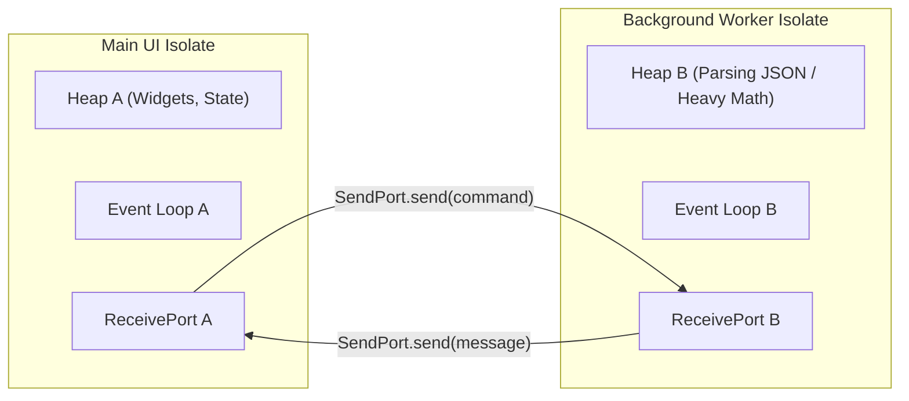

# 02. Dart Concurrency, Event Loops, Zones & Isolates Architecture

> "Dart code executes in a single-threaded event loop by default. True parallelism is achieved not through shared-memory multithreading with locks and mutexes, but through Isolates: isolated memory heaps communicating purely via message passing."  
> — *Referencing Concurrent Programming in Dart & The Dart SDK Architecture*

---

## 1. The Dart Event Loop Architecture

Every Dart isolate runs an infinite event loop with two distinct queues:



### 1.1 Microtask Queue vs Event Queue
1. **`MicrotaskQueue`**: High-priority, internal actions that must execute immediately before returning control to the outside world (e.g., `scheduleMicrotask`, internal `Future` completions).
2. **`EventQueue`**: Standard external events: user gestures, HTTP responses, file I/O callbacks, and `Timer` events.

> **Starvation Trap**: If code continuously schedules microtasks in a loop, the event loop will **starve** the event queue, freezing the Flutter UI completely because tap events and frame rendering callbacks in the event queue never get executed.

---

## 2. Dart Zones & Error Encapsulation

A **Zone** represents an asynchronous execution context. Zones can intercept asynchronous behavior, timer creation, microtask scheduling, and unhandled exceptions:

```dart
import 'dart:async';

void runProductionApp(void Function() appRunner) {
  runZonedGuarded(
    () {
      // Runs inside a custom Zone
      appRunner();
    },
    (error, stackTrace) {
      // Intercepts ALL uncaught asynchronous errors across the entire app
      print('CRITICAL ZONE ERROR: $error');
      // Send crash report to Sentry / Firebase Crashlytics
    },
    zoneSpecification: ZoneSpecification(
      print: (self, parent, zone, line) {
        // Redact PII or disable print statements in production release builds
        parent.print(zone, '[SECURE_LOG] $line');
      },
    ),
  );
}
```

---

## 3. Isolates Architecture: True Parallelism

In Dart, there is **no shared mutable state between threads**. Each **Isolate** has:
* Its own dedicated execution thread.
* Its own dedicated memory heap.
* Its own independent event loop.



### 3.1 Deep Copying vs Zero-Copy Buffer Sharing
When messages are passed between isolates via `SendPort.send()`:
* Normal Dart objects (strings, maps, lists) are **deep-copied** (serialized and deserialized) across heaps.
* To achieve zero-copy transfer of large binary data (e.g., 50MB file or camera frame), use **`TransferableTypedData`**. It transfers ownership of the underlying native memory pointer in $O(1)$ time without copying.

---

## 4. Production Isolate Worker Implementation

Below is an enterprise-grade background worker using modern `Isolate.run` and long-lived worker isolates with two-way communication:

```dart
import 'dart:async';
import 'dart:isolate';
import 'dart:typed_data';

// 1. One-off computation using high-level Isolate.run (Dart 2.19+)
Future<List<Map<String, dynamic>>> parseMassiveJsonInBackground(String rawJson) async {
  return await Isolate.run(() {
    // This code executes entirely in a background isolate heap!
    // Zero impact on Flutter UI frame rate
    final decoded = <Map<String, dynamic>>[];
    // Simulated heavy parsing
    return decoded;
  });
}

// 2. Long-Lived Background Worker Isolate with Two-Way Command Channel
class BackgroundComputeEngine {
  SendPort? _commandPort;
  final Completer<void> _initCompleter = Completer<void>();

  Future<void> initialize() async {
    final initPort = ReceivePort();
    await Isolate.spawn(_isolateEntryPoint, initPort.sendPort);

    final eventStream = initPort.asBroadcastStream();
    _commandPort = await eventStream.first as SendPort;
    _initCompleter.complete();
  }

  static void _isolateEntryPoint(SendPort sendPort) {
    final receivePort = ReceivePort();
    sendPort.send(receivePort.sendPort);

    receivePort.listen((message) {
      if (message is WorkerTask) {
        final result = _executeTask(message);
        message.responsePort.send(result);
      }
    });
  }

  static WorkerResponse _executeTask(WorkerTask task) {
    // Perform intensive vector math or image filtering
    final sum = task.payload.fold<int>(0, (prev, elem) => prev + elem);
    return WorkerResponse(task.taskId, sum);
  }

  Future<int> execute(List<int> data) async {
    await _initCompleter.future;
    final responsePort = ReceivePort();
    final task = WorkerTask(
      taskId: DateTime.now().microsecondsSinceEpoch.toString(),
      payload: data,
      responsePort: responsePort.sendPort,
    );

    _commandPort!.send(task);
    final response = await responsePort.first as WorkerResponse;
    responsePort.close();
    return response.calculatedValue;
  }
}

class WorkerTask {
  final String taskId;
  final List<int> payload;
  final SendPort responsePort;
  WorkerTask({required this.taskId, required this.payload, required this.responsePort});
}

class WorkerResponse {
  final String taskId;
  final int calculatedValue;
  WorkerResponse(this.taskId, this.calculatedValue);
}
```
