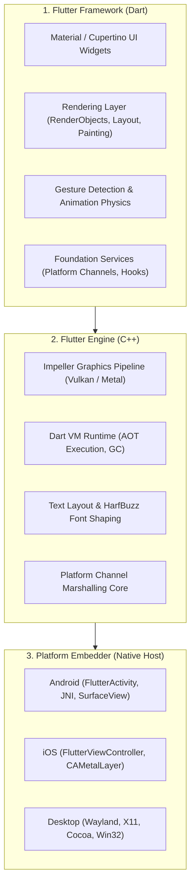
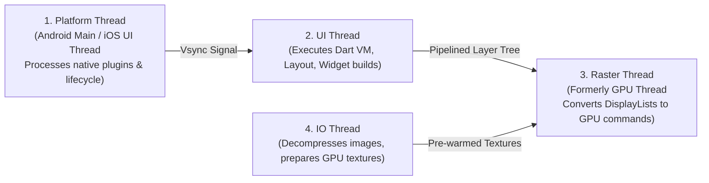
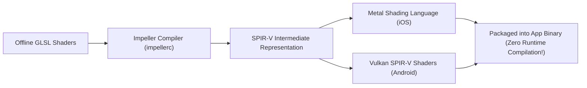

# 03. Flutter Engine Architecture, C++ Runner & Impeller Pipeline

> "Flutter does not translate Dart code into native OEM widgets (like React Native). Flutter is a full-stack graphics engine: it draws every single pixel onto an OS surface buffer using its own C++ engine and Impeller Vulkan/Metal graphics pipeline."  
> — *Referencing Flutter Engine Architecture Documentation & Impeller Rendering Specification*

---

## 1. The 3-Tier Layered Architecture

---

## 2. Flutter Engine Threading Model

The Flutter engine coordinates four dedicated system threads. Understanding thread boundaries is critical to preventing frame drops:

* **Platform Thread**: Hosts the native OS window and processes input events and platform channels. Never block this thread with heavy native computations.
* **UI Thread**: Executes the Dart VM and the Flutter framework code (`build()`, `layout()`, `paint()`).
* **Raster Thread**: Takes the `LayerTree` produced by the UI thread and issues hardware draw calls to the GPU.
* **IO Thread**: Asynchronously decompresses images from disk/network into GPU-ready texture formats, uploading them without stalling the Raster thread.

---

## 3. The Impeller Graphics Engine: Eliminating Shader Jank

For years, Flutter used Google's Skia 2D library. Skia compiled graphics shaders dynamically at runtime on the user's device when a new animation or transition first appeared, causing notorious **runtime shader compilation jank**.

### 3.1 Impeller Design Principles
Flutter designed **Impeller** from scratch to replace Skia:

1. **Ahead-Of-Time (AOT) Shader Compilation**: All shaders are pre-compiled at build time into Metal Shading Language (MSL) or Vulkan SPIR-V binaries packaged inside the app. **Zero shader compilation occurs on the user's device at runtime.**
2. **First-Class Vulkan & Metal**: Targets modern low-overhead graphics APIs directly, avoiding legacy OpenGL abstraction baggage.
3. **Deterministic Memory Footprint**: Allocates graphics memory predictable per-frame, eliminating sporadic GPU allocations.
