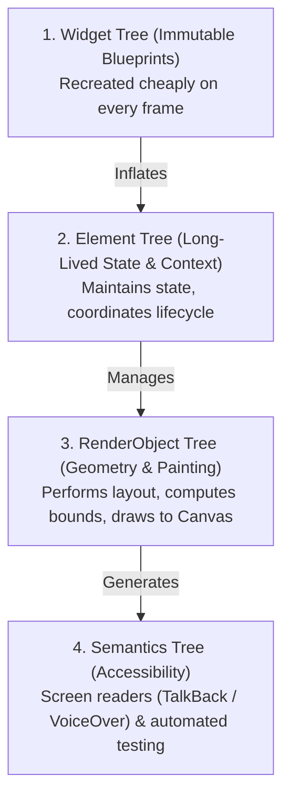
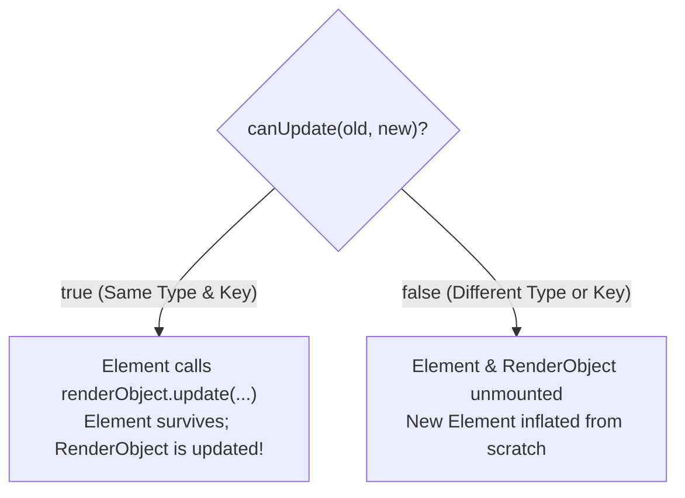
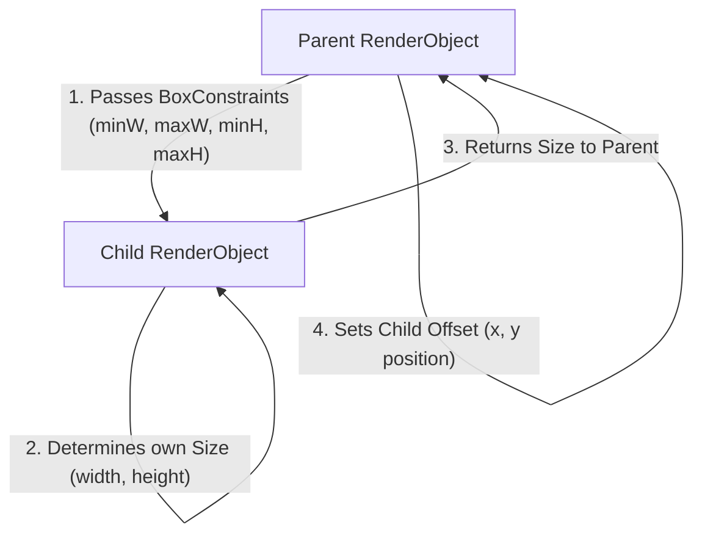

# 04. The Four Trees of Flutter, Element Lifecycle & Layout Protocol

> "Most developers believe Flutter has three trees. In reality, a production Flutter application manages four synchronized tree structures: the Widget Tree, the Element Tree, the RenderObject Tree, and the Semantics Tree. Understanding how Elements mediate between immutable Widgets and mutable RenderObjects is the secret to high-performance Flutter UI."  
> — *Referencing Flutter Architecture Guidelines & Flutter Complete Reference*

---

## 1. The Four Synchronized Trees



### 1.1 Why Widgets are Cheap
A `Widget` is an immutable, lightweight configuration object (typically an instance of `const`). Creating 10,000 widgets per second costs almost nothing because they are allocated in the Dart nursery and scavenged instantly.

### 1.2 Elements as the Architectural Backbone
An `Element` represents the instantiation of a Widget at a specific location in the tree. Elements:
* Hold references to mutable state (`State<T>`).
* Hold the `BuildContext` (the `BuildContext` passed to `build()` **is** the Element itself).
* Retain the corresponding `RenderObject`.

---

## 2. Element Reconciliation & The `canUpdate` Algorithm

When a widget tree rebuilds, Flutter does not destroy and recreate the underlying UI nodes. Instead, it walks the Element tree and executes `Widget.canUpdate`:

```dart
static bool canUpdate(Widget oldWidget, Widget newWidget) {
  return oldWidget.runtimeType == newWidget.runtimeType
      && oldWidget.key == newWidget.key;
}
```



---

## 3. The Flutter Layout Protocol: Constraints Go Down, Sizes Go Up

Flutter layout execution is strictly one-pass ($O(N)$ linear time). It obeys three invariant rules:



1. **Constraints go down**: A parent passes `BoxConstraints` to its child.
2. **Sizes go up**: The child decides its own `Size` within those constraints and reports it back.
3. **Parent sets position**: The parent decides the child's coordinate offset (`parentData.offset`).

---

## 4. Production Custom RenderObject: Circular Radar Visualizer

Below is an enterprise-grade custom `RenderBox` implementing high-performance manual geometry calculation, custom painting, and hit testing:

```dart
import 'dart:math' as math;
import 'package:flutter/rendering.dart';
import 'package:flutter/widgets.dart';

class RadarSweepWidget extends LeafRenderObjectWidget {
  final double progress;
  final Color sweepColor;

  const RadarSweepWidget({
    super.key,
    required this.progress,
    required this.sweepColor,
  });

  @override
  RenderObject createRenderObject(BuildContext context) {
    return RenderRadarSweep(progress: progress, sweepColor: sweepColor);
  }

  @override
  void updateRenderObject(BuildContext context, covariant RenderRadarSweep renderObject) {
    renderObject
      ..progress = progress
      ..sweepColor = sweepColor;
  }
}

class RenderRadarSweep extends RenderBox {
  double _progress;
  Color _sweepColor;

  RenderRadarSweep({
    required double progress,
    required Color sweepColor,
  })  : _progress = progress,
        _sweepColor = sweepColor;

  double get progress => _progress;
  set progress(double value) {
    if (_progress == value) return;
    _progress = value;
    markNeedsPaint(); // Does not trigger layout! Only repaints canvas.
  }

  Color get sweepColor => _sweepColor;
  set sweepColor(Color value) {
    if (_sweepColor == value) return;
    _sweepColor = value;
    markNeedsPaint();
  }

  @override
  void performLayout() {
    // Obey BoxConstraints: size to maximum available or fallback to 200x200
    final desiredWidth = constraints.hasBoundedWidth ? constraints.maxWidth : 200.0;
    final desiredHeight = constraints.hasBoundedHeight ? constraints.maxHeight : 200.0;
    size = constraints.constrain(Size(desiredWidth, desiredHeight));
  }

  @override
  void paint(PaintingContext context, Offset offset) {
    final canvas = context.canvas;
    final center = offset + Offset(size.width / 2, size.height / 2);
    final radius = math.min(size.width, size.height) / 2;

    // Draw concentric radar boundary
    final circlePaint = Paint()
      ..color = _sweepColor.withValues(alpha: 0.2)
      ..style = PaintingStyle.stroke
      ..strokeWidth = 2.0;
    canvas.drawCircle(center, radius, circlePaint);

    // Draw radar sweep wedge
    final sweepPaint = Paint()
      ..shader = SweepGradient(
        startAngle: 0.0,
        endAngle: math.pi * 2,
        colors: [_sweepColor.withValues(alpha: 0.0), _sweepColor],
        stops: const [0.7, 1.0],
        transform: GradientRotation(_progress * math.pi * 2),
      ).createShader(Rect.fromCircle(center: center, radius: radius));

    canvas.drawCircle(center, radius, sweepPaint);
  }
}
```
