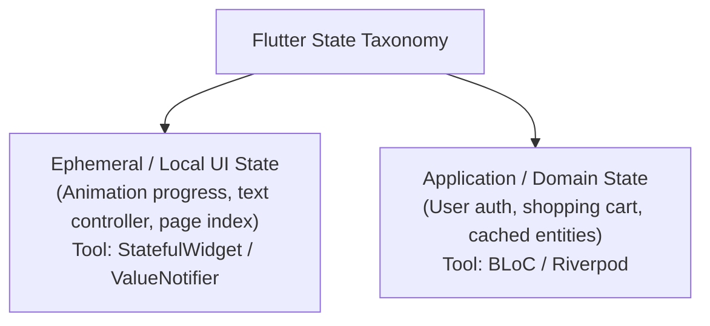
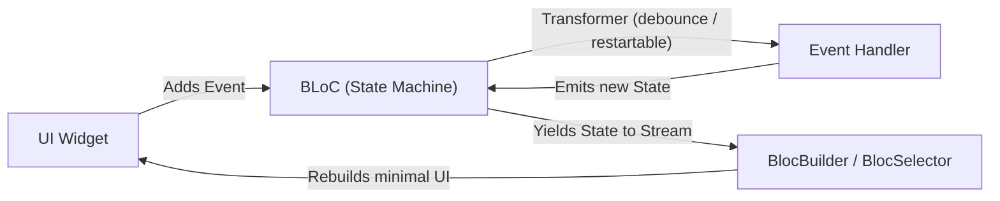

# 05. Enterprise State Management (BLoC 8+, Riverpod 2.0 & Signals)

> "State management in Flutter is not about picking a trendy library. It is about enforcing boundaries between business logic and UI rendering, decoupling asynchronous side-effects, guaranteeing predictable state transitions, and preventing unnecessary widget subtree rebuilds."  
> — *Referencing Enterprise Flutter Architecture & Felix Angelov's BLoC Design Paradigm*

---

## 1. Architectural Taxonomy of State in Flutter



---

## 2. The BLoC (Business Logic Component) Pattern

BLoC enforces strict Unidirectional Data Flow using Dart **Streams**:



### Event Concurrency Transformers
Standard Flutter `StreamController` handles events concurrently. In production, BLoC leverages `package:bloc_concurrency` to control event execution:
* **`restartable()`**: Cancels ongoing operations if a new event arrives (ideal for live search queries).
* **`droppable()`**: Ignores incoming events while a current task is executing (ideal for payment submission buttons).
* **`sequential()`**: Queues incoming events to execute in FIFO order.

---

## 3. Production E-Commerce Cart Implementation with BLoC 8+

Below is an enterprise-grade Cart BLoC featuring immutable Freezed-like states, event debouncing, and custom transformers:

```dart
import 'dart:async';
import 'package:flutter_bloc/flutter_bloc.dart';
import 'package:bloc_concurrency/bloc_concurrency.dart';

// 1. Domain Models
class CartItem {
  final String productId;
  final String title;
  final int quantity;
  final double unitPrice;

  const CartItem({
    required this.productId,
    required this.title,
    required this.quantity,
    required this.unitPrice,
  });

  CartItem copyWith({int? quantity}) => CartItem(
    productId: productId,
    title: title,
    quantity: quantity ?? this.quantity,
    unitPrice: unitPrice,
  );
}

// 2. Sealed Events
sealed class CartEvent {
  const CartEvent();
}

final class CartStarted extends CartEvent {
  const CartStarted();
}

final class CartItemAdded extends CartEvent {
  final CartItem item;
  const CartItemAdded(this.item);
}

final class CartItemRemoved extends CartEvent {
  final String productId;
  const CartItemRemoved(this.productId);
}

final class CartCheckoutSubmitted extends CartEvent {
  const CartCheckoutSubmitted();
}

// 3. Sealed States
sealed class CartState {
  const CartState();
}

final class CartLoading extends CartState {
  const CartLoading();
}

final class CartLoaded extends CartState {
  final List<CartItem> items;
  final bool isCheckingOut;
  final String? errorMessage;

  const CartLoaded({
    required this.items,
    this.isCheckingOut = false,
    this.errorMessage,
  });

  double get totalPrice => items.fold(0.0, (acc, item) => acc + (item.unitPrice * item.quantity));

  CartLoaded copyWith({
    List<CartItem>? items,
    bool? isCheckingOut,
    String? errorMessage,
  }) {
    return CartLoaded(
      items: items ?? this.items,
      isCheckingOut: isCheckingOut ?? this.isCheckingOut,
      errorMessage: errorMessage,
    );
  }
}

// 4. Production Cart BLoC
class CartBloc extends Bloc<CartEvent, CartState> {
  final CartRepository _repository;

  CartBloc({required CartRepository repository})
      : _repository = repository,
        super(const CartLoading()) {
    on<CartStarted>(_onStarted);
    on<CartItemAdded>(_onItemAdded);
    on<CartItemRemoved>(_onItemRemoved);
    // Use droppable transformer to prevent multiple duplicate checkout charges!
    on<CartCheckoutSubmitted>(_onCheckoutSubmitted, transformer: droppable());
  }

  Future<void> _onStarted(CartStarted event, Emitter<CartState> emit) async {
    emit(const CartLoading());
    try {
      final items = await _repository.fetchCart();
      emit(CartLoaded(items: items));
    } catch (e) {
      emit(CartLoaded(items: const [], errorMessage: e.toString()));
    }
  }

  void _onItemAdded(CartItemAdded event, Emitter<CartState> emit) {
    if (state is! CartLoaded) return;
    final current = state as CartLoaded;

    final existingIndex = current.items.indexWhere((i) => i.productId == event.item.productId);
    final updatedList = List<CartItem>.from(current.items);

    if (existingIndex >= 0) {
      final currentItem = updatedList[existingIndex];
      updatedList[existingIndex] = currentItem.copyWith(quantity: currentItem.quantity + 1);
    } else {
      updatedList.add(event.item);
    }

    emit(current.copyWith(items: updatedList));
  }

  void _onItemRemoved(CartItemRemoved event, Emitter<CartState> emit) {
    if (state is! CartLoaded) return;
    final current = state as CartLoaded;
    final updatedList = current.items.where((i) => i.productId != event.productId).toList();
    emit(current.copyWith(items: updatedList));
  }

  Future<void> _onCheckoutSubmitted(CartCheckoutSubmitted event, Emitter<CartState> emit) async {
    if (state is! CartLoaded) return;
    final current = state as CartLoaded;
    emit(current.copyWith(isCheckingOut: true, errorMessage: null));

    try {
      await _repository.processPayment(current.items);
      emit(const CartLoaded(items: [])); // Cart cleared after checkout
    } catch (e) {
      emit(current.copyWith(isCheckingOut: false, errorMessage: 'Payment processing failed: $e'));
    }
  }
}

abstract class CartRepository {
  Future<List<CartItem>> fetchCart();
  Future<void> processPayment(List<CartItem> items);
}
```
