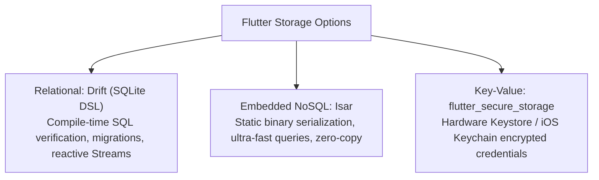
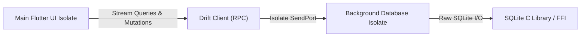

# 06. Reactive SQLite (Drift), Embedded NoSQL (Isar) & Offline Sync

> "Local persistence in Flutter must be reactive, statically type-safe, and executed off the main UI isolate. When querying thousands of cached records, synchronous database calls or JSON decoding on the UI isolate cause noticeable frame drops."  
> — *Referencing Offline-First Mobile Architectures & Drift Engine Design*

---

## 1. Local Database Engines in Flutter



---

## 2. Drift Engine & Multi-Isolate Execution

Drift (formerly Moor) is a reactive persistence library for Dart. It generates strongly typed Dart APIs from either Dart table definitions or raw SQL files.

### 2.1 Multi-Isolate Drift Architecture
To ensure UI rendering is never interrupted by database I/O, Drift connects to a dedicated background isolate:



---

## 3. Production Multi-Isolate Drift Implementation

Below is a complete enterprise implementation of an offline-first Drift database with background isolate execution and reactive stream queries:

```dart
import 'dart:io';
import 'package:drift/drift.dart';
import 'package:drift/native.dart';
import 'package:path_provider/path_provider.dart';
import 'package:path/path.dart' as p;

part 'app_database.g.dart';

// 1. Table Schema Definition
class CachedProducts extends Table {
  TextColumn get id => text()();
  TextColumn get title => text().withLength(min: 1, max: 255)();
  IntColumn get priceCents => integer()();
  TextColumn get category => text()();
  DateTimeColumn get syncedAt => dateTime().withDefault(currentDateAndTime)();

  @override
  Set<Column> get primaryKey => {id};
}

// 2. Database Definition
@DriftDatabase(tables: [CachedProducts])
class AppDatabase extends _$AppDatabase {
  AppDatabase() : super(_openConnection());

  @override
  int get schemaVersion => 1;

  // Reactive auto-updating Stream query
  Stream<List<CachedProduct>> watchProductsByCategory(String category) {
    return (select(cachedProducts)
          ..where((tbl) => tbl.category.equals(category))
          ..orderBy([(tbl) => OrderingTerm.desc(tbl.syncedAt)]))
        .watch();
  }

  // Atomic batch upsert for network synchronization
  Future<void> upsertProducts(List<CachedProductsCompanion> entries) async {
    await batch((batch) {
      batch.insertAllOnConflictUpdate(cachedProducts, entries);
    });
  }

  // Offline cache eviction
  Future<int> purgeOldEntries(DateTime threshold) {
    return (delete(cachedProducts)..where((tbl) => tbl.syncedAt.isSmallerThanValue(threshold))).go();
  }
}

// 3. Isolated Background Database Connection
LazyDatabase _openConnection() {
  return LazyDatabase(() async {
    final dbFolder = await getApplicationDocumentsDirectory();
    final file = File(p.join(dbFolder.path, 'enterprise_store.sqlite'));
    
    // Connects using native FFI SQLite bindings
    return NativeDatabase.createInBackground(file);
  });
}
```

---

## 4. Offline Synchronization & Conflict Resolution

When syncing data between offline clients and a central server:
1. **Last-Write-Wins (LWW)**: Uses monotonically increasing server timestamps. Simple to implement, but risk of losing interleaved edits.
2. **Offline Mutation Queue**: Each local user action is saved as an immutable `PendingMutation` entity. When connectivity is restored, the queue is drained sequentially with exponential backoff retries.
