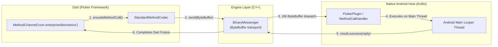

# 08. Platform Channels Architecture, BinaryMessenger & Codecs

> "When Flutter needs to communicate with native Android (Kotlin) or iOS (Swift) APIs, it relies on Platform Channels. Platform Channels are not magic direct method calls; they are an asynchronous binary messaging bus encoding and decoding byte buffers via StandardMessageCodec."  
> — *Referencing Flutter Platform Channel Architecture & Engine Source Code*

---

## 1. Platform Channel Mechanics: The BinaryMessenger Bus



### 1.1 Types of Platform Channels
1. **`MethodChannel`**: Asynchronous RPC (Remote Procedure Call) for one-off invocations (`invokeMethod`).
2. **`EventChannel`**: Continuous event streaming from native platform to Dart (e.g., accelerometer, network connectivity changes).
3. **`BasicMessageChannel`**: Direct raw binary or JSON message exchange with custom codecs.

---

## 2. StandardMessageCodec Type Serialization

Values passed across platform channels are converted into binary formats according to the following mapping:

| Dart Type | Android (Java/Kotlin) Type | iOS (Objective-C/Swift) Type | Wire Format |
| :--- | :--- | :--- | :--- |
| `null` | `null` | `nil` | `0x00` |
| `bool` | `java.lang.Boolean` | `NSNumber numberWithBool:` | `0x01` (true), `0x02` (false) |
| `int` | `Integer` / `Long` | `NSNumber numberWithLong:` | 32-bit or 64-bit Big-Endian |
| `double` | `Double` | `NSNumber numberWithDouble:` | 64-bit IEEE 754 float |
| `String` | `String` | `NSString` | Length-prefixed UTF-8 |
| `Uint8List` | `byte[]` | `FlutterStandardTypedData` | Raw byte array |
| `List` | `ArrayList` | `NSArray` | Length-prefixed array |
| `Map` | `HashMap` | `NSDictionary` | Key-value pairs |

---

## 3. Production Native Biometrics Channel Implementation

Below is a complete, production-grade biometrics integration spanning native Kotlin and Flutter Dart.

### 3.1 Native Android Host Implementation (`BiometricsPlugin.kt`)
```kotlin
package com.enterprise.biometrics

import android.os.Handler
import android.os.Looper
import androidx.biometric.BiometricManager
import androidx.biometric.BiometricPrompt
import androidx.core.content.ContextCompat
import androidx.fragment.app.FragmentActivity
import io.flutter.embedding.engine.plugins.FlutterPlugin
import io.flutter.embedding.engine.plugins.activity.ActivityAware
import io.flutter.embedding.engine.plugins.activity.ActivityPluginBinding
import io.flutter.plugin.common.MethodCall
import io.flutter.plugin.common.MethodChannel

class BiometricsPlugin : FlutterPlugin, ActivityAware, MethodChannel.MethodCallHandler {

    private lateinit var channel: MethodChannel
    private var activity: FragmentActivity? = null

    companion object {
        private const val CHANNEL_NAME = "com.enterprise.app/biometrics"
    }

    override fun onAttachedToEngine(binding: FlutterPlugin.FlutterPluginBinding) {
        channel = MethodChannel(binding.binaryMessenger, CHANNEL_NAME)
        channel.setMethodCallHandler(this)
    }

    override fun onDetachedFromEngine(binding: FlutterPlugin.FlutterPluginBinding) {
        channel.setMethodCallHandler(null)
    }

    override fun onMethodCall(call: MethodCall, result: MethodChannel.Result) {
        when (call.method) {
            "canAuthenticate" -> {
                val act = activity ?: return result.error("NO_ACTIVITY", "Activity not available", null)
                val biometricManager = BiometricManager.from(act)
                val canAuth = biometricManager.canAuthenticate(
                    BiometricManager.Authenticators.BIOMETRIC_STRONG
                ) == BiometricManager.BIOMETRIC_SUCCESS
                result.success(canAuth)
            }
            "authenticate" -> {
                val act = activity ?: return result.error("NO_ACTIVITY", "Activity not available", null)
                val title = call.argument<String>("title") ?: "Biometric Authentication"
                val subtitle = call.argument<String>("subtitle") ?: "Confirm your identity"

                val executor = ContextCompat.getMainExecutor(act)
                val prompt = BiometricPrompt(act, executor, object : BiometricPrompt.AuthenticationCallback() {
                    override fun onAuthenticationSucceeded(authResult: BiometricPrompt.AuthenticationResult) {
                        result.success(true)
                    }

                    override fun onAuthenticationError(errorCode: Int, errString: CharSequence) {
                        result.error("AUTH_ERROR", errString.toString(), errorCode)
                    }

                    override fun onAuthenticationFailed() {
                        // Intermediate failed attempt (e.g. bad finger placement), do not resolve yet
                    }
                })

                val promptInfo = BiometricPrompt.PromptInfo.Builder()
                    .setTitle(title)
                    .setSubtitle(subtitle)
                    .setNegativeButtonText("Cancel")
                    .setAllowedAuthenticators(BiometricManager.Authenticators.BIOMETRIC_STRONG)
                    .build()

                prompt.authenticate(promptInfo)
            }
            else -> result.notImplemented()
        }
    }

    override fun onAttachedToActivity(binding: ActivityPluginBinding) {
        activity = binding.activity as? FragmentActivity
    }

    override fun onDetachedFromActivityForConfigChanges() { activity = null }
    override fun onReattachedToActivityForConfigChanges(binding: ActivityPluginBinding) {
        activity = binding.activity as? FragmentActivity
    }
    override fun onDetachedFromActivity() { activity = null }
}
```

### 3.2 Flutter Dart Client Implementation (`biometrics_client.dart`)
```dart
import 'package:flutter/services.dart';

class BiometricsClient {
  static const MethodChannel _channel = MethodChannel('com.enterprise.app/biometrics');

  Future<bool> canAuthenticate() async {
    try {
      final bool result = await _channel.invokeMethod('canAuthenticate');
      return result;
    } on PlatformException {
      return false;
    }
  }

  Future<bool> authenticate({
    String title = 'Authorize Transaction',
    String subtitle = 'Verify your identity to proceed',
  }) async {
    try {
      final bool success = await _channel.invokeMethod('authenticate', {
        'title': title,
        'subtitle': subtitle,
      });
      return success;
    } on PlatformException catch (e) {
      if (e.code == 'AUTH_ERROR') {
        print('Biometric error: ${e.message}');
      }
      return false;
    }
  }
}
```
