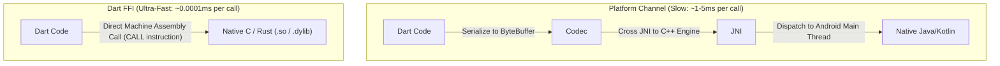

# 09. Dart FFI (Foreign Function Interface) & High-Performance C-Interop

> "Platform Channels are too slow for high-throughput computation (audio synthesis, ML inference, cryptographic hashing) because every call serializes data over the JNI and engine binary bus. Dart FFI (Foreign Function Interface) enables direct, zero-overhead calls into native C, C++, and Rust shared libraries with zero serialization."  
> — *Referencing Dart FFI Specification & Flutter High-Performance Interop Documentation*

---

## 1. Why Dart FFI: Overcoming Platform Channel Latency



Dart FFI compiles native function invocations directly into assembly instructions, achieving speeds identical to native C callers.

---

## 2. Memory Management in FFI & `NativeFinalizer`

Dart managed heap objects are tracked by the Dart GC. Native C allocations created via `malloc()` or `calloc()` live in unmanaged process memory. If native pointers are not freed, they cause permanent **native memory leaks**.

### The `NativeFinalizer` Solution (Dart 2.17+)
Dart provides **`NativeFinalizer`** to bind the lifecycle of an unmanaged native C pointer to a Dart garbage-collected object:


---

## 3. Production Native C & Dart FFI Integration: Vector Hash Engine

Below is a complete enterprise integration featuring a native C shared library with dynamic allocation, NativeFinalizer safety, and typed Dart bindings:

### 3.1 Native C Source Code (`vector_hasher.c`)
```c
#include <stdint.h>
#include <stdlib.h>
#include <string.h>

typedef struct {
    uint32_t length;
    uint8_t* buffer;
} HashContext;

// Exported symbols
HashContext* create_hash_context(uint32_t size) {
    HashContext* ctx = (HashContext*)malloc(sizeof(HashContext));
    if (!ctx) return NULL;
    ctx->length = size;
    ctx->buffer = (uint8_t*)malloc(size);
    return ctx;
}

void destroy_hash_context(HashContext* ctx) {
    if (ctx) {
        if (ctx->buffer) free(ctx->buffer);
        free(ctx);
    }
}

uint64_t compute_fast_hash(const HashContext* ctx) {
    if (!ctx || !ctx->buffer) return 0;
    // Fast 64-bit FNV-1a hash
    uint64_t hash = 14695981039346656037ULL;
    for (uint32_t i = 0; i < ctx->length; ++i) {
        hash ^= (uint64_t)ctx->buffer[i];
        hash *= 1099511628211ULL;
    }
    return hash;
}
```

### 3.2 Strongly-Typed Dart FFI Bindings (`vector_hasher_bindings.dart`)
```dart
import 'dart:ffi' as ffi;
import 'dart:io';
import 'package:ffi/ffi.dart';

// 1. C Struct Representation
final class NativeHashContext extends ffi.Opaque {}

// 2. C Function Signatures
typedef NativeCreateContext = ffi.Pointer<NativeHashContext> Function(ffi.Uint32);
typedef DartCreateContext = ffi.Pointer<NativeHashContext> Function(int);

typedef NativeDestroyContext = ffi.Void Function(ffi.Pointer<NativeHashContext>);
typedef DartDestroyContext = void Function(ffi.Pointer<NativeHashContext>);

typedef NativeComputeHash = ffi.Uint64 Function(ffi.Pointer<NativeHashContext>);
typedef DartComputeHash = int Function(ffi.Pointer<NativeHashContext>);

// 3. High-Level Ergonomic Wrapper
class FastVectorHasher {
  late final ffi.DynamicLibrary _dylib;
  late final DartCreateContext _create;
  late final DartComputeHash _compute;
  late final ffi.Pointer<ffi.NativeFunction<NativeDestroyContext>> _destroyNativeFunc;
  late final ffi.NativeFinalizer _finalizer;

  FastVectorHasher() {
    // Load native library per platform
    _dylib = Platform.isAndroid
        ? ffi.DynamicLibrary.open('libvector_hasher.so')
        : ffi.DynamicLibrary.process();

    _create = _dylib.lookupFunction<NativeCreateContext, DartCreateContext>('create_hash_context');
    _compute = _dylib.lookupFunction<NativeComputeHash, DartComputeHash>('compute_fast_hash');
    
    // Resolve destructor symbol for NativeFinalizer
    _destroyNativeFunc = _dylib.lookup<ffi.NativeFunction<NativeDestroyContext>>('destroy_hash_context');
    _finalizer = ffi.NativeFinalizer(_destroyNativeFunc.cast());
  }

  HashSession createSession(int size) {
    final pointer = _create(size);
    if (pointer == ffi.nullptr) {
      throw OutOfMemoryError();
    }

    final session = HashSession._(pointer, _compute);
    // Attach finalizer: when session is garbage collected, C free() is called automatically!
    _finalizer.attach(session, pointer.cast(), detach: session);
    return session;
  }
}

class HashSession implements ffi.Finalizable {
  final ffi.Pointer<NativeHashContext> _ctx;
  final DartComputeHash _computeFunc;

  HashSession._(this._ctx, this._computeFunc);

  int calculateHash() => _computeFunc(_ctx);
}
```
