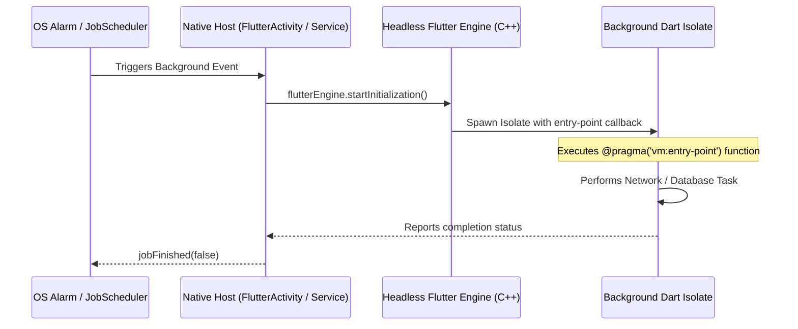

# 10. Background Execution, Workmanager & Native OS Services

> "Executing Dart code in the background when the app is minimized or terminated requires understanding headless engine instantiation, entry-point symbol preservation, and OS battery optimization restrictions."  
> — *Referencing Flutter Engine Background Execution Guide & Android/iOS OS Background Policies*

---

## 1. Background Execution in Flutter: Headless Engine Initialization

When a Flutter app is in the background or killed, the UI isolate does not run. To execute background tasks (e.g., periodic database sync or push notification handlers), the platform must instantiate a **Headless Flutter Engine**:



### The `@pragma('vm:entry-point')` Prerequisite
In release builds, the Dart AOT compiler (`gen_snapshot`) strips unused methods via aggressive tree-shaking. Because background entry points are invoked dynamically from native C++/Java/Kotlin code, they must be marked with `@pragma('vm:entry-point')` so the compiler retains them in the compiled binary:

```dart
@pragma('vm:entry-point')
void backgroundTaskDispatcher() {
  Workmanager().executeTask((taskName, inputData) async {
    print('Executing background task: $taskName');
    return Future.value(true);
  });
}
```

---

## 2. Flutter Workmanager Integration

`package:workmanager` wraps Android's native `WorkManager` and iOS's `BGAppRefreshTask`, ensuring background tasks obey OS constraints:

```dart
import 'package:flutter/widgets.dart';
import 'package:workmanager/workmanager.dart';

const String kCatalogSyncTask = 'com.enterprise.app.catalog_sync';

@pragma('vm:entry-point')
void callbackDispatcher() {
  Workmanager().executeTask((task, inputData) async {
    switch (task) {
      case kCatalogSyncTask:
        // Perform offline sync in background
        print('Synchronizing catalog in background isolate...');
        break;
    }
    return Future.value(true);
  });
}

void initializeBackgroundWork() {
  WidgetsFlutterBinding.ensureInitialized();
  Workmanager().initialize(
    callbackDispatcher,
    isInDebugMode: false,
  );

  // Schedule periodic task with hardware constraints
  Workmanager().registerPeriodicTask(
    '1',
    kCatalogSyncTask,
    frequency: const Duration(hours: 6),
    constraints: Constraints(
      networkType: NetworkType.unmetered, // Wi-Fi only
      requiresBatteryNotLow: true,
      requiresStorageNotLow: true,
    ),
    backoffPolicy: BackoffPolicy.exponential,
    backoffPolicyDelay: const Duration(minutes: 15),
  );
}
```

---

## 3. Firebase Cloud Messaging (FCM) Terminated State Handling

Handling push notifications when the app is terminated requires a top-level background message handler:

```dart
import 'package:firebase_core/firebase_core.dart';
import 'package:firebase_messaging/firebase_messaging.dart';

// Must be a top-level function annotated with entry-point
@pragma('vm:entry-point')
Future<void> firebaseMessagingBackgroundHandler(RemoteMessage message) async {
  // Ensure Firebase is initialized within the background isolate
  await Firebase.initializeApp();
  print('Handling terminated/background push message: ${message.messageId}');
  print('Payload data: ${message.data}');
}

void setupPushNotifications() {
  FirebaseMessaging.onBackgroundMessage(firebaseMessagingBackgroundHandler);

  // Foreground message listener
  FirebaseMessaging.onMessage.listen((RemoteMessage message) {
    print('Foreground push received: ${message.notification?.title}');
  });
}
```
