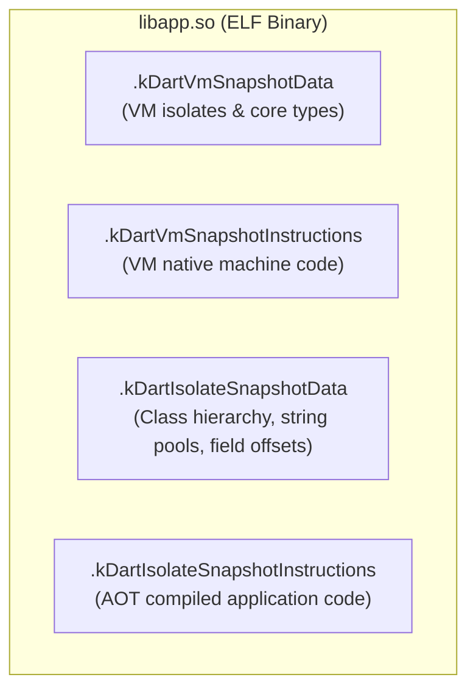

# 11. Security Hardening, Obfuscation & Binary Reverse Engineering Defense

> "Flutter compiled binaries (`libapp.so`) are not immune to reverse engineering. Tools like Blutter and Dylib can reconstruct Dart classes, methods, and string literals from snapshot memory pools. Securing enterprise Flutter applications requires AOT bytecode obfuscation, symbol splitting, root/jailbreak detection, and anti-tampering guards."  
> — *Referencing Flutter Reverse Engineering Internals & OWASP Mobile Security Testing Guide (MSTG)*

---

## 1. Reverse Engineering Flutter: Inside `libapp.so`

When Flutter builds a release binary, `gen_snapshot` compiles Dart code into an ELF shared library named `libapp.so` containing four key sections:



### How Reverse Engineers Attack Flutter Binaries
Decompilers inspect `.kDartIsolateSnapshotData` to extract the **Object Pool**, mapping method names, class definitions, and plain-text URLs/API keys back to readable signatures.

---

## 2. AOT Code Obfuscation & Symbol Stripping

Flutter includes built-in obfuscation tools that rename symbols, strip string tables, and extract debug symbols into external files:

```bash
flutter build appbundle \
  --release \
  --obfuscate \
  --split-debug-info=./build/symbols/
```

* **`--obfuscate`**: Replaces Dart class, method, and field names with meaningless identifiers (`a`, `b`, `c`).
* **`--split-debug-info`**: Extracts debug symbols and mapping tables into a separate directory, preventing stack trace strings from being bundled into the user's release APK.

---

## 3. Secure Credential Storage

Never store encryption keys or auth tokens in `SharedPreferences`, `NSUserDefaults`, or plain SQLite tables. Use `flutter_secure_storage`, which bridges to the **Android Keystore** (AES-256 GCM) and **iOS Keychain** (kSecAccessControl):

```dart
import 'package:flutter_secure_storage/flutter_secure_storage.dart';

class SecureCredentialStore {
  final FlutterSecureStorage _storage = const FlutterSecureStorage(
    aOptions: AndroidOptions(
      encryptedSharedPreferences: true,
      resetOnError: true,
      keyCipherAlgorithm: KeyCipherAlgorithm.RSA_ECB_PKCS1Padding,
      storageCipherAlgorithm: StorageCipherAlgorithm.AES_GCM_NoPadding,
    ),
    iOptions: IOSOptions(
      accessibility: KeychainAccessibility.first_unlock,
    ),
  );

  Future<void> saveAuthToken(String token) async {
    await _storage.write(key: 'jwt_bearer_token', value: token);
  }

  Future<String?> readAuthToken() async {
    return await _storage.read(key: 'jwt_bearer_token');
  }

  Future<void> clear() async {
    await _storage.deleteAll();
  }
}
```

---

## 4. Runtime Integrity & Root/Jailbreak Detection

To protect sensitive financial workflows from executing on compromised devices:

```dart
import 'dart:io';
import 'package:flutter/services.dart';

class AppSecurityGuard {
  static const List<String> _knownRootPaths = [
    '/system/bin/su',
    '/system/xbin/su',
    '/sbin/su',
    '/data/local/xbin/su',
    '/data/local/bin/su',
    '/system/sd/xbin/su',
    '/data/local/su',
  ];

  static bool isDeviceRooted() {
    if (!Platform.isAndroid) return false;

    for (final path in _knownRootPaths) {
      if (File(path).existsSync()) {
        return true;
      }
    }
    return false;
  }

  static void enforceExecutionIntegrity() {
    if (isDeviceRooted()) {
      // Gracefully terminate application or wipe encrypted storage
      SystemNavigator.pop();
    }
  }
}
```
