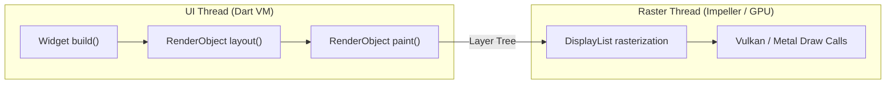

# 12. Profiling, Frame Budgets, Jank Elimination & CI-CD Pipelines

> "Achieving a locked 120 FPS in Flutter requires rigorous profiling discipline: understanding UI thread vs Raster thread bottlenecks, diagnosing offscreen layers and saveLayer penalties, writing golden regression tests, and automating builds via Fastlane."  
> — *Referencing Flutter Performance Profiling Guide & Google Flutter Engineering Best Practices*

---

## 1. Frame Rendering Budgets: UI Thread vs Raster Thread

Flutter targets 60 FPS ($16.6\text{ms}$) or 120 FPS ($8.33\text{ms}$) displays:



### Diagnosing Jank in Flutter DevTools
* **UI Jank**: The UI thread took longer than $16.6\text{ms}$. Common causes: heavy JSON decoding on the main isolate, complex widget rebuilds, or excessive layout passes.
* **Raster Jank**: The Raster thread took longer than $16.6\text{ms}$. Common causes: excessive `saveLayer()` calls, complex opacity animations without `RepaintBoundary`, or unoptimized clipping paths (`ClipPath`).

---

## 2. Eliminating Repaint Jank: `RepaintBoundary`

When a widget animates (e.g. a spinning loader or pulsating button), Flutter repaints everything on that same canvas layer by default.
Wrapping the animating subtree with **`RepaintBoundary`** isolates it onto a dedicated render layer, preventing parent widgets from repainting:

```dart
class AnimatedProductCard extends StatelessWidget {
  final Animation<double> scaleAnimation;
  final Widget child;

  const AnimatedProductCard({super.key, required this.scaleAnimation, required this.child});

  @override
  Widget build(BuildContext context) {
    return RepaintBoundary(
      // Creates a separate DisplayList layer on the Raster thread
      child: ScaleTransition(
        scale: scaleAnimation,
        child: child,
      ),
    );
  }
}
```

---

## 3. Automated Testing with `bloc_test` & `mocktail`

Testing asynchronous state machines in Flutter without flaky timeouts is achieved using `bloc_test`:

```dart
import 'package:test/test.dart';
import 'package:bloc_test/bloc_test.dart';
import 'package:mocktail/mocktail.dart';
import 'package:enterprise_app/cart/cart_bloc.dart';

class MockCartRepository extends Mock implements CartRepository {}

void main() {
  late MockCartRepository mockRepository;

  setUp(() {
    mockRepository = MockCartRepository();
  });

  group('CartBloc Tests', () {
    final tItem = CartItem(productId: 'prod_1', title: 'Running Shoes', quantity: 1, unitPrice: 99.99);

    blocTest<CartBloc, CartState>(
      'emits [CartLoading, CartLoaded] when CartStarted is added and repository succeeds',
      build: () {
        when(() => mockRepository.fetchCart()).thenAnswer((_) async => [tItem]);
        return CartBloc(repository: mockRepository);
      },
      act: (bloc) => bloc.add(const CartStarted()),
      expect: () => [
        isA<CartLoading>(),
        isA<CartLoaded>().having((s) => s.items.length, 'items length', 1),
      ],
      verify: (_) {
        verify(() => mockRepository.fetchCart()).called(1);
      },
    );
  });
}
```

---

## 4. Production Fastlane Deployment Pipeline

Below is an enterprise `Fastfile` automating Flutter Android App Bundle builds, code signing, and Google Play internal track distribution:

```ruby
default_platform(:android)

platform :android do
  desc "Build and deploy release App Bundle to Google Play Internal Track"
  lane :deploy_internal do
    # 1. Run Flutter clean and unit test suite
    sh("flutter clean")
    sh("flutter test")

    # 2. Compile obfuscated Android App Bundle with split debug symbols
    sh("flutter build appbundle --release --obfuscate --split-debug-info=./build/symbols/")

    # 3. Distribute to Google Play Developer Console
    upload_to_play_store(
      track: 'internal',
      aab: '../build/app/outputs/bundle/release/app-release.aab',
      skip_upload_metadata: true,
      skip_upload_images: true,
      skip_upload_screenshots: true,
      json_key: ENV["PLAY_STORE_JSON_KEY"]
    )
  end
end
```
