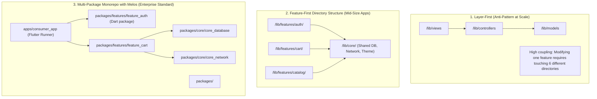

# 13. Production Flutter Architecture & Enterprise Project Structure

> "A Flutter codebase that puts all widgets, models, and providers in a single `/lib` directory quickly degrades into an unmaintainable monolith with slow hot reloads, circular package dependencies, and fragile state ownership. Production Flutter architectures use multi-package monorepos (Melos) or strict Feature-First / Clean Architecture layered directory structures with explicit dependency boundaries."  
> — *Referencing Very Good Ventures (VGV) Architecture, Reso Coder Clean Architecture & Official Flutter Monorepo Engineering*

---

## 1. Monorepo vs Layered vs Feature-First Architecture

Large-scale enterprise Flutter teams organize code around three architectural patterns:



### Why Feature-First / Multi-Package Modularization Wins:
1. **Bounded Contexts**: Every feature (`auth`, `checkout`, `catalog`) encapsulates its own presentation (widgets, BLoC/Riverpod), domain (entities, use cases), and data sources.
2. **Fast Incremental Analysis**: Analyzer runs in parallel on discrete packages rather than scanning millions of lines of code in one pass.
3. **Reusability Across Apps**: Core packages (e.g. `core_network`, `core_database`, `design_system`) can be shared between consumer apps, merchant apps, and internal admin tools.

---

## 2. Complete Enterprise Flutter Directory Structure (Feature-First)

Below is the standard, production-proven layout used by enterprise Flutter engineering teams:

```
my_enterprise_flutter_app/
├── android/                                    # Android Native Host (FlutterActivity, Gradle, Keystore)
├── ios/                                        # iOS Native Host (FlutterViewController, Podfile, Entitlements)
├── web/                                        # Web entry points (index.html, manifest.json)
├── test/                                       # Mirror of lib/ for Unit & BLoC tests
│   ├── core/
│   └── features/
│       └── checkout/
│           ├── presentation/
│           └── domain/
├── test_goldens/                               # Golden UI visual regression tests
├── integration_test/                           # End-to-end driver tests (app_test.dart)
├── assets/
│   ├── icons/
│   ├── images/
│   └── translations/                           # Localization JSON/ARB files
│
├── lib/
│   ├── main_development.dart                  # Development flavor entry point
│   ├── main_staging.dart                      # Staging flavor entry point
│   ├── main_production.dart                   # Production release entry point
│   │
│   ├── app/                                    # App-level orchestration
│   │   ├── app.dart                            # MaterialApp / CupertinoApp configuration
│   │   ├── app_flavor.dart                     # Flavor environment variables (API URLs, keys)
│   │   ├── app_observer.dart                   # BlocObserver / ProviderObserver for global logging
│   │   └── routes/
│   │       ├── app_router.dart                 # GoRouter / AutoRoute declarative navigation DAG
│   │       └── route_guards.dart               # Auth redirect guards
│   │
│   ├── core/                                   # Shared Infrastructure Across All Features
│   │   ├── database/                           # Drift SQLite engine / Isar
│   │   │   ├── app_database.dart
│   │   │   └── tables/
│   │   ├── network/                            # Dio client, Interceptors, Cert Pinning
│   │   │   ├── api_client.dart
│   │   │   ├── auth_interceptor.dart
│   │   │   └── network_exceptions.dart
│   │   ├── security/                           # Biometric prompt & FlutterSecureStorage
│   │   │   └── secure_storage_service.dart
│   │   ├── theme/                              # Design System, Typography, Colors, Tokens
│   │   │   ├── app_colors.dart
│   │   │   ├── app_typography.dart
│   │   │   └── app_theme.dart
│   │   ├── di/                                 # Service locator injection (get_it / injectable)
│   │   │   ├── injection_container.dart
│   │   │   └── injection_container.config.dart # Generated by injectable
│   │   └── utils/                              # Formatters, Logger, Extension methods
│   │
│   └── features/                               # Self-Contained Domain Features
│       │
│       ├── auth/                               # Feature: Authentication & Onboarding
│       │   ├── data/
│       │   │   ├── datasources/                # Remote & Local data sources
│       │   │   ├── models/                     # DTOs with json_serializable
│       │   │   └── repositories/               # Repository implementations
│       │   ├── domain/
│       │   │   ├── entities/                   # Pure Dart domain entities
│       │   │   ├── repositories/               # Abstract repository contracts
│       │   │   └── usecases/                   # Single-purpose business rules
│       │   └── presentation/
│       │       ├── bloc/                       # AuthBloc, AuthEvent, AuthState
│       │       ├── screens/                    # LoginScreen, RegisterScreen
│       │       └── widgets/                    # Auth-specific UI components
│       │
│       ├── catalog/                            # Feature: Product Catalog & Search
│       │   ├── data/
│       │   ├── domain/
│       │   └── presentation/
│       │
│       └── checkout/                           # Feature: Shopping Cart, Payment, Invoicing
│           ├── data/
│           │   ├── datasources/
│           │   │   ├── checkout_remote_datasource.dart
│           │   │   └── checkout_local_datasource.dart
│           │   ├── models/
│           │   │   └── order_summary_model.dart
│           │   └── repositories/
│           │       └── checkout_repository_impl.dart
│           ├── domain/
│           │   ├── entities/
│           │   │   ├── cart_item.dart
│           │   │   └── order_summary.dart
│           │   ├── repositories/
│           │   │   └── checkout_repository.dart
│           │   └── usecases/
│           │       ├── process_payment_usecase.dart
│           │       └── get_active_cart_usecase.dart
│           └── presentation/
│               ├── bloc/
│               │   ├── cart_bloc.dart
│               │   ├── cart_event.dart
│               │   └── cart_state.dart
│               ├── screens/
│               │   ├── cart_screen.dart
│               │   └── checkout_screen.dart
│               └── widgets/
│                   ├── cart_item_tile.dart
│                   └── payment_bottom_sheet.dart
│
├── pubspec.yaml                                # Root dependencies & assets declaration
├── analysis_options.yaml                       # Strict Dart linter rules (pedantic / very_good_analysis)
└── build.yaml                                  # Code-gen options (build_runner, freezed, json_serializable)
```

---

## 3. Production Dependency Injection Setup with `get_it` & `injectable`

In large-scale Flutter apps, manual constructor injection across deeply nested widget trees becomes unwieldy.
Production apps use **`injectable`** (a code generator for `get_it`) to automatically register services and BLoCs at compile time:

```dart
// lib/core/di/injection_container.dart
import 'package:get_it/get_it.dart';
import 'package:injectable/injectable.dart';
import 'injection_container.config.dart';

final getIt = GetIt.instance;

@InjectableInit(
  initializerName: 'init',
  preferRelativeImports: true,
  asExtension: true,
)
Future<void> configureDependencies(String environment) async {
  await getIt.init(environment: environment);
}
```

```dart
// Automatic registration in Checkout feature
@lazySingleton
class ProcessPaymentUseCase {
  final CheckoutRepository _repository;
  ProcessPaymentUseCase(this._repository);

  Future<Result<String>> call(PaymentToken token) => _repository.processPayment(token);
}

@injectable
class CartBloc extends Bloc<CartEvent, CartState> {
  final ProcessPaymentUseCase _processPayment;
  CartBloc(this._processPayment) : super(const CartInitial()) { ... }
}
```

---

## 4. Declarative Navigation DAG with GoRouter

Modern Flutter uses declarative routing with **`go_router`**, supporting deep links, URL path parameters, and redirection guards (e.g. redirecting unauthenticated users to `/login`):

```dart
// lib/app/routes/app_router.dart
import 'package:flutter/material.dart';
import 'package:go_router/go_router.dart';
import '../../features/catalog/presentation/screens/catalog_screen.dart';
import '../../features/checkout/presentation/screens/cart_screen.dart';
import '../../features/auth/presentation/screens/login_screen.dart';
import '../../features/auth/presentation/bloc/auth_bloc.dart';

final GlobalKey<NavigatorState> rootNavigatorKey = GlobalKey<NavigatorState>();

GoRouter createAppRouter(AuthBloc authBloc) {
  return GoRouter(
    navigatorKey: rootNavigatorKey,
    initialLocation: '/catalog',
    refreshListenable: StreamListenable(authBloc.stream),
    redirect: (BuildContext context, GoRouterState state) {
      final isAuthenticated = authBloc.state is AuthAuthenticated;
      final isLoggingIn = state.matchedLocation == '/login';

      if (!isAuthenticated && !isLoggingIn) {
        return '/login';
      }
      if (isAuthenticated && isLoggingIn) {
        return '/catalog';
      }
      return null;
    },
    routes: [
      GoRoute(
        path: '/login',
        builder: (context, state) => const LoginScreen(),
      ),
      GoRoute(
        path: '/catalog',
        builder: (context, state) => const CatalogScreen(),
        routes: [
          GoRoute(
            path: 'cart',
            builder: (context, state) => const CartScreen(),
          ),
        ],
      ),
    ],
  );
}

// Utility class converting a Stream to a ChangeNotifier for GoRouter
class StreamListenable extends ChangeNotifier {
  StreamListenable(Stream stream) {
    stream.listen((_) => notifyListeners());
  }
}
```

---

## 5. Strict Linter Configuration (`analysis_options.yaml`)

Enterprise Flutter codebases enforce strict typing, immutability, and zero unawaited futures using `very_good_analysis`:

```yaml
include: package:very_good_analysis/analysis_options.yaml

analyzer:
  language:
    strict-casts: true
    strict-inference: true
    strict-raw-types: true
  errors:
    missing_required_param: error
    missing_return: error
    todo: ignore
    invalid_annotation_target: ignore

linter:
  rules:
    - unawaited_futures
    - always_declare_return_types
    - avoid_empty_else
    - cancel_subscriptions
    - close_sinks
    - prefer_const_constructors
    - prefer_const_declarations
    - prefer_final_locals
    - sort_constructors_first
```
