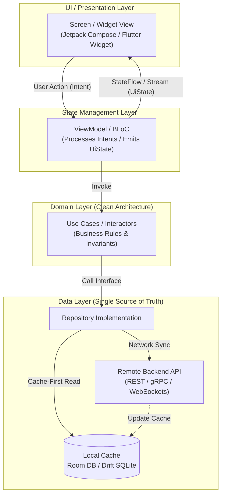

# Production Android & Flutter Development Master Portal

> "Modern mobile engineering is no longer about simply displaying pixels on a screen. It is about building resilient, offline-first distributed clients that handle unpredictable network conditions, conserve battery life, protect cryptographic secrets, and maintain 60–120 FPS rendering performance."  
> — *Modern Mobile Engineering Philosophy*
>
> "Android has evolved: from imperative XML layouts and manual lifecycles to declarative Jetpack Compose, unidirectional data flow (MVI/UDF), Kotlin Coroutines, and Hilt. Concurrently, Flutter with Dart provides a high-performance cross-platform engine rendering directly to the canvas via Impeller."  
> — *Synthesized from Google Modern Android Development (MAD) & Flutter Architectural Guidelines*

---

## 🏛️ Curriculum Architecture & Technical Taxonomy

This knowledge base is an authoritative, publication-grade manual on **Production Android Engineering (Kotlin & Jetpack Compose)** and **Enterprise Cross-Platform Mobile Engineering (Flutter & Dart 3+)**. 

Every topic explores the underlying runtime engine, memory model, architectural patterns, and production-grade code implementations across both ecosystems.

```
Projects/Production-Android-and-Flutter-Development/
├── README.md                                                 # Master Portal, Ecosystem Matrix & Curriculum Sitemap
│
├── 01. Core Languages & Modern Runtime Internals (Kotlin vs Dart).md  # ART/JVM vs Dart VM, Coroutines vs Isolates, Memory & GC
├── 02. Declarative UI Paradigms (Jetpack Compose & Flutter Widgets).md # Composition Tree, Recomposition Optimization, 3 Trees of Flutter
├── 03. Architecture Patterns (MVI, MVVM, Clean Architecture & BLoC).md # UDF / MVI, StateFlow/Channels, BLoC Pattern, Riverpod 2.0
├── 04. Dependency Injection & Service Locators (Hilt, Koin, Injectable).md # KSP / Dagger Hilt, Koin DSL, get_it & Injectable, Riverpod
├── 05. Local Persistence, Caching & Offline-First Data.md      # Room DB, DataStore (Proto), Drift SQLite, Hive/Isar, Keystore
├── 06. Networking, Serialization & Real-Time Sync.md         # Retrofit 2 + OkHttp, Ktor, Dio, WebSockets, Kotlinx / Freezed
├── 07. Background Processing, Concurrency & Push Notifications.md # WorkManager, Doze Mode, Dart Isolates, FCM Push & Deep Links
├── 08. Native Platform Channels & Hardware Integration.md     # MethodChannel, EventChannel, Dart FFI, CameraX, Biometrics, BLE
├── 09. Performance Optimization, Profiling & Security Hardening.md # Android Profiler, LeakCanary, Flutter DevTools, R8/ProGuard, Keystore
└── 10. CI-CD, Release Engineering & Testing (Unit, Widget, E2E).md # JUnit 5, Turbine, MockK, Flutter WidgetTester, Fastlane, Play Console
```

---

## 📊 Comprehensive Ecosystem Comparison: Native Android vs. Flutter

| Architectural Dimension | Native Android (Kotlin + Jetpack Compose) | Cross-Platform (Flutter + Dart 3) |
| :--- | :--- | :--- |
| **Primary Language** | Kotlin 2.0+ (K2 Compiler, Coroutines, Flow) | Dart 3.0+ (Sound Null Safety, Records, Patterns) |
| **Runtime & Execution** | Android Runtime (ART) with AOT / JIT & Profile-Guided Compilation | Dart VM (AOT compiled to native ARM64 machine code) |
| **Rendering Pipeline** | Android Framework View hierarchy / Skia / Vulkan Canvas | Impeller (Metal/Vulkan custom engine) / Skia |
| **UI Paradigm** | Jetpack Compose (Kotlin compiler plugin, Slot API) | Flutter Widgets (Widget, Element, RenderObject trees) |
| **Concurrency Model** | Coroutines (Cooperative multitasking, Light threads) | Event Loop (Single-threaded) + Isolates (Actor model) |
| **State Management** | StateFlow, SharedFlow, ViewModel, Compose State | BLoC, Riverpod, StateNotifier, ValueNotifier |
| **Dependency Injection**| Hilt (Dagger compile-time code-gen via KSP), Koin | `get_it` (Service Locator), `injectable`, Riverpod |
| **Local Persistence** | Room (SQLite ORM with KSP), Preferences/Proto DataStore | Drift (Reactive SQLite), Isar / Hive (NoSQL No-ORM) |
| **Network Client** | OkHttp + Retrofit, Ktor Client | Dio, `http` package |
| **Binary Size Overhead** | Minimal base size ($\sim 3\text{MB} - 8\text{MB}$ release APK) | Engine overhead included ($\sim 15\text{MB} - 25\text{MB}$ base APK) |
| **Ideal Production Role**| Hardware-intensive, system-level integrations, deep OS hooks | Rapid multi-platform (Android, iOS, Web, Desktop) parity |

---

## 🗺️ The Modern Mobile Engineering Stack (Reference Architecture)

```
===================================================================================================
                                  MOBILE CLIENT ARCHITECTURE
===================================================================================================

  [ UI / Presentation Layer ]
  ├── Native Android:   Jetpack Compose (@Composable Screens, State Hoisting, Material 3)
  └── Flutter:          Declarative Widget Tree (Stateless/Stateful, BLoC Builder, Riverpod Consumer)
           │
           ▼ (Dispatches User Intents / Events)
  [ State Management & Presentation Logic ]
  ├── Native Android:   ViewModel + MVI (StateFlow<UiState> + Channel<UiEffect>)
  └── Flutter:          BLoC (Event -> State) / Riverpod AsyncNotifier
           │
           ▼ (Invokes Business Rules)
  [ Domain Layer (Pure Business Logic) ]
  ├── Use Cases / Interactors (Zero platform dependencies)
  └── Domain Models & Business Invariants
           │
           ▼ (Requests Data via Repository Interfaces)
  [ Data Layer & Offline-First Persistence ]
  ├── Repositories (Coordinates Local Cache + Remote API)
  ├── Local Persistence:  Room DB / Proto DataStore (Android) | Drift / Isar (Flutter)
  └── Remote Client:      Retrofit + OkHttp (Android) | Dio (Flutter)
===================================================================================================
```



---

## 📚 10-Chapter Curriculum Index

1. **[01. Core Languages & Modern Runtime Internals (Kotlin vs Dart)](01.%20Core%20Languages%20&%20Modern%20Runtime%20Internals%20(Kotlin%20vs%20Dart).md)**: ART execution, JVM bytecode, Kotlin Coroutines, Structured Concurrency, Flow, Dart VM, Event Loop, Isolates.
2. **[02. Declarative UI Paradigms (Jetpack Compose & Flutter Widgets)](02.%20Declarative%20UI%20Paradigms%20(Jetpack%20Compose%20&%20Flutter%20Widgets).md)**: Slot API, Recomposition, stability inference, Flutter 3-Tree Architecture (Widget, Element, RenderObject), Impeller engine.
3. **[03. Architecture Patterns (MVI, MVVM, Clean Architecture & BLoC)](03.%20Architecture%20Patterns%20(MVI,%20MVVM,%20Clean%20Architecture%20&%20BLoC).md)**: Unidirectional Data Flow (UDF), MVI state machines, Single Live Events, BLoC Pattern, Riverpod 2.0.
4. **[04. Dependency Injection & Service Locators (Hilt, Koin, Injectable)](04.%20Dependency%20Injection%20&%20Service%20Locators%20(Hilt,%20Koin,%20Injectable).md)**: Compile-time vs Runtime DI, Dagger Hilt with KSP, Koin DSL, `get_it`, `injectable` code generation.
5. **[05. Local Persistence, Caching & Offline-First Data](05.%20Local%20Persistence,%20Caching%20&%20Offline-First%20Data.md)**: Single Source of Truth (SSOT), Room Database migrations, Proto DataStore, Drift reactive SQLite, Hive / Isar.
6. **[06. Networking, Serialization & Real-Time Sync](06.%20Networking,%20Serialization%20&%20Real-Time%20Sync.md)**: Retrofit 2 + OkHttp interceptors, Ktor client, Dio client, WebSocket streaming, Kotlinx Serialization, Freezed.
7. **[07. Background Processing, Concurrency & Push Notifications](07.%20Background%20Processing,%20Concurrency%20&%20Push%20Notifications.md)**: WorkManager, Doze Mode, Foreground services, Dart Isolates, Firebase Cloud Messaging (FCM), Deep Linking.
8. **[08. Native Platform Channels & Hardware Integration](08.%20Native%20Platform%20Channels%20&%20Hardware%20Integration.md)**: MethodChannel, EventChannel, Dart FFI, CameraX, BiometricPrompt, Hardware Keystore, Bluetooth Low Energy.
9. **[09. Performance Optimization, Profiling & Security Hardening](09.%20Performance%20Optimization,%20Profiling%20&%20Security%20Hardening.md)**: Android Profiler, LeakCanary, Flutter DevTools, R8/ProGuard rules, Android Keystore, Root/Frida detection.
10. **[10. CI-CD, Release Engineering & Testing (Unit, Widget, E2E)](10.%20CI-CD,%20Release%20Engineering%20&%20Testing%20(Unit,%20Widget,%20E2E).md)**: JUnit 5, MockK, Turbine, Compose UI Testing, Flutter WidgetTester, Fastlane automation, Play Store App Bundles (`.aab`).
