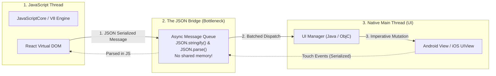
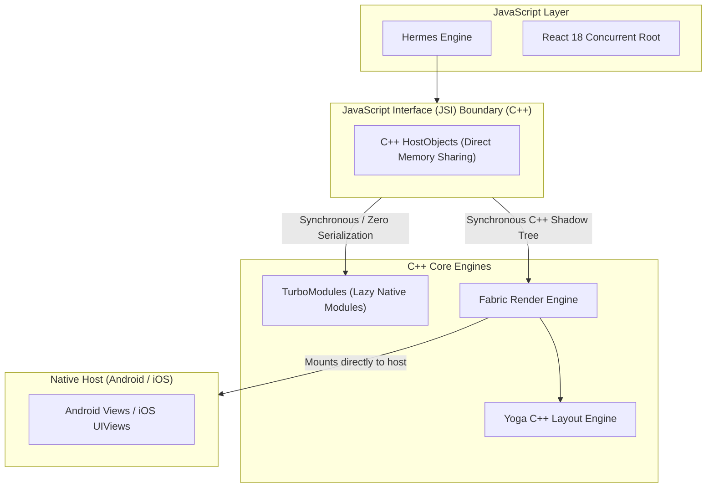

# 01. React Native Architecture Evolution (Old Bridge vs New Architecture)

> "The legacy React Native bridge was an asynchronous, unidirectional, serialized JSON communication bus connecting two isolated worlds. When large amounts of data, rapid touches, or animations crossed the bridge, the queue congested, dropping frames to 15 FPS. The New Architecture fundamentally fixes this by replacing the bridge with the JavaScript Interface (JSI): direct C++ memory-to-memory function calls."  
> — *Referencing Meta Open Source React Native New Architecture Whitepaper & Callstack React Native Optimization Guide*

---

## 1. Anatomy of the Legacy Bridge Architecture (And Why It Failed)

In React Native versions prior to 0.70, execution was strictly segregated into three isolated threads:

### The Three Fatal Flaws of the Legacy Bridge:
1. **Asynchronous Serialization Overhead**: Every string, layout coordinate, and touch event had to be serialized into a UTF-8 JSON string via `JSON.stringify()`, sent over the message queue, and parsed back via `JSON.parse()` on the other side.
2. **Asynchronous UI Updates & Blank Frames**: Because UI updates were asynchronous, fast scrolling in long lists (`FlatList`) resulted in the native UI thread moving faster than the JS thread could calculate layouts, showing empty white blank cards to the user.
3. **Eager Native Module Initialization**: During cold startup, every native module (camera, location, storage) had to be instantiated on the main UI thread during app launch, causing 2-5 second app launch latencies.

---

## 2. The New Architecture: JSI, Fabric & TurboModules

The New Architecture eliminates the asynchronous JSON bridge completely. JavaScript, C++, and native host platforms now communicate via **shared in-memory pointers**:

### The Three Key Innovations:
1. **JavaScript Interface (JSI)**: A lightweight, general-purpose C++ abstraction layer allowing the JavaScript engine to hold direct C++ object references and invoke C++ methods synchronously with zero serialization overhead.
2. **TurboModules**: Native modules are written in C++ and loaded **lazily on demand** when JavaScript first invokes them. Unused modules consume zero startup time and zero memory.
3. **Fabric**: A unified C++ rendering system that computes immutable Shadow Trees and layouts synchronously, eliminating blank frames during fast scrolling.
