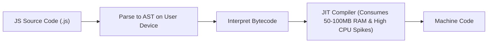
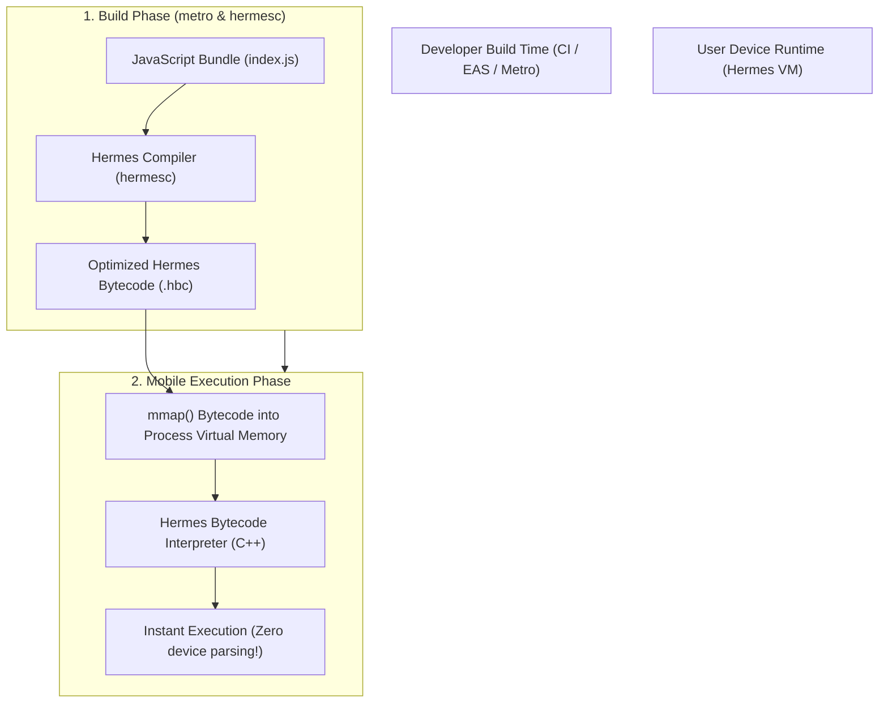
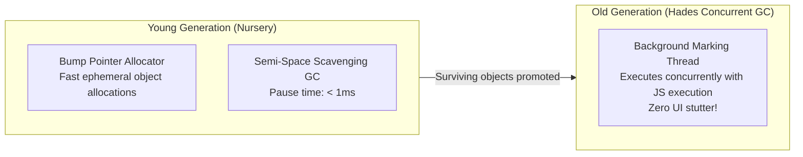

# 02. JavaScript Engine Deep Dive (Hermes Internals, Bytecode & GC)

> "Unlike server-side V8 or desktop browser engines that prioritize sustained peak JIT throughput, a mobile JavaScript engine must optimize for three metrics above all else: instant Time to Interactive (TTI), tiny APK binary footprint, and low memory consumption. Hermes was designed by Meta from the silicon up to solve these exact mobile constraints."  
> — *Referencing Hermes Engine Architecture & Meta Engineering Research Papers*

---

## 1. Why Standard V8 and JavaScriptCore Struggle on Mobile

Desktop JS engines (like Chrome's V8) rely heavily on complex, memory-hungry multi-tier Just-In-Time (JIT) compilers:

### Mobile Consequences of JIT:
1. **Slow App Startup**: The device CPU must parse megabytes of raw JavaScript text on every cold start before executing a single line of code.
2. **High Memory Overhead**: JIT compilers allocate huge chunks of writable, executable heap memory to compile code dynamically. Mobile OSes (especially iOS) strictly forbid writable/executable memory pages (`W^X` security policy) for non-Apple web engines.
3. **App Kill Risk**: Heavy memory consumption triggers Android's `lmkd` or iOS `jetsam` daemon, killing the app when in the background.

---

## 2. The Hermes Ahead-of-Time (AOT) Bytecode Compilation Pipeline

Hermes flips the execution paradigm by shifting all parsing and compilation **ahead-of-time to the developer's build machine**:

### 2.1 Memory Mapping (`mmap`) & Instant TTI
* Because the `.hbc` file is pre-compiled bytecode with fixed structural offsets, Hermes loads it into memory using the POSIX **`mmap()`** system call.
* **Zero Parse Time**: The operating system maps the file pages directly into virtual memory. Pages are loaded on demand from flash storage only when actually accessed.
* **Paging Out**: Because bytecode memory pages are clean and read-only, the OS kernel can evict them under memory pressure without having to write them to swap, dramatically lowering crash rates.

---

## 3. Hermes Memory Model & Garbage Collection Internals

Hermes implements a highly tuned, **Generational Garbage Collector (Hades GC)**:

### 3.1 Hades Concurrent Mark-Sweep
* Traditional JS garbage collectors pause the JavaScript execution thread while marking the entire heap (Stop-The-World).
* **Hades GC**: The Old Generation GC runs concurrent marking on a dedicated background thread while JavaScript continues executing uninterrupted, eliminating GC frame drops.
* **Compressed Pointers**: In 64-bit systems, standard pointers take 8 bytes. Hermes uses **pointer compression** (32-bit offsets relative to the heap base), cutting object memory footprint in half.
