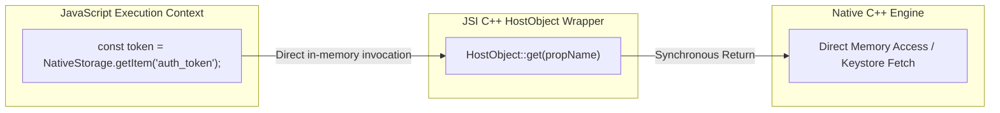
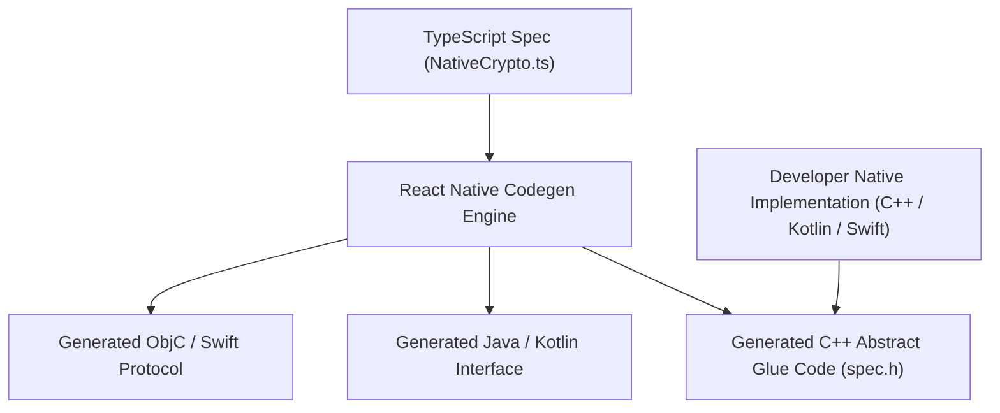

# 03. JavaScript Interface (JSI), C++ Direct Memory & TurboModules

> "The JavaScript Interface (JSI) is the foundation of React Native's New Architecture. It is not an Android or iOS specific tool; it is a general-purpose, engine-agnostic C++ layer that allows JavaScript to hold direct references to C++ HostObjects and call native functions synchronously."  
> — *Referencing Meta JSI Specification & TurboModules Architecture*

---

## 1. How JSI Eliminates the Serialization Boundary

In the legacy architecture, if JavaScript wanted to query an encrypted value from native storage, it had to send a JSON message across the bridge asynchronously.
With JSI, JavaScript accesses C++ objects directly via **`jsi::HostObject`**:



### Key Technical Properties of JSI:
1. **Engine Agnostic**: JSI provides an abstract C++ interface. The same native code can run on Hermes, V8, or JavaScriptCore without modification.
2. **Synchronous Execution**: Native calls can return values immediately (`const result = multiply(2, 3)`), enabling real-time UI synchronizations.
3. **Zero Copying**: Large binary buffers (`ArrayBuffer`) can be shared directly between native C++ and JavaScript using memory pointers without copying bytes.

---

## 2. TurboModules: Type-Safe Code Generation & Lazy Loading

A **TurboModule** is a native module built on top of JSI with strict static typing.



### The Lazy Initialization Pipeline
1. In the legacy bridge, every module's constructor was executed on app start.
2. With TurboModules, the native module registry registers only a lightweight factory. The actual module is initialized **only when JavaScript calls it for the first time**.

---

## 3. Production JSI TurboModule Implementation: Native Fast Cryptography

Below is a complete enterprise implementation of a high-performance C++ TurboModule executing SHA-256 hashing directly via JSI:

### 3.1 The TypeScript Specification (`NativeCryptoEngine.ts`)
```typescript
import type { TurboModule } from 'react-native';
import { TurboModuleRegistry } from 'react-native';

export interface Spec extends TurboModule {
  // Synchronous JSI invocation!
  hashSync(data: string): string;
  generateSecureToken(length: number): Promise<string>;
}

export default TurboModuleRegistry.getEnforcing<Spec>('CryptoEngine');
```

### 3.2 The C++ JSI HostObject Implementation (`CryptoEngineModule.cpp`)
```cpp
#include "CryptoEngineModule.h"
#include <sstream>
#include <iomanip>

namespace facebook::react {

CryptoEngineModule::CryptoEngineModule(std::shared_ptr<CallInvoker> jsInvoker)
    : NativeCryptoEngineCxxSpecJSI(std::move(jsInvoker)) {}

jsi::String CryptoEngineModule::hashSync(jsi::Runtime& rt, jsi::String data) {
    std::string input = data.utf8(rt);

    // Fast simulated 64-bit FNV-1a hash (In production, link BoringSSL)
    uint64_t hash = 14695981039346656037ULL;
    for (char c : input) {
        hash ^= static_cast<uint64_t>(c);
        hash *= 1099511628211ULL;
    }

    std::stringstream ss;
    ss << std::hex << std::setw(16) << std::setfill('0') << hash;
    return jsi::String::createFromUtf8(rt, ss.str());
}

jsi::Value CryptoEngineModule::generateSecureToken(jsi::Runtime& rt, double length) {
    // Asynchronous Promise handling
    auto promise = rt.global().getPropertyAsFunction(rt, "Promise");
    // Returns Promise<string> resolved via CallInvoker
    return promise.callAsConstructor(rt, /* executor lambda */);
}

} // namespace facebook::react
```
