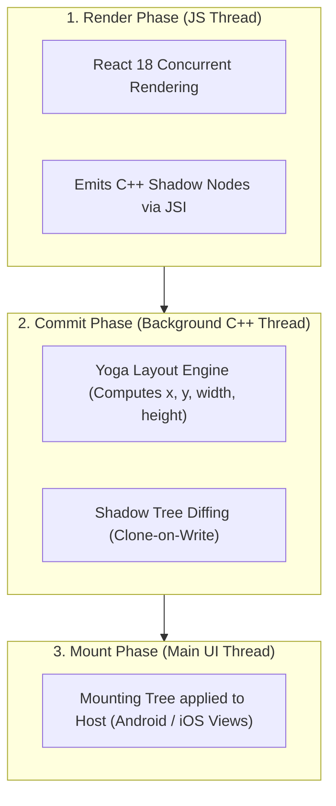
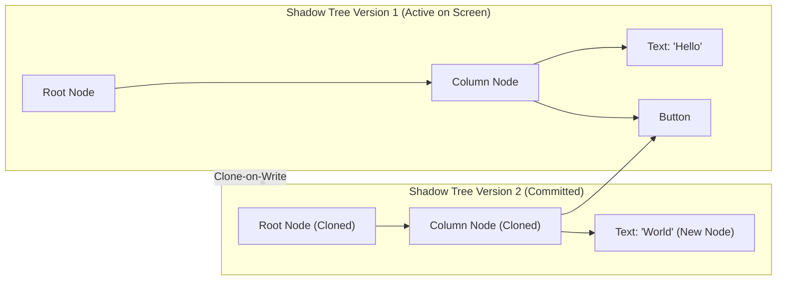

# 04. Fabric Rendering Engine, Shadow Tree & Yoga Flexbox Internals

> "Fabric is React Native's modern C++ rendering system. It moves UI operations out of platform-specific code (Java/ObjC) into a shared C++ core, manages UI hierarchies through immutable Shadow Trees with Clone-on-Write semantics, and calculates Flexbox layouts synchronously using Yoga."  
> — *Referencing Fabric Architecture Documentation & Yoga Layout Engine Internals*

---

## 1. The Three Render Phases of Fabric

Fabric processes UI updates in three sequential, multi-threaded phases:

1. **Render Phase**: React executes component logic in JavaScript. The compiler creates C++ `ShadowNode` objects directly via JSI.
2. **Commit Phase**: Executes on a dedicated background C++ thread. The **Yoga** layout engine computes layout dimensions and offsets for each node. Fabric diffs the old Shadow Tree against the new Shadow Tree.
3. **Mount Phase**: Executes on the native UI main thread. Fabric translates the C++ mutation instructions into native view creations, updates, or deletions.

---

## 2. Immutable Shadow Trees & Clone-on-Write (CoW)

In the legacy architecture, the UI Manager modified a mutable view hierarchy imperatively, leading to race conditions between background fetches and user scroll gestures.

Fabric uses **Immutable Shadow Trees**:

* **Zero Lock Contention**: Because trees are immutable, the main UI thread can read and render Version 1 while a background thread is concurrently calculating layouts on Version 2.
* **Structural Sharing**: Unmodified nodes (like the `Button` in the diagram) are not copied; they are shared between tree versions by pointer reference.

---

## 3. Yoga Flexbox Layout Engine Internals

Both Android and iOS have native layout systems (Android's `MeasureSpec` / View system and iOS's Auto Layout). However, translating Flexbox into Auto Layout constraints dynamically causes $O(N^3)$ exponential layout solver stalls.

### How Yoga Solves Cross-Platform Layout
**Yoga** is an open-source, highly optimized C++ implementation of the W3C CSS Flexible Box Layout specification:
* **One-Pass Constraint Solving**: Computes boundaries in linear $O(N)$ time.
* **Zero Platform Overhead**: Yoga operates entirely on C++ structs (`YGNode`), computing pixel-exact floats (`left`, `top`, `width`, `height`) before any platform views are allocated.
* **Hermetic Behavior**: A `<View style={{ flexDirection: 'row', justifyContent: 'space-between' }}>` produces identical floating-point coordinates on Android, iOS, Windows, and macOS.
