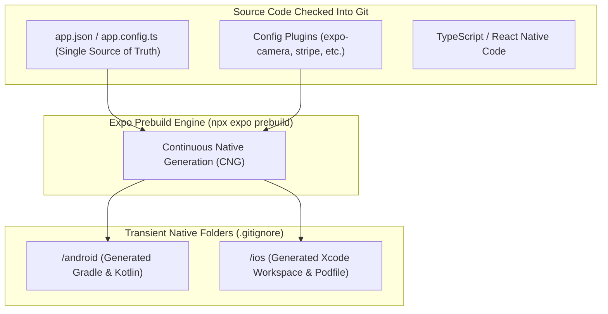

# 05. Modern Expo Ecosystem (EAS, Prebuild CNG, Config Plugins & Expo Router)

> "Expo is no longer a restrictive sandbox for beginners. Modern Expo is the premier production framework for React Native, built on Continuous Native Generation (CNG), EAS cloud pipelines, Config Plugins for native code modification without Git drift, and file-based universal routing."  
> — *Referencing Expo Architecture Documentation & Continuous Native Generation (CNG) Guidelines*

---

## 1. Continuous Native Generation (CNG) & Expo Prebuild

In traditional React Native, developers checked `/android` and `/ios` folders into Git. Over time, upgrading React Native versions or installing native SDKs resulted in catastrophic merge conflicts, broken Gradle scripts, and CocoaPods build failures.



### The Invariant Benefits of CNG:
1. **Zero Native Folder Maintenance**: `/android` and `/ios` are transient build artifacts and can be safely deleted and regenerated at any time (`npx expo prebuild --clean`).
2. **Deterministic Upgrades**: Upgrading React Native versions is as simple as bumping `expo` in `package.json` and running prebuild.

---

## 2. Under the Hood of Config Plugins

How does Expo modify `AndroidManifest.xml`, `Info.plist`, or `build.gradle` without manual edits?
Through **Config Plugins**: pure TypeScript functions executed at prebuild time that transform the native ASTs:

```typescript
// plugins/withCustomSecurity.ts
import { ConfigPlugin, withAndroidManifest, withInfoPlist } from '@expo/config-plugins';

export const withCustomSecurity: ConfigPlugin<{ minSdk: number }> = (config, props) => {
  // 1. Modify iOS Info.plist
  config = withInfoPlist(config, (plistConfig) => {
    plistConfig.modResults.NSFaceIDUsageDescription = 'Allow Biometric Authentication for Secure Checkout';
    return plistConfig;
  });

  // 2. Modify Android AndroidManifest.xml
  config = withAndroidManifest(config, (manifestConfig) => {
    const mainApplication = manifestConfig.modResults.manifest.application?.[0];
    if (mainApplication) {
      mainApplication.$['android:allowBackup'] = 'false';
    }
    return manifestConfig;
  });

  return config;
};

export default withCustomSecurity;
```

---

## 3. Universal File-Based Routing: Expo Router

**Expo Router** brings the file-based routing architecture popularized by Next.js to native mobile apps, built on top of React Navigation primitives:

```
app/
├── _layout.tsx                                 # Root Stack layout & Global Providers
├── index.tsx                                   # Landing / Splash Screen
├── (auth)/                                     # Auth Route Group (Non-visual)
│   ├── _layout.tsx                             # Auth Stack
│   ├── login.tsx                               # Route: /login
│   └── register.tsx                            # Route: /register
└── (tabs)/                                     # Bottom Tab Navigation
    ├── _layout.tsx                             # Bottom Tabs Configuration
    ├── feed.tsx                                # Route: /feed
    ├── explore.tsx                             # Route: /explore
    └── cart/                                   # Nested Stack within Cart Tab
        ├── _layout.tsx
        ├── index.tsx                           # Route: /cart
        └── [orderId].tsx                       # Dynamic Route: /cart/ORD-1234
```

### Dynamic Routing Implementation (`app/(tabs)/cart/[orderId].tsx`)
```tsx
import React from 'react';
import { View, Text, StyleSheet } from 'react-native';
import { useLocalSearchParams, Stack } from 'expo-router';

export default function OrderDetailScreen() {
  const { orderId } = useLocalSearchParams<{ orderId: string }>();

  return (
    <View style={styles.container}>
      <Stack.Screen options={{ title: `Order #${orderId}`, headerBackTitle: 'Cart' }} />
      <Text style={styles.title}>Processing Order: {orderId}</Text>
    </View>
  );
}

const styles = StyleSheet.create({
  container: { flex: 1, justifyContent: 'center', alignItems: 'center', backgroundColor: '#fff' },
  title: { fontSize: 20, fontWeight: '700' },
});
```
