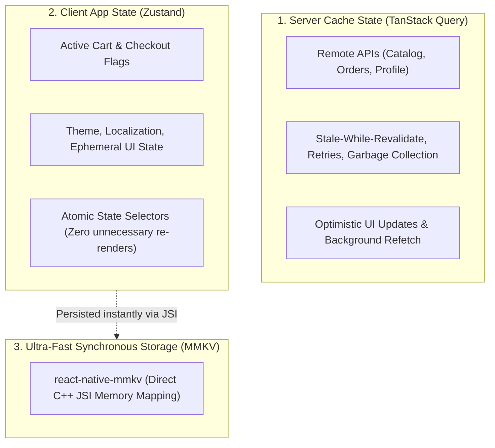

# 06. State Management in Mobile React (Zustand, TanStack Query & MMKV)

> "In mobile React Native, state management must be partitioned into two distinct domains: Server Cache State (remote data synchronization, cache invalidation, offline mutations) and Client App State (ephemeral UI flags, user session, local carts). Mixing them into a giant Redux store degrades performance and causes unnecessary re-renders."  
> — *Referencing High Performance React Native State & Modern State Management Patterns*

---

## 1. The Mobile State Management Taxonomy



---

## 2. Ultra-Fast Storage: Why MMKV Beats AsyncStorage

* **`AsyncStorage` (Legacy)**: Asynchronous, serialized over the JSON bridge. Reading a small token takes $5-15\text{ms}$ and blocks startup.
* **`react-native-mmkv` (Modern JSI)**: Built on Tencent's C++ MMKV engine. It memory-maps files (`mmap`) into virtual memory. Reads and writes are **synchronous JSI function calls executing in under $0.0002\text{ms}$** (up to 30x faster than AsyncStorage).

---

## 3. Production Zustand Store with MMKV Persistence

Below is an enterprise-grade Shopping Cart store using Zustand with synchronous JSI MMKV persistence:

```typescript
import { create } from 'zustand';
import { createJSONStorage, persist, StateStorage } from 'zustand/middleware';
import { MMKV } from 'react-native-mmkv';

// 1. Initialize High-Performance MMKV Storage
export const storage = new MMKV({
  id: 'enterprise-cart-storage',
  encryptionKey: 'secure_local_encryption_key_v1',
});

// 2. Wrap MMKV for Zustand Synchronous Storage
const mmkvZustandStorage: StateStorage = {
  setItem: (name, value) => storage.set(name, value),
  getItem: (name) => storage.getString(name) ?? null,
  removeItem: (name) => storage.delete(name),
};

// 3. Domain Types
export interface CartItem {
  id: string;
  title: string;
  priceCents: number;
  quantity: number;
}

interface CartState {
  items: CartItem[];
  addItem: (item: Omit<CartItem, 'quantity'>) => void;
  removeItem: (id: string) => void;
  clearCart: () => void;
  totalPriceDollars: () => number;
}

// 4. Production Store Definition
export const useCartStore = create<CartState>()(
  persist(
    (set, get) => ({
      items: [],

      addItem: (newItem) => {
        set((state) => {
          const existingIndex = state.items.findIndex((i) => i.id === newItem.id);
          if (existingIndex >= 0) {
            const updated = [...state.items];
            updated[existingIndex].quantity += 1;
            return { items: updated };
          }
          return { items: [...state.items, { ...newItem, quantity: 1 }] };
        });
      },

      removeItem: (id) => {
        set((state) => ({
          items: state.items.filter((i) => i.id !== id),
        }));
      },

      clearCart: () => set({ items: [] }),

      totalPriceDollars: () => {
        const cents = get().items.reduce((sum, item) => sum + item.priceCents * item.quantity, 0);
        return cents / 100;
      },
    }),
    {
      name: 'cart_storage_v1',
      storage: createJSONStorage(() => mmkvZustandStorage),
    }
  )
);
```

---

## 4. Server State: TanStack Query (React Query)

Managing server data with TanStack Query ensures automatic caching, deduplication, and offline hydration:

```typescript
import { useQuery, useMutation, useQueryClient } from '@tanstack/react-query';
import axios from 'axios';

export interface Product {
  id: string;
  name: string;
  priceCents: number;
}

export function useProductCatalog() {
  return useQuery<Product[]>({
    queryKey: ['products', 'catalog'],
    queryFn: async () => {
      const response = await axios.get<Product[]>('https://api.enterprise.com/products');
      return response.data;
    },
    staleTime: 1000 * 60 * 5, // Data fresh for 5 minutes
    gcTime: 1000 * 60 * 60 * 24, // Keep in cache for 24 hours
  });
}
```
