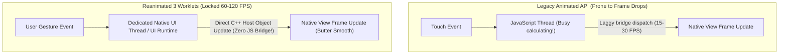

# 07. High-Performance UI, Gestures & Animations (Reanimated 3 & Gesture Handler)

> "Animations in React Native that run on the JavaScript thread will inevitably drop frames when the JS thread is busy parsing JSON, sorting lists, or processing business logic. Software Mansion's React Native Reanimated solves this via JS Worklets: compiling JavaScript animation functions into bytecode executed directly on the native UI thread at a locked 60–120 FPS."  
> — *Referencing Software Mansion Reanimated 3 Architecture & React Native Performance Guides*

---

## 1. The Animation Threading Problem & JS Worklets



### What is a Worklet?
A **worklet** is a JavaScript function marked with the directive `'worklet';` at the top of its body.
* The Babel / Metro compiler extracts this function, compiles it into a standalone bundle, and deploys it onto a dedicated **UI JavaScript Runtime** running directly on the native UI thread.
* When touch gestures arrive, the worklet executes synchronously on the UI thread without crossing into the main JavaScript thread.

---

## 2. Production Interactive Swipeable Card Implementation

Below is a complete, production-grade interactive swipe-to-dismiss card built with **React Native Gesture Handler** and **Reanimated 3**:

```tsx
import React from 'react';
import { StyleSheet, Dimensions, Text, View } from 'react-native';
import { GestureDetector, Gesture } from 'react-native-gesture-handler';
import Animated, {
  useSharedValue,
  useAnimatedStyle,
  withSpring,
  withTiming,
  runOnJS,
} from 'react-native-reanimated';

const { width: SCREEN_WIDTH } = Dimensions.get('window');
const SWIPE_THRESHOLD = -SCREEN_WIDTH * 0.3;

interface SwipeableCardProps {
  title: string;
  onDismiss: () => void;
}

export const SwipeableProductCard: React.FC<SwipeableCardProps> = ({ title, onDismiss }) => {
  const translateX = useSharedValue(0);
  const itemHeight = useSharedValue(80);
  const opacity = useSharedValue(1);

  const panGesture = Gesture.Pan()
    .onChange((event) => {
      // Runs entirely as a Worklet on the UI thread!
      'worklet';
      translateX.value = Math.min(0, event.translationX);
    })
    .onEnd(() => {
      'worklet';
      if (translateX.value < SWIPE_THRESHOLD) {
        // Swiped past threshold: animate offscreen and collapse
        translateX.value = withTiming(-SCREEN_WIDTH, { duration: 250 });
        itemHeight.value = withTiming(0, { duration: 250 });
        opacity.value = withTiming(0, { duration: 250 }, (finished) => {
          if (finished) {
            runOnJS(onDismiss)();
          }
        });
      } else {
        // Snap back with natural spring physics
        translateX.value = withSpring(0, { damping: 15, stiffness: 120 });
      }
    });

  const animatedStyle = useAnimatedStyle(() => {
    'worklet';
    return {
      transform: [{ translateX: translateX.value }],
      height: itemHeight.value,
      opacity: opacity.value,
    };
  });

  return (
    <View style={styles.container}>
      <View style={styles.deleteBackground}>
        <Text style={styles.deleteText}>Delete</Text>
      </View>
      <GestureDetector gesture={panGesture}>
        <Animated.View style={[styles.card, animatedStyle]}>
          <Text style={styles.cardTitle}>{title}</Text>
        </Animated.View>
      </GestureDetector>
    </View>
  );
};

const styles = StyleSheet.create({
  container: {
    width: '100%',
    marginVertical: 4,
    overflow: 'hidden',
  },
  deleteBackground: {
    ...StyleSheet.absoluteFillObject,
    backgroundColor: '#ff4444',
    justifyContent: 'center',
    alignItems: 'flex-end',
    paddingRight: 24,
  },
  deleteText: {
    color: '#fff',
    fontWeight: '700',
  },
  card: {
    width: '100%',
    height: 80,
    backgroundColor: '#ffffff',
    justifyContent: 'center',
    paddingHorizontal: 20,
    elevation: 2,
    shadowColor: '#000',
    shadowOpacity: 0.1,
    shadowRadius: 4,
    shadowOffset: { width: 0, height: 2 },
  },
  cardTitle: {
    fontSize: 16,
    fontWeight: '600',
  },
});
```
