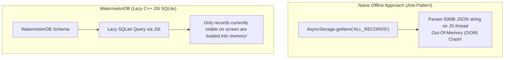

# 08. Enterprise Networking, Offline-First Persistence & WatermelonDB

> "For apps managing tens of thousands of offline records (chat apps, field services, offline retail), loading entire collections into JavaScript memory will exhaust mobile device RAM. Enterprise React Native applications use WatermelonDB: an observable, SQLite-backed relational database engine that lazily loads records only when rendered."  
> — *Referencing Nozbe WatermelonDB Architecture & Offline-First Mobile Design*

---

## 1. The Offline Data Challenge in React Native



### Why WatermelonDB Scales:
1. **Lazy Loading**: If a table contains 50,000 products, fetching them creates zero JavaScript objects initially. Objects are instantiated lazily as the user scrolls.
2. **Reactive Observables**: Tables expose RxJS `Observable` streams. Modifying a record automatically re-renders only the specific components observing that row.
3. **Multi-Threaded SQLite**: Queries execute directly on native background threads using SQLite with WAL (Write-Ahead Logging).

---

## 2. Production WatermelonDB Schema & Model Implementation

```typescript
import { appSchema, tableSchema } from '@nozbe/watermelondb';
import { Model } from '@nozbe/watermelondb';
import { field, date, readonly } from '@nozbe/watermelondb/decorators';

// 1. Database Schema
export const enterpriseSchema = appSchema({
  version: 1,
  tables: [
    tableSchema({
      name: 'products',
      columns: [
        { name: 'title', type: 'string' },
        { name: 'price_cents', type: 'number' },
        { name: 'category', type: 'string', isIndexed: true },
        { name: 'synced_at', type: 'number' },
      ],
    }),
  ],
});

// 2. Strongly Typed Model
export class ProductModel extends Model {
  static table = 'products';

  @field('title') title!: string;
  @field('price_cents') priceCents!: number;
  @field('category') category!: string;
  @date('synced_at') syncedAt!: Date;
}
```

---

## 3. Resilient Networking & Token Refresh with Axios Interceptors

Below is an enterprise Axios client featuring synchronized token refresh and SSL Public Key Pinning (via `react-native-ssl-pinning`):

```typescript
import axios, { AxiosError, InternalAxiosRequestConfig } from 'axios';
import { storage } from '../storage/mmkv';

export const apiClient = axios.create({
  baseURL: 'https://api.enterprise.com/v1',
  timeout: 15000,
});

let isRefreshing = false;
let failedQueue: Array<{
  resolve: (token: string) => void;
  reject: (error: any) => void;
}> = [];

const processQueue = (error: any, token: string | null = null) => {
  failedQueue.forEach((prom) => {
    if (error) {
      prom.reject(error);
    } else {
      prom.resolve(token!);
    }
  });
  failedQueue = [];
};

// Request Interceptor: Inject Token from MMKV synchronously
apiClient.interceptors.request.use((config: InternalAxiosRequestConfig) => {
  const token = storage.getString('auth_access_token');
  if (token && config.headers) {
    config.headers.Authorization = `Bearer ${token}`;
  }
  return config;
});

// Response Interceptor: Mutex Token Refresh
apiClient.interceptors.response.use(
  (response) => response,
  async (error: AxiosError) => {
    const originalRequest = error.config as InternalAxiosRequestConfig & { _retry?: boolean };

    if (error.response?.status === 401 && !originalRequest._retry) {
      if (isRefreshing) {
        return new Promise((resolve, reject) => {
          failedQueue.push({ resolve, reject });
        })
          .then((token) => {
            originalRequest.headers.Authorization = `Bearer ${token}`;
            return apiClient(originalRequest);
          })
          .catch((err) => Promise.reject(err));
      }

      originalRequest._retry = true;
      isRefreshing = true;

      try {
        const refreshToken = storage.getString('auth_refresh_token');
        const { data } = await axios.post('https://api.enterprise.com/v1/auth/refresh', {
          refresh_token: refreshToken,
        });

        const newAccessToken = data.access_token;
        storage.set('auth_access_token', newAccessToken);

        apiClient.defaults.headers.common.Authorization = `Bearer ${newAccessToken}`;
        processQueue(null, newAccessToken);
        return apiClient(originalRequest);
      } catch (refreshErr) {
        processQueue(refreshErr, null);
        storage.delete('auth_access_token');
        storage.delete('auth_refresh_token');
        return Promise.reject(refreshErr);
      } finally {
        isRefreshing = false;
      }
    }
    return Promise.reject(error);
  }
);
```
