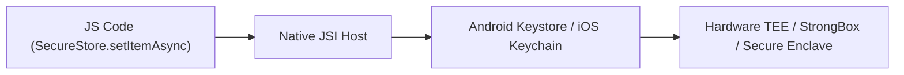

# 09. Hardware Security, Biometrics, Keystore & App Hardening

> "In cross-platform JavaScript applications, sensitive tokens and encryption keys must never be stored in plain text or in insecure storage like standard AsyncStorage. Keys must be anchored into hardware silicon: Android Keystore StrongBox and Apple Secure Enclave with Face ID / Touch ID gating."  
> — *Referencing OWASP Mobile Application Security Verification Standard (MASVS) & Expo SecureStore*

---

## 1. Hardware Security Architecture: SecureStore

`expo-secure-store` encrypts data using platform-native hardware security:
* **iOS**: Stores data in the **Keychain Services**, protected by the Secure Enclave Processor (SEP) using `kSecAttrAccessibleAfterFirstUnlockThisDeviceOnly`.
* **Android**: Generates a master AES-256 GCM key inside the **Android Keystore**, encrypting data into an `EncryptedSharedPreferences` container.



---

## 2. Production Biometric Authentication Service

Below is an enterprise-grade biometric authentication service integrating `expo-local-authentication` and `expo-secure-store`:

```typescript
import * as LocalAuthentication from 'expo-local-authentication';
import * as SecureStore from 'expo-secure-store';

export class BiometricSecurityService {
  private static readonly REFRESH_TOKEN_KEY = 'enterprise_secure_refresh_token';

  // 1. Check hardware biometric capabilities
  static async checkBiometricSupport(): Promise<boolean> {
    const hasHardware = await LocalAuthentication.hasHardwareAsync();
    const isEnrolled = await LocalAuthentication.isEnrolledAsync();
    return hasHardware && isEnrolled;
  }

  // 2. Authenticate User with Face ID / Fingerprint
  static async authenticateUser(promptMessage: string): Promise<boolean> {
    const isSupported = await this.checkBiometricSupport();
    if (!isSupported) return false;

    const result = await LocalAuthentication.authenticateAsync({
      promptMessage,
      cancelLabel: 'Cancel',
      fallbackLabel: 'Use Passcode',
      disableDeviceFallback: false,
    });

    return result.success;
  }

  // 3. Store Sensitive Refresh Token in Hardware Keystore
  static async storeSecureToken(token: string): Promise<void> {
    await SecureStore.setItemAsync(this.REFRESH_TOKEN_KEY, token, {
      keychainAccessible: SecureStore.AFTER_FIRST_UNLOCK_THIS_DEVICE_ONLY,
    });
  }

  // 4. Retrieve Token only after verifying Biometrics
  static async retrieveTokenWithBiometrics(): Promise<string | null> {
    const authenticated = await this.authenticateUser('Authorize access to sensitive financial account');
    if (!authenticated) {
      throw new Error('Biometric authentication failed');
    }

    return await SecureStore.getItemAsync(this.REFRESH_TOKEN_KEY);
  }

  static async clearSecureStorage(): Promise<void> {
    await SecureStore.deleteItemAsync(this.REFRESH_TOKEN_KEY);
  }
}
```

---

## 3. Runtime Application Self-Protection (RASP) & Tamper Defense

To protect React Native apps from running inside compromised emulators or under Frida/Xposed hooks:

```typescript
import { Platform } from 'react-native';
import * as Device from 'expo-device';

export class AppIntegrityGuard {
  static async verifyRuntimeEnvironment(): Promise<boolean> {
    // 1. Check if running on real device
    if (!Device.isDevice) {
      console.warn('SECURITY ALERT: Running inside an emulator/simulator');
      return false;
    }

    // 2. Check for rooted or jailbroken filesystem markers
    const isRooted = await Device.isRootedExperimentalAsync();
    if (isRooted) {
      console.warn('SECURITY ALERT: Jailbroken / Rooted device detected');
      return false;
    }

    return true;
  }
}
```
