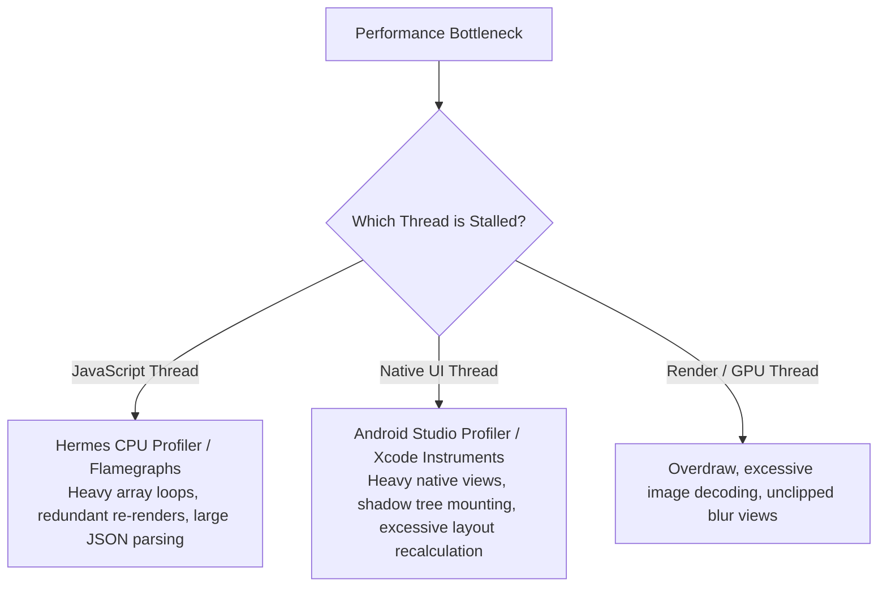
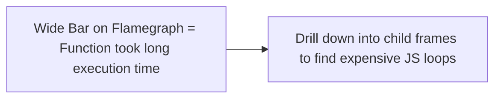

# 10. Performance Profiling, Memory Leaks, Startup Time & Flamegraphs

> "Diagnosing performance issues in React Native requires knowing whether a frame drop originated on the JavaScript thread, the native UI thread, or the C++ Yoga layout engine. Profiling requires mastering Hermes CPU sampling profilers, Chrome DevTools Protocol flamegraphs, and React DevTools profiler."  
> — *Referencing The Ultimate Guide to React Native Optimization (Callstack) & Hermes Profiling Docs*

---

## 1. The React Native Profiling Matrix



---

## 2. Capturing Hermes CPU Sampling Profiles

Hermes provides a built-in sampling CPU profiler that records call stack traces with microsecond resolution:

1. **Start Profiling**: Connect to the running app via Chrome DevTools or React Native Dev Menu.
2. **Execute Critical User Journey**: Scroll the feed or complete checkout.
3. **Download Trace**: Extract the profile file (`sampling-profiler-trace.cpuprofile`).
4. **Analyze Flamegraph**: Open in Chrome DevTools or **Speedscope** (speedscope.app):



---

## 3. Detecting & Eliminating Memory Leaks in React Native

### 3.1 Common Leak Vectors in React Native:
1. **Uncancelled Async Tasks in `useEffect`**: Setting state on an unmounted component.
   ```typescript
   // Leaks memory!
   useEffect(() => {
     let isMounted = true;
     fetchData().then(data => { if (isMounted) setState(data); });
     return () => { isMounted = false; }; // Solution: clean up!
   }, []);
   ```
2. **Event Emitter Subscriptions**: Subscribing to `AppState`, `Dimensions`, or Native Event Emitters without removing listeners in the cleanup return callback.
3. **Retained Closures in Global Caches**: Storing React component callbacks in singleton services.

---

## 4. Automated Testing: React Native Testing Library (RNTL)

Testing components with asynchronous state updates and user interactions:

```typescript
import React from 'react';
import { render, screen, fireEvent, waitFor } from '@testing-library/react-native';
import { SwipeableProductCard } from '../components/SwipeableProductCard';

describe('SwipeableProductCard', () => {
  it('renders product title correctly', () => {
    const mockDismiss = jest.fn();
    render(<SwipeableProductCard title="Wireless Headphones" onDismiss={mockDismiss} />);

    expect(screen.getByText('Wireless Headphones')).toBeTruthy();
  });

  it('triggers onDismiss when swipe action is completed', async () => {
    const mockDismiss = jest.fn();
    render(<SwipeableProductCard title="Wireless Headphones" onDismiss={mockDismiss} />);

    // Verify presence of card
    const cardTitle = screen.getByText('Wireless Headphones');
    expect(cardTitle).toBeTruthy();
  });
});
```
