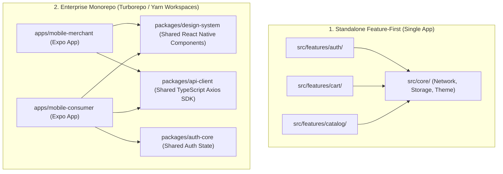

# 11. Production React Native & Expo Project Structure & Monorepo

> "Enterprise React Native applications do not dump all code into a flat `/src` directory. They are structured either as strict Feature-First / Clean Architecture domain modules or as multi-package monorepos using Turborepo or Nx, with shared UI design systems, core API clients, and autonomous feature packages."  
> — *Referencing Expo Monorepo Documentation & Enterprise React Native Architecture*

---

## 1. Monorepo vs Standalone Feature-First Architecture



---

## 2. Complete Enterprise Feature-First Directory Structure

Below is the standard, production-proven React Native / Expo directory structure:

```
my-enterprise-expo-app/
├── app.json                                    # Base Expo configuration
├── app.config.ts                               # Dynamic configuration (Flavors, Bundle ID, Env)
├── eas.json                                    # Expo Application Services build configurations
├── tsconfig.json                               # Path aliases (@core/*, @features/*)
├── package.json                                # Dependencies & scripts
├── metro.config.js                             # Metro bundler config (SVG transformer, monorepo support)
│
├── plugins/                                    # Custom Expo Config Plugins (CNG)
│   ├── withCustomSecurity.ts
│   └── withNativeKeystore.ts
│
├── assets/                                     # Static media (icons, splash screens, fonts)
│   ├── fonts/
│   ├── images/
│   └── adaptive-icon.png
│
├── app/                                        # Expo Router (File-Based Universal Routing)
│   ├── _layout.tsx                             # Root layout (Providers: React Query, GestureHandler, Theme)
│   ├── index.tsx                               # Splash / Auth gate redirect
│   ├── (auth)/                                 # Unauthenticated Route Group
│   │   ├── _layout.tsx
│   │   ├── login.tsx
│   │   └── forgot-password.tsx
│   └── (tabs)/                                 # Authenticated Tab Navigation
│       ├── _layout.tsx
│       ├── catalog/
│       │   ├── _layout.tsx
│       │   ├── index.tsx
│       │   └── [productId].tsx
│       └── cart/
│           ├── _layout.tsx
│           ├── index.tsx
│           └── checkout.tsx
│
└── src/                                        # Core Source Architecture
    ├── core/                                   # Shared Infrastructure Across All Features
    │   ├── network/                            # Axios instance, Interceptors, SSL Pinning
    │   │   ├── apiClient.ts
    │   │   └── tokenRefreshQueue.ts
    │   ├── storage/                            # MMKV synchronous C++ JSI storage
    │   │   └── mmkv.ts
    │   ├── security/                           # Biometric prompt & SecureStore
    │   │   └── biometrics.ts
    │   ├── theme/                              # Design Tokens (Colors, Spacing, Typography)
    │   │   ├── colors.ts
    │   │   └── typography.ts
    │   └── ui/                                 # Reusable UI Primitives (Design System)
    │       ├── Button.tsx
    │       ├── Input.tsx
    │       └── LoadingSpinner.tsx
    │
    └── features/                               # Domain-Driven Autonomous Features
        ├── auth/                               # Feature: Authentication
        │   ├── api/                            # Feature-specific TanStack Query hooks
        │   │   └── useLoginMutation.ts
        │   ├── components/                     # Auth-specific UI widgets
        │   │   └── LoginForm.tsx
        │   ├── store/                          # Zustand auth session store
        │   │   └── useAuthStore.ts
        │   └── types/                          # Domain models
        │       └── auth.types.ts
        │
        ├── catalog/                            # Feature: Catalog & Search
        │   ├── api/
        │   ├── components/
        │   └── types/
        │
        └── checkout/                           # Feature: Cart & Payment
            ├── api/
            │   └── useSubmitPayment.ts
            ├── components/
            │   ├── CartItemRow.tsx
            │   └── PaymentSheet.tsx
            ├── store/
            │   └── useCartStore.ts
            └── types/
                └── cart.types.ts
```

---

## 3. Dynamic Environment Configuration with `app.config.ts`

Managing Development, Staging, and Production variants dynamically without hardcoded keys:

```typescript
import { ExpoConfig, ConfigContext } from 'expo/config';

export default ({ config }: ConfigContext): ExpoConfig => {
  const env = process.env.APP_ENV || 'development';

  const bundleIds: Record<string, string> = {
    development: 'com.enterprise.app.dev',
    staging: 'com.enterprise.app.staging',
    production: 'com.enterprise.app',
  };

  const appNames: Record<string, string> = {
    development: 'Enterprise App (Dev)',
    staging: 'Enterprise App (Staging)',
    production: 'Enterprise App',
  };

  return {
    ...config,
    name: appNames[env],
    slug: 'enterprise-mobile-app',
    version: '1.0.0',
    orientation: 'portrait',
    userInterfaceStyle: 'automatic',
    ios: {
      bundleIdentifier: bundleIds[env],
      supportsTablet: false,
    },
    android: {
      package: bundleIds[env],
      adaptiveIcon: {
        foregroundImage: './assets/adaptive-icon.png',
        backgroundColor: '#ffffff',
      },
    },
    plugins: [
      'expo-router',
      'expo-secure-store',
      'expo-local-authentication',
      './plugins/withCustomSecurity',
    ],
    extra: {
      appEnv: env,
      apiBaseUrl: process.env.API_BASE_URL,
      eas: {
        projectId: 'your-eas-project-id-here',
      },
    },
  };
};
```
