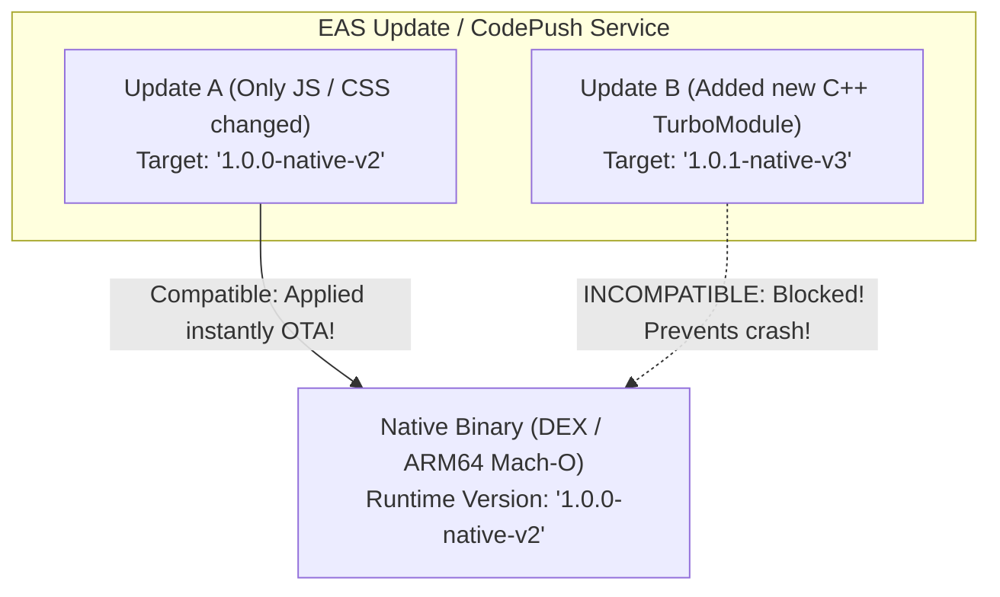

# 12. Enterprise Release Engineering, Over-The-Air (OTA) Updates & CI-CD

> "One of React Native's unique architectural advantages is Over-The-Air (OTA) updates: fixing critical JavaScript bugs in production instantly without waiting 48 hours for App Store review. However, managing OTA updates incorrectly will cause catastrophic app crashes if JavaScript code calls native APIs that do not exist in the installed native binary."  
> — *Referencing Expo EAS Update Architecture & Enterprise Mobile CI/CD Guidelines*

---

## 1. The OTA Update Invariant: JS vs Native Runtime Compatibility

When users download your app from Google Play or the App Store, they install an **embedded native binary**:



### The Fatal OTA Trap:
If an OTA update pushes JavaScript code that calls a new native TurboModule that wasn't compiled into the user's installed binary, the app will **crash immediately on launch** with a missing symbol exception.
* **The Solution**: Modern Expo uses **`runtimeVersion`** policies (e.g. fingerprint hashing). An OTA update is applied **only if the native binary fingerprint matches identically**.

---

## 2. EAS Build Configuration (`eas.json`)

Expo Application Services (EAS) automates cloud compilation of production Android App Bundles (`.aab`) and iOS `.ipa` binaries:

```json
{
  "cli": {
    "version": ">= 9.0.0"
  },
  "build": {
    "development": {
      "developmentClient": true,
      "distribution": "internal",
      "ios": {
        "simulator": true
      }
    },
    "staging": {
      "distribution": "internal",
      "channel": "staging",
      "android": {
        "buildType": "apk"
      }
    },
    "production": {
      "channel": "production",
      "autoIncrement": true,
      "android": {
        "buildType": "app-bundle"
      },
      "ios": {
        "enterpriseProvisioning": false
      }
    }
  },
  "submit": {
    "production": {
      "android": {
        "serviceAccountKeyPath": "./google-service-key.json",
        "track": "internal"
      },
      "ios": {
        "appleId": "eng@enterprise.com",
        "ascAppId": "1234567890"
      }
    }
  }
}
```

---

## 3. Automated CI/CD Pipeline with GitHub Actions

Below is an enterprise GitHub Actions workflow automating linting, Jest unit tests, and continuous deployment via EAS:

```yaml
name: Mobile CI/CD Pipeline

on:
  push:
    branches: [main, staging]
  pull_request:
    branches: [main]

jobs:
  test-and-lint:
    runs-on: ubuntu-latest
    steps:
      - name: Checkout repository
        uses: actions/checkout@v4

      - name: Setup Node.js
        uses: actions/setup-node@v4
        with:
          node-version: 20
          cache: 'yarn'

      - name: Install dependencies
        run: yarn install --frozen-lockfile

      - name: Run TypeScript type check
        run: yarn tsc --noEmit

      - name: Run ESLint
        run: yarn lint

      - name: Run Jest Test Suite
        run: yarn test --ci --coverage

  deploy-ota-staging:
    needs: test-and-lint
    if: github.ref == 'refs/heads/staging'
    runs-on: ubuntu-latest
    steps:
      - uses: actions/checkout@v4
      - uses: actions/setup-node@v4
        with:
          node-version: 20
      - run: yarn install --frozen-lockfile

      - name: Setup EAS CLI
        uses: expo/expo-github-action@v8
        with:
          eas-version: latest
          token: ${{ secrets.EXPO_TOKEN }}

      - name: Publish Staging OTA Update
        run: eas update --branch staging --message "${{ github.event.head_commit.message }}"
```
