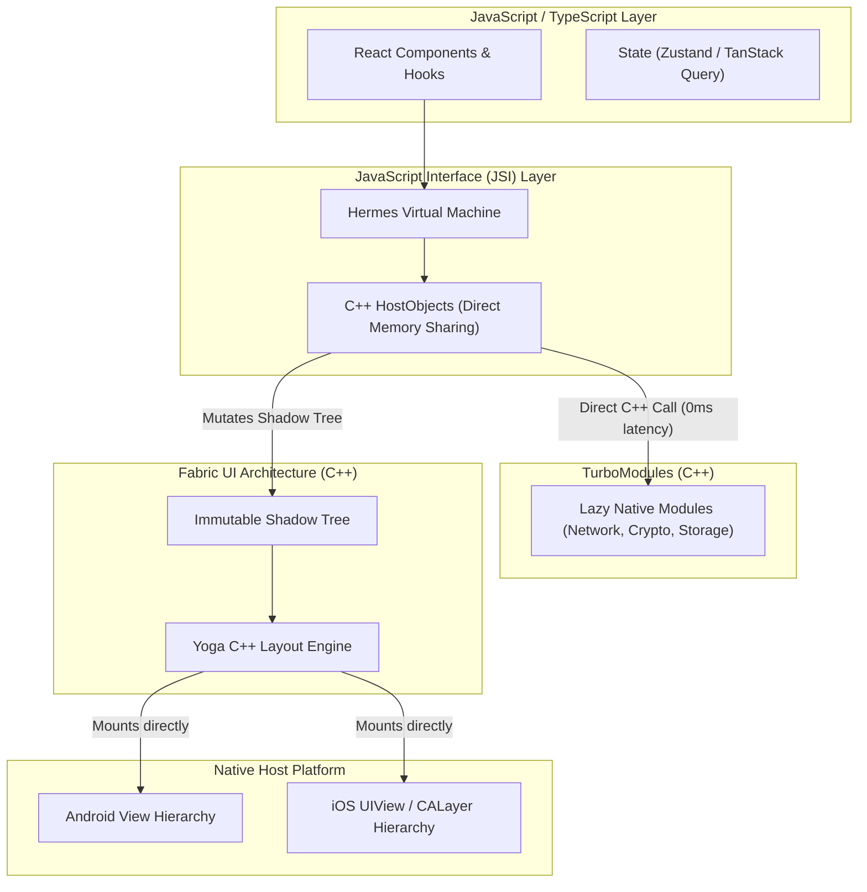

# Production React Native & Expo Development Master Curriculum

> "React Native has undergone an architectural revolution. The legacy asynchronous JSON bridge with its serialization bottlenecks and frame drops has been completely superseded by the New Architecture: the Hermes JavaScript engine, direct C++ JSI (JavaScript Interface) memory access, Fabric declarative C++ rendering over Yoga, and TurboModules for lazy native execution. Paired with Expo Prebuild (CNG), EAS, and Expo Router, React Native is now a premier enterprise cross-platform mobile engine."  
> — *Synthesized from React Native Architecture Documentation (Meta Open Source), Expo Documentation, React Native in Action, and The Ultimate Guide to React Native Optimization*

---

## 📚 Canonical Literature & Authoritative References
This curriculum is built directly upon industry-standard literature, engineering whitepapers, and official specifications:
1. **React Native New Architecture Official Documentation** (Meta Open Source / reactnative.dev/docs/the-new-architecture/landing-page)
2. **The Ultimate Guide to React Native Optimization** (Callstack Engineering Team)
3. **Expo Documentation & Continuous Native Generation (CNG)** (docs.expo.dev)
4. **React Native in Action** (Nader Dabit)
5. **Fullstack React Native** (Devin Abbott, Houssein Djirdeh, Sophia Shoemaker)
6. **Yoga Layout Engine Architecture** (yogacss.com)

---

## 🏛️ Comprehensive Curriculum Structure

```
Projects/Production-React-Native-and-Expo-Development/
├── README.md                                                 # Master Portal, Technology Matrix & Architecture Roadmap
├── 01. React Native Architecture Evolution (Old Bridge vs New Architecture).md
├── 02. JavaScript Engine Deep Dive (Hermes Internals, Bytecode & GC).md
├── 03. JavaScript Interface (JSI), C++ Direct Memory & TurboModules.md
├── 04. Fabric Rendering Engine, Shadow Tree & Yoga Flexbox Internals.md
├── 05. Modern Expo Ecosystem (EAS, Prebuild CNG, Config Plugins & Expo Router).md
├── 06. State Management in Mobile React (Zustand, TanStack Query & MMKV).md
├── 07. High-Performance UI, Gestures & Animations (Reanimated 3 & Gesture Handler).md
├── 08. Enterprise Networking, Offline-First Persistence & WatermelonDB.md
├── 09. Hardware Security, Biometrics, Keystore & App Hardening.md
├── 10. Performance Profiling, Memory Leaks, Startup Time & Flamegraphs.md
├── 11. Production React Native & Expo Project Structure & Monorepo.md
└── 12. Enterprise Release Engineering, Over-The-Air (OTA) Updates & CI-CD.md
```

---

## 📊 Comprehensive Architectural Matrix: Legacy vs New Architecture

| Architectural Dimension | Legacy React Native (0.60 - 0.67) | Modern React Native (0.74+ New Architecture) |
| :--- | :--- | :--- |
| **Execution Bridge** | Asynchronous JSON Bridge over native message queue | JavaScript Interface (JSI) with direct C++ pointer access |
| **JS Engine** | JavaScriptCore (JSC) / V8 | Hermes (AOT precompiled bytecode, low RAM footprint) |
| **Native Module Loading**| Eagerly initialized on app startup via reflection | TurboModules (Lazily loaded on first JS method call via JSI) |
| **UI Rendering Engine** | Imperative UI Manager (Async batching, race conditions) | Fabric (C++ core, synchronous layout, immutable Shadow Trees) |
| **Layout Calculation** | Yoga layout executed on Java/ObjC wrapper thread | Yoga C++ integrated directly with Fabric Shadow Tree |
| **Native Tooling** | Manual Xcode / Gradle native folder maintenance | Expo Prebuild / Continuous Native Generation (CNG) |
| **Navigation** | Imperative React Navigation stack configurations | Expo Router (File-based routing built on React Native Navigation) |
| **Fast Local Storage** | Slow async `AsyncStorage` (Bridge serialized) | Reactive MMKV (Direct synchronous mmap via C++ JSI) |
| **Animations** | JS thread bridge serialization (stuttery 30 FPS) | React Native Reanimated (Worklets executing on dedicated UI thread) |

---

## 🗺️ Modern React Native Reference Architecture

```
===================================================================================================
                             REACT NATIVE NEW ARCHITECTURE STACK
===================================================================================================

  [ JavaScript / TypeScript Application Layer ]
  ├── React 18+ (Concurrent Features, Suspense, Automatic Batching)
  ├── Expo Router (File-based Routing, Universal Deep Links)
  └── State & Data: Zustand + TanStack Query + Reactive MMKV Storage
           │
           ▼ (Direct In-Memory C++ Function Invocation - ZERO JSON BRIDGE)
  [ JavaScript Interface (JSI) Runtime Layer ]
  ├── Hermes JS Engine (AOT Bytecode Execution, Compressed Pointers)
  ├── HostObject C++ Bindings (Direct Pointer Dereferencing)
  └── TurboModules Core (Lazy On-Demand Native Module Dispatch)
           │
           ▼ (C++ Thread Coordination & Layout)
  [ C++ Fabric & Yoga Core ]
  ├── Fabric Shadow Tree (Immutable C++ Nodes, Clone-on-Write)
  ├── Yoga Layout Engine (Flexbox constraint satisfaction in C++)
  └── Native Animated / Reanimated Worklets (UI Thread Animation Pipeline)
           │
           ▼ (Platform Pixel Drawing)
  [ Native Platform Host (Android & iOS) ]
  ├── Android: SurfaceView / ViewGroups / NDK C++ JNI
  └── iOS: UIView / CALayer / Metal Drawing Contexts
===================================================================================================
```


