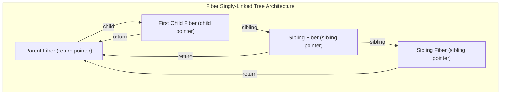
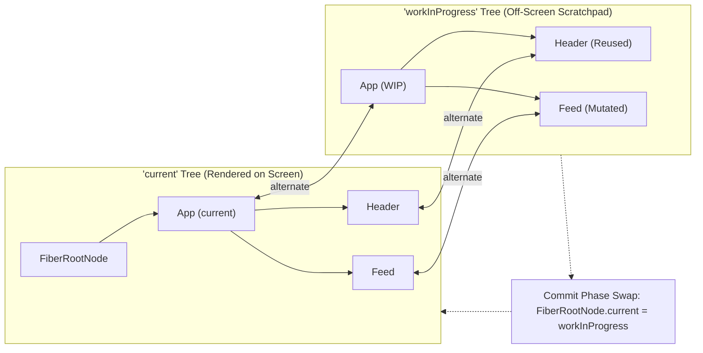
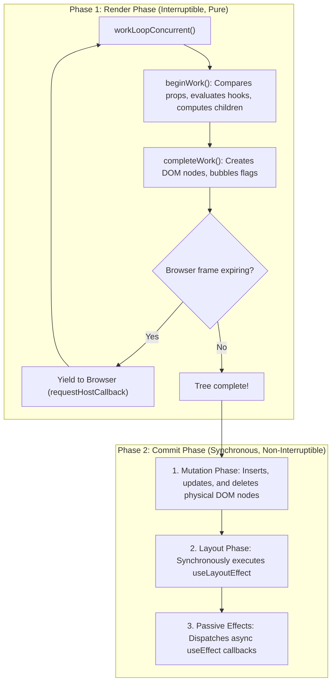

# 01. React 19 Fiber Reconciler & The Work Loop

> "React is not a virtual DOM diffing library. In React 19, reconciliation is performed by the Fiber architecture: an algebraic, stack-agnostic virtual call-stack implementation backed by a singly-linked tree data structure with double buffering and interruptible cooperative scheduling."  
> — *Referencing Inside Fiber: The Reconciliation Algorithm in React (Max Koretskyi) & React Core Architecture*

---

## 1. The Fiber Node: Data Structure & Memory Topology

In early versions of React (the legacy Stack Reconciler), reconciliation was recursive. Once a component tree update started, JavaScript could not yield control back to the browser until the entire recursive call stack finished, causing frame drops and unresponsive user inputs.

A **Fiber Node** is a JavaScript object representing a unit of work. It acts as a custom stack frame stored on the heap:



### 1.1 Core Fields of a Fiber Object
```typescript
interface Fiber {
  // 1. Structural Pointers
  child: Fiber | null;        // Pointer to the first child
  sibling: Fiber | null;      // Pointer to the next sibling
  return: Fiber | null;       // Pointer to the parent (return destination)

  // 2. Identity & Type
  tag: WorkTag;               // Identifies type of fiber (FunctionComponent, HostComponent, etc.)
  key: null | string;         // Reconciliation key
  elementType: any;           // The React component function or DOM string ('div')

  // 3. State & Props
  pendingProps: any;          // Incoming props to be processed
  memoizedProps: any;         // Props used to render the current output
  memoizedState: any;         // Linked list of hooks or class state
  updateQueue: any;           // Queue of pending state updates

  // 4. Scheduling & Effects
  lanes: Lanes;               // Bitmask of priority lanes for this fiber
  childLanes: Lanes;          // Bitmask of priority lanes for all children
  flags: Flags;               // Bitmask of DOM mutations needed (Placement, Update, Deletion)
  
  // 5. Double Buffering Pointer
  alternate: Fiber | null;    // Pointer to the counterpart in the alternate tree
}
```

---

## 2. Double Buffering: `current` vs `workInProgress` Trees

To prevent screen tearing and incomplete renders, React uses **Double Buffering** (a technique borrowed from 3D graphics game engines):



* **`current` Tree**: Represents what is currently mounted and visible on the DOM.
* **`workInProgress` Tree**: Constructed off-screen in memory during the render phase. Unmodified fibers are cloned with shallow reference reuse.
* **The Commit Swap**: When rendering finishes, React simply points `FiberRootNode.current` to the `workInProgress` tree in an instantaneous $O(1)$ pointer assignment.

---

## 3. The Two Phases: Render (Interruptible) vs Commit (Synchronous)



### The Work Loop Implementation (`workLoopConcurrent`)
```javascript
function workLoopConcurrent() {
  // Perform work until there are no remaining nodes or the browser needs the thread
  while (workInProgress !== null && !shouldYieldToHost()) {
    performUnitOfWork(workInProgress);
  }
}
```

---

## 4. Do's, Don'ts & Production Gotchas

| Category | Rule | Deep Technical Rationale |
| :--- | :--- | :--- |
| **DON'T** | Never cause side-effects inside component render bodies. | The Render Phase is **interruptible and can be executed multiple times** before committing, or discarded entirely if a higher-priority lane interrupts. Any side-effect (HTTP calls, analytics tracking, mutating global variables) inside the render body will fire multiple times or leave leaked state. |
| **DO** | Perform side-effects exclusively in `useEffect` or event handlers. | `useEffect` executes in the Passive Effect phase **only after** the tree is safely committed to the DOM. |
| **GOTCHA** | Modifying props or state directly without setters breaks Fiber double buffering. | Fiber relies on object reference inequality (`prevProps !== nextProps`) to bail out of `beginWork()`. Mutating objects directly mutates both `current` and `workInProgress` instances simultaneously, bypassing change detection. |
| **DO** | Use stable keys for dynamic lists (`key={item.id}`). | Without unique keys, the reconciliation algorithm cannot match alternate fibers and will unmount and recreate the entire DOM subtree instead of moving it. |
| **DON'T** | Never use array index (`key={index}`) when items can be sorted, filtered, or prepended. | Using array indices causes child fibers to retain the previous index's hook state and DOM state (e.g. focused text inputs), creating subtle input data corruption bugs. |
