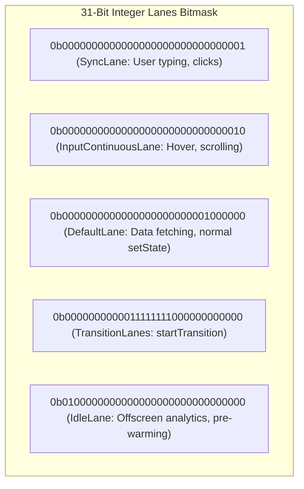
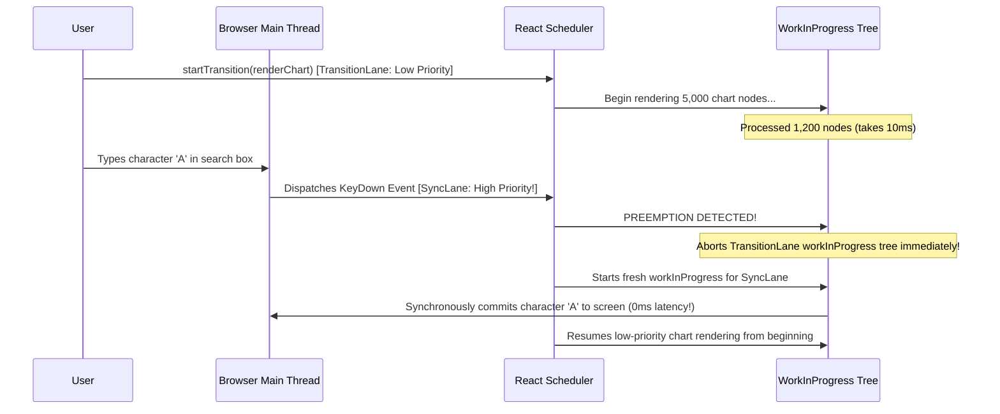

# 02. Concurrent Mode, Lanes Architecture & Scheduling

> "Concurrent React is not multithreading; JavaScript remains single-threaded. Concurrency in React 19 is cooperative, prioritized time-slicing powered by a 31-bit integer bitmask system known as the Lanes Architecture and a custom cooperative scheduler."  
> — *Referencing React Scheduler Architecture & Andrew Clark's Lanes RFC*

---

## 1. The 31-Bit Integer Lanes Architecture

Prior to React 18, React used a scalar expiration time system to prioritize updates. However, scalar timestamps could not express batching across disparate features, decoupled rendering priorities, or CPU vs I/O boundaries.

React 19 models update priorities using **Lanes**: 31 discrete bit positions in a 32-bit signed integer.



### 1.1 Bitwise Priority Arithmetic
Bitwise operations allow React to manipulate priority sets in $O(1)$ CPU cycles:
```javascript
// Check if a fiber contains work in the current render lanes
const hasWork = (fiber.lanes & renderLanes) !== NoLanes;

// Merge new update lane into fiber's existing lanes
fiber.lanes |= updateLane;

// Extract highest priority lane (isolates least significant bit)
function getHighestPriorityLane(lanes) {
  return lanes & -lanes;
}
```

---

## 2. Cooperative Time-Slicing & Priority Preemption

When a user triggers a slow transition update (e.g. rendering 5,000 data chart items), React processes the tree in the `TransitionLane`.

If the user suddenly types a key into a text input, React intercepts the input event in `SyncLane`:



---

## 3. The React Scheduler & MessageChannel

React does not use `window.requestIdleCallback()` because its browser implementation is inconsistent and capped at an unpredictable 20 Hz frame rate.
Instead, React builds its own cooperative scheduler using **`MessageChannel`** micro-macrotask scheduling:
* When React needs to yield, it posts a message over a `MessageChannel`.
* The browser paints the current frame, processes user events, and calls React's `onmessage` callback on the very next turn of the event loop ($5\text{ms}$ time slices).

---

## 4. Do's, Don'ts & Production Gotchas

| Category | Rule | Deep Technical Rationale |
| :--- | :--- | :--- |
| **DO** | Wrap expensive filtering, search results, and page navigations in `startTransition`. | `startTransition` marks the associated state updates with `TransitionLanes`. This allows urgent updates (typing, button clicks) to preempt the slow render, keeping inputs at 120 FPS. |
| **DON'T** | Never put controlled text input state (`value={text}`) inside `startTransition`. | If typing updates are placed in a transition, the user's keystrokes can lag behind user typing, producing a sluggish "rubber-banding" typing experience. Controlled inputs must always run in `SyncLane`. |
| **GOTCHA** | Wrapping synchronous loops inside `startTransition` will NOT make them asynchronous. | `startTransition` only affects the scheduling of **React component rendering**. A blocking loop (e.g., heavy mathematical calculation or parsing a 50MB JSON file in JavaScript) will still freeze the main thread because JavaScript execution itself is synchronous. Offload heavy computations to a Web Worker. |
| **DO** | Use `useDeferredValue` when consumers cannot wrap the producer's `setState`. | When props are passed down from a parent or third-party library, `useDeferredValue(query)` creates a deferred copy that lags behind in `TransitionLane`, allowing the parent input to remain responsive. |
| **DON'T** | Avoid chaining multiple transitions sequentially without dependencies. | Overlapping multiple unrelated transitions causes lane starvation, where the scheduler continuously cancels and restarts work, stalling rendering indefinitely. |
